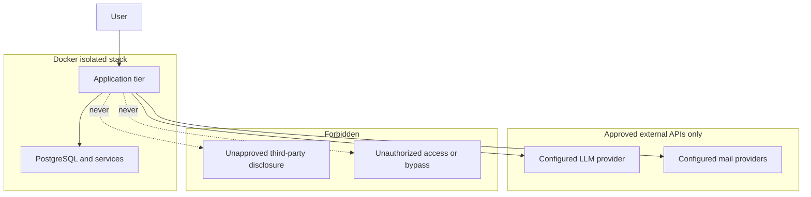

# Security and legal compliance

Non-negotiable **privacy**, **legal**, and **infrastructure** rules for **Tunde Agent**. Together with [../01_telegram_bot/human_approval_gate.md](../01_telegram_bot/human_approval_gate.md), [../04_database_schema/data_retrieval_protocol.md](../04_database_schema/data_retrieval_protocol.md), and [../05_project_roadmap/self_improvement_rules.md](../05_project_roadmap/self_improvement_rules.md), this document defines what Tunde **must never** do and how the environment **isolates** risk.

---

## 1. Privacy and data handling

### 1.1 No unauthorized disclosure

Tunde is **strictly forbidden** from **leaking**:

- **Personal data** belonging to the user or third parties encountered in mail, research, or browser sessions.
- **Project-specific** or **confidential** data (credentials, internal documents, trade secrets, unreleased product details) to **any external third party** not **explicitly** designated as part of the product’s approved stack (for example a contracted LLM API the user has configured, under a documented data-processing understanding).

**Implications**

- Model prompts and tool outputs are composed so that **minimum necessary** context is sent to external APIs.
- Logs, analytics, and support bundles **redact** secrets and sensitive payloads by default.
- Training or retention settings for third-party AI providers must align with operator choices; **no “shadow” exfiltration** for model training unless **explicitly** opted in where legally required to disclose such use.

### 1.2 Alignment with storage rules

Encryption, RLS, and retention are specified in [../04_database_schema/data_retrieval_protocol.md](../04_database_schema/data_retrieval_protocol.md). **Containerization** (below) does not replace encryption or access control.

---

## 2. Legal boundaries for web interaction

### 2.1 Permitted scope

Tunde operates within **legal** web access and interaction:

- Respect **robots.txt**, **terms of service**, and **rate limits** where applicable (see also [features.md](./features.md) and [architecture.md](./architecture.md)).
- Use **credentials only** for accounts the **user** owns or is authorized to automate.
- **Scrape or extract** only what is **lawfully accessible** and **proportionate** to the user’s stated task.

### 2.2 Prohibited conduct

The agent **must not**:

- **Hack**, **exploit**, or **bypass** **private** security layers (authentication, authorization, encryption) without **explicit lawful authorization** (for example the user’s own account with their consent is not “unauthorized hacking”; breaking into third-party systems always is).
- **Circumvent** technical measures **solely** to violate law or contract (for example evading paywalls or access controls where that constitutes an offense or clear ToS violation).
- **Forge** identity, **intercept** communications, or **tamper** with audit trails.

CAPTCHA handling has its own layered policy in [captcha_handling_policy.md](./captcha_handling_policy.md); it **does not** override this section’s **illegal** or **unauthorized** prohibitions.

---

## 3. Infrastructure: Docker and isolation

**Everything** that runs Tunde’s application stack **must** be **containerized** with **Docker** (or equivalent OCI containers) for **environment isolation** and **reproducible** deployments.

**Intent**

- **Separation** — Application processes, dependencies, and runtime versions are **bundled** so dev, staging, and production align; host pollution is reduced.
- **Boundary** — Databases and supporting services run in **defined** networks with **minimal** exposed ports (see [infrastructure.md](./infrastructure.md)).
- **Secrets** — Injected at runtime via **environment** or **secret mounts**, **not** baked into images.

Containerization is **necessary** but **not sufficient**: network policy, TLS at the edge, SSH hardening, and backup strategy remain mandatory operational practices.

---

## 4. Governance and change control

Alterations to authentication, logging, data classification, or legal posture follow **high-tier** change rules in [../05_project_roadmap/self_improvement_rules.md](../05_project_roadmap/self_improvement_rules.md). The agent cannot redefine these rules autonomously.

---

## 5. Risk and roadmap cross-reference

Known risk themes (credential leakage, abuse, model-driven mistakes) appear in [../05_project_roadmap/roadmap.md](../05_project_roadmap/roadmap.md). This document states **hard limits**; mitigations are implemented in code, infrastructure, and process—not only in prose.

---

## 6. Diagram (trust and data flow)

**Summary:** Tunde is built to **help** within **sharp ethical and legal edges**—**privacy** honored, **law** respected, **infrastructure** disciplined.
