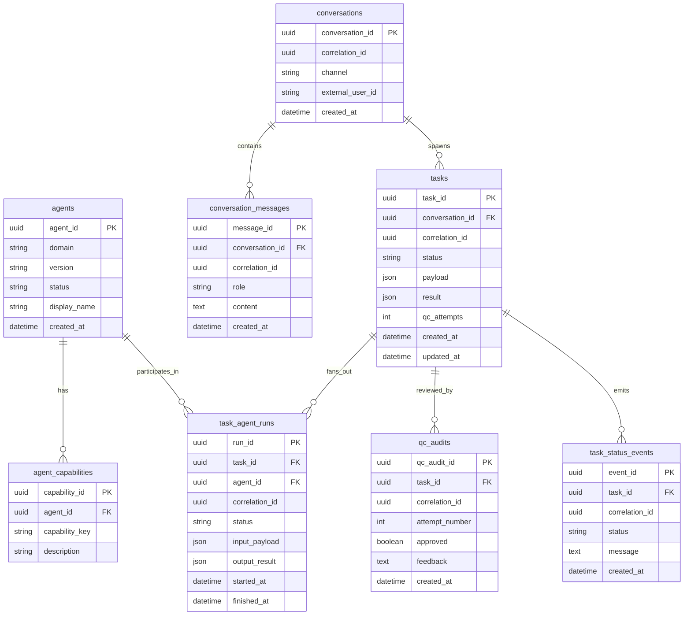

# Database schema overview (CEO / Army / QC) — Phase 2.1 blueprint

This document is the **design blueprint** for Tunde Agent’s persistent memory layer. It is intentionally **SQL-relational** and compatible with **PostgreSQL** (preferred) and **SQLite** (dev/testing).

Scope: **design + documentation only**. No migrations are created in this step.

---

## 1. Design goals

- **Traceability end-to-end**: every task run and QC decision is linkable by `correlation_id`.
- **CEO / Army / QC separation**: the CEO response is recorded, but the **sub-agent work** and **QC audits** are stored as first-class records.
- **Audit-first**: execution steps and QC outcomes are preserved for debugging and compliance.
- **Extensible to 25 agents**: agent definitions are data, not hard-coded.

---

## 2. Text ERD (Mermaid)

---

## 3. Table list (with purpose + key fields)

### 3.1 `agents`
**Purpose:** The “Army” registry (Physics, Chemistry, AI, etc.).

- **PK:** `agent_id`
- **Fields (design):** `domain`, `display_name`, `version`, `status (active/inactive)`, `created_at`

**Implementation note (Phase 2.2):** The initial implementation stores `capabilities` as a JSON string column directly on `agents` (SQLite-friendly) and uses `is_active` (boolean) instead of `status`. The separate `agent_capabilities` table remains a valid future normalization step if/when capability metadata grows.

### 3.2 `agent_capabilities`
**Purpose:** Declarative capabilities per agent (search, math, extraction, etc.).

- **PK:** `capability_id`
- **FK:** `agent_id → agents.agent_id`
- **Fields:** `capability_key`, `description`

### 3.3 `conversations`
**Purpose:** Top-level thread for user interactions (Web UI, Telegram, etc.).

- **PK:** `conversation_id`
- **Traceability:** `correlation_id` (optional, for cross-system linking)
- **Fields:** `channel`, `external_user_id`, `created_at`

### 3.4 `conversation_messages`
**Purpose:** User inputs and CEO outputs (and later: system/tool messages if needed).

- **PK:** `message_id`
- **FK:** `conversation_id → conversations.conversation_id`
- **Traceability:** `correlation_id` (recommended; can match the task correlation when message triggers a task)
- **Fields:** `role` (`user`/`ceo`/`system`), `content`, `created_at`

### 3.5 `tasks`
**Purpose:** The orchestration “conveyor belt” unit of work.

- **PK:** `task_id`
- **FK:** `conversation_id → conversations.conversation_id` (nullable if tasks can be system-triggered)
- **Traceability:** `correlation_id` (required; UUID)
- **Fields:** `status`, `payload`, `result`, `qc_attempts`, timestamps

### 3.6 `task_status_events`
**Purpose:** Append-only lifecycle log (mirrors WebSocket `task_status_change` events).

- **PK:** `event_id`
- **FK:** `task_id → tasks.task_id`
- **Traceability:** `correlation_id` (same as task)
- **Fields:** `status`, `message`, `created_at`

### 3.7 `task_agent_runs`
**Purpose:** Fan-out execution tracking (which agent worked on what, and its output).

- **PK:** `run_id`
- **FKs:** `task_id → tasks.task_id`, `agent_id → agents.agent_id`
- **Traceability:** `correlation_id`
- **Fields:** run `status`, `input_payload`, `output_result`, `started_at`, `finished_at`

### 3.8 `qc_audits`
**Purpose:** Every QC decision, for every attempt.

- **PK:** `qc_audit_id`
- **FK:** `task_id → tasks.task_id`
- **Traceability:** `correlation_id`
- **Fields:** `attempt_number`, `approved`, `feedback`, `created_at`

---

## 4. Traceability rules (correlation_id)

- `tasks.correlation_id` is the **root** correlation for an execution.
- `task_status_events.correlation_id`, `task_agent_runs.correlation_id`, `qc_audits.correlation_id` should **match** the task’s correlation id.
- `conversation_messages.correlation_id` should be set when a message triggers a task (or is produced as the CEO response for that task).

---

## 5. PostgreSQL vs SQLite notes

- **UUIDs**: PostgreSQL uses `uuid`; SQLite stores UUID as `TEXT`.
- **JSON**: PostgreSQL uses `jsonb`; SQLite stores as `TEXT` (JSON serialized), with optional JSON1 functions.
- **Timestamps**: store UTC (`timestamptz` in Postgres; ISO text in SQLite).

---

## 6. Migration plan (strategy only)

Preferred approach: **Alembic** (consistent with the existing repo).

- Create a new Alembic revision series for the web app schema (separate from legacy tables if desired).
- Apply migrations in CI and on deploy.
- Keep “append-only” tables (`task_status_events`, `qc_audits`) non-destructive; avoid silent deletes.

Alternative for early dev: a single `schema.sql` bootstrap for SQLite, then migrate to Alembic once the ERD stabilizes.

---

## 7. Phase 2.2 implementation pointer (Agents table only)

Implemented (SQLite-first, SQLAlchemy-compatible):

- Model: `tunde_webapp_backend/app/models/agent.py`
- DB bootstrap: `tunde_webapp_backend/app/db.py` (`init_db()` uses `create_all` for now)
- Repository: `tunde_webapp_backend/app/repositories/agent_repository.py`
- Seed: `tunde_webapp_backend/app/seed_agents.py` (Physics, Chemistry, Space, Geology, AI)

The migration mechanism (Alembic) will be introduced once the full schema (tasks, messages, qc_audits) is ready to be versioned together.

---

## 8. Phase 2.3 implementation note (naming + step logs)

The Phase 2.3 implementation uses these concrete table names:

- `conversations` (`conv_id`, `user_id`, `started_at`)
- `messages` (`message_id`, `conv_id`, `role`, `content`, `timestamp`)
- `task_executions` (`task_id`, `correlation_id`, `agent_id`, `status`, `final_result`, `created_at`)
- `qc_audit_logs` (`audit_id`, `task_id`, `attempt_number`, `approved`, `feedback`, `timestamp`)
- `task_status_events` (append-only per-step log to satisfy “store every task step”)

This is a naming divergence from the blueprint’s generic `conversation_messages` / `qc_audits` naming, but the relationships and intent are the same.

---

## 9. Published landing pages (web workspace)

The web dashboard backend also creates **`published_pages`** via SQLAlchemy (`tunde_webapp_backend/app/models/published_page.py`):

| Column | Purpose |
| ------ | ------- |
| `page_id` (UUID, PK) | Public id in **`GET /share/{page_id}`** |
| `user_id` | Uploader principal (mock or future auth) |
| `title` | Report title |
| `html_document` | Full HTML document (Tailwind CDN self-contained page) |
| `created_at` | UTC timestamp |

Rows are written by **`POST /api/pages/publish`**. See [workspace_tools_and_landing.md](../03_web_app_frontend/workspace_tools_and_landing.md) §5.

