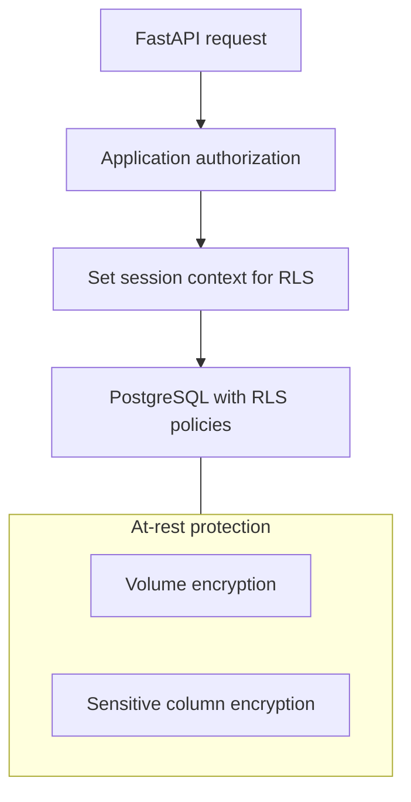

# Data retrieval protocol

Standards for how Tunde Agent stores, queries, and protects data using **PostgreSQL** as the **primary relational database**. Goals: **high-performance querying**, **legal safety**, **data integrity**, and **least-privilege access** aligned with [../02_web_app_backend/security_and_legal_compliance.md](../02_web_app_backend/security_and_legal_compliance.md) and [../01_telegram_bot/human_approval_gate.md](../01_telegram_bot/human_approval_gate.md).

Architecture context: [../02_web_app_backend/architecture.md](../02_web_app_backend/architecture.md). Infrastructure (including Docker): [../02_web_app_backend/infrastructure.md](../02_web_app_backend/infrastructure.md).

---

## 1. Database role

PostgreSQL holds authoritative state for sessions, tasks, preferences, email metadata and rules, research artifact references, audit events, and other structured domain data. The application accesses PostgreSQL through **parameterized** access patterns; ad hoc query execution from model output is forbidden.

---

## 2. Row-Level Security (RLS)

**Strict RLS** is required for any table that can contain multi-tenant or multi-principal data, or that must enforce separation between automation contexts.

**Principles**

- **Database-enforced boundaries** — Policies express **which rows** a database role may read or write, keyed by stable principal identifiers (for example user or workspace identifiers carried in session context).
- **Least privilege** — Application roles used by the API are **not** superusers; migration and admin roles are used only outside the request path.
- **Session context** — Each request establishes a **database session variable** or equivalent mechanism (for example `SET LOCAL` scoped to transaction) so RLS predicates apply consistently for every query in that unit of work.
- **Defense in depth** — RLS complements, not replaces, application-layer authorization and the immutable controls in [../05_project_roadmap/self_improvement_rules.md](../05_project_roadmap/self_improvement_rules.md).

**Operational note** — Policy review belongs in change governance: altering RLS is a **high-tier** change per [../05_project_roadmap/self_improvement_rules.md](../05_project_roadmap/self_improvement_rules.md).

---

## 3. Encryption at rest

**Sensitive data**—including **email content or credentials**, **payment-related fields**, tokens, and other regulated categories—**must be encrypted at rest**.

**Layers (conceptual)**

- **Storage layer** — Volume or disk encryption for database files and backups (host or cloud provider).
- **Application or column-level** — Fields classified as highly sensitive use **application-managed encryption** (keys from a secret manager, not stored beside ciphertext in plaintext configuration) so that a raw table dump without keys remains unusable.

**Key management**

- Keys live **outside** the database and **outside** container images; rotation and access logging follow [../02_web_app_backend/infrastructure.md](../02_web_app_backend/infrastructure.md) and [../02_web_app_backend/security_and_legal_compliance.md](../02_web_app_backend/security_and_legal_compliance.md).

---

## 4. Schema and query design for performance and integrity

**Performance**

- **Primary keys and foreign keys** — Explicit constraints preserve referential integrity and help the planner.
- **Indexes** — Align indexes with real query paths (time-ordered lists, thread identifiers, status filters); avoid speculative indexes that slow writes without benefit.
- **Pagination** — Keyset or cursor pagination for large mail and audit tables; avoid unbounded offsets on hot paths.
- **Partitioning** — Consider time-based partitioning for append-heavy tables (audit, raw fetch logs) when volume warrants it.

**Legal safety and integrity**

- **Retention and minimization** — Store only what the product needs; document retention in line with [../02_web_app_backend/security_and_legal_compliance.md](../02_web_app_backend/security_and_legal_compliance.md).
- **Immutability of audit** — Append-only or tamper-evident patterns for approval and sensitive-action logs; no silent delete of audit rows from application roles.
- **Provenance** — Research artifacts and extracted facts link to **source references** and timestamps where [../02_web_app_backend/features.md](../02_web_app_backend/features.md) requires attribution.

---

## 5. Retrieval patterns and safety

- **No string-concatenated SQL from model output** — All retrieval uses bound parameters and fixed query shapes approved by code review.
- **Sensitive reads** — Access to decrypted sensitive columns is logged at coarse granularity where policy requires (without logging the secret itself).
- **Cross-principal isolation** — RLS and application checks must agree; tests should prove one principal cannot read another’s rows.

---

## 6. Diagram (access path)

This protocol keeps Tunde’s memory **fast, bounded, and defensible** under scrutiny—technically and legally.

---

## 7. Schema present in migrations (today)

Alembic revision **`001_rls`** creates the **`tunde_app`** login role (dev password in migration for local use), tables **`users`**, **`sessions`**, **`audit_logs`**, **`encrypted_data`**, enables **RLS** on applicable tables, seeds a **smoke-test user** UUID used by development helpers, and grants least-privilege DML to **`tunde_app`**. Revision **`002_approval`** adds **`approval_requests`** (JSONB payload, status constrained to `pending` / `approved` / `denied`), RLS on that table, and **`resolve_approval_from_telegram`**.

Session context for RLS is set in application code per request/transaction (see `db/session.py` usage). End-to-end HTTP and Telegram flows: [../02_web_app_backend/current_implementation.md](../02_web_app_backend/current_implementation.md).
