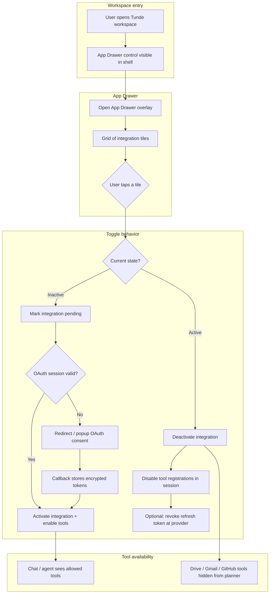
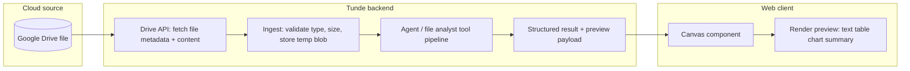

# Tunde App Ecosystem — Integrations Design (Google & GitHub)

This document describes how external **Google** (Drive, Gmail) and **GitHub** integrations fit into the Tunde web product: user-facing **App Drawer** flows, **OAuth2** authentication, and **data flow** from cloud files through analysis to the workspace canvas.

---

## 1. Integration summaries

### 1.1 Google Drive

Google Drive lets users pick or sync files stored in their cloud drive. Tunde uses Drive as a **read-oriented** source for documents, spreadsheets, and exports that should be analyzed, summarized, or transformed inside a task. Access is gated by OAuth2 with least-privilege scopes (for example, read-only file access where possible). File bytes flow through the backend **ingest** path (validation, temporary storage, tool payloads) before agents run.

### 1.2 Gmail

Gmail integration enables Tunde to work with **email context** users explicitly attach or authorize: thread snippets, labeled messages, or exports—always under user consent and scoped OAuth. Typical uses include summarization, draft assistance, and turning email content into structured tasks. Tokens and message identifiers are treated as sensitive data and stored only in **encrypted** form at rest (see `user_integrations` in the backend).

### 1.3 GitHub

GitHub connects Tunde to **repositories, issues, and pull requests** the user can read (and optionally act on within allowed scopes). OAuth2 identifies the user to GitHub; the backend uses tokens only for API calls the user has enabled via the App Drawer. This supports code-aware assistance, changelog-style summaries, and linking tasks to issues without embedding secrets in prompts.

---

## 2. User flow — App Drawer and tool toggles

The **App Drawer** (Manus-style) is the entry point for turning integrations on or off. Enabling an integration may trigger OAuth; disabling it hides dependent tools and stops using stored tokens for new requests.



---

## 3. Authentication sequence — Google OAuth2 and GitHub OAuth

Both providers use the **OAuth 2.0 authorization code** pattern with PKCE recommended for public clients. The backend exchanges the code for tokens, encrypts them, and persists rows in `user_integrations`. The diagram below applies to **Google** and **GitHub**; only authorization and token endpoints differ per provider.

```mermaid
sequenceDiagram
    autonumber
    participant U as User
    participant B as Browser
    participant W as Tunde Web App
    participant API as Tunde Backend
    participant P as OAuth Provider

    Note over P: Google OAuth 2.0 or GitHub OAuth

    U->>W: Enable integration in App Drawer
    W->>API: GET /auth/{provider}/start
    API->>W: authorization_url + state + PKCE verifier server-side or session-bound
    W->>B: Navigate to authorization_url
    B->>P: User signs in and consents to scopes
    P->>B: Redirect to callback with code + state
    B->>API: GET /auth/{provider}/callback?code&state
    API->>P: POST token endpoint (code + client_secret or PKCE)
    P->>API: access_token, refresh_token optional, expires_in
    API->>API: Encrypt tokens at application layer
    API->>API: UPSERT user_integrations row
    API->>W: Session / cookie updated; redirect to workspace
    W->>U: Integration shows Active in App Drawer
```

**Provider-specific notes (implementation detail):**

- **Google:** Use Google’s OAuth endpoints; combine scopes carefully so Drive and Gmail can share one Google connection or use separate OAuth flows per tile—product decision documented with UX.
- **GitHub:** Use GitHub’s OAuth App or GitHub App user-to-server tokens per product choice; callback URL must match registered application settings.

---

## 4. Data flow — Drive file → analysis → Canvas preview

This flow describes pulling a **single file** from Drive through analysis to a **Canvas** preview in the web UI (split workspace / canvas region).



**Steps in plain language:**

1. **Pull:** With a valid Google token, the backend requests file metadata and downloads bytes (or export format for Google Docs).
2. **Analyze:** The file enters the same safety and tooling path as uploads: parsing, optional tabular analysis, and CEO/agent orchestration.
3. **Preview:** Results and excerpts are sent to the client (for example over the existing WebSocket or REST task result channel) and rendered in **Canvas** without exposing raw tokens to the browser.

---

## 5. UI layout concept — App Drawer

### 5.1 Grid-based menu

- The drawer opens as a **modal or side sheet** over the workspace, dimming the chat/canvas behind it.
- Integrations appear in a **responsive grid** (for example 2 columns on narrow viewports, 3–4 on desktop), similar to Manus-style app launchers.
- Each **tile** includes: high-quality **brand icon** (Drive, Gmail, GitHub), a short **label**, and a **toggle** or tap-to-connect affordance.

### 5.2 Icons

- **Google Drive:** Full-color Drive triangle mark on a neutral tile background.
- **Gmail:** Gmail envelope / M icon consistent with Google brand guidelines.
- **GitHub:** GitHub invertocat on light or dark tile per theme.

Use official brand assets where licensing allows, or neutral monochrome equivalents that remain recognizable.

### 5.3 Active vs inactive states

| State | Visual | Behavior |
| ----- | ------ | -------- |
| **Inactive** | Muted tile, desaturated icon, “Connect” or off toggle | No provider API calls; tools hidden. |
| **Pending** | Subtle pulse or spinner on tile | OAuth in progress. |
| **Active** | Full color icon, accent border or “on” toggle | Tools registered; App Drawer shows checkmark or connected badge. |
| **Error** | Warning tint, short error hint | Token refresh failed; user can reconnect. |

---

## 6. Related implementation

- **ORM table:** `user_integrations` stores **encrypted** OAuth tokens keyed by `user_id` and `provider` (see backend models and `init_db`).
- **Auth modules (placeholders):** `app/core/auth/google_auth.py`, `app/core/auth/github_auth.py` — URL builders, token exchange, and refresh logic to be implemented in a later phase.
