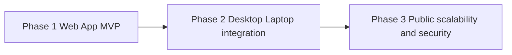

# Roadmap

Phased delivery for Tunde Agent from a **personal web MVP** toward **desktop integration** and eventually **public scalability and hardening**. Architecture is in [../02_web_app_backend/architecture.md](../02_web_app_backend/architecture.md); features in [../02_web_app_backend/features.md](../02_web_app_backend/features.md); runbooks and hosting in [../02_web_app_backend/infrastructure.md](../02_web_app_backend/infrastructure.md); safety and change limits in [self_improvement_rules.md](./self_improvement_rules.md). **What is already built in git** is summarized in [../02_web_app_backend/current_implementation.md](../02_web_app_backend/current_implementation.md). The **multi-agent runtime and provider routing** are documented in [../02_web_app_backend/multi_agent.md](../02_web_app_backend/multi_agent.md).

---

## Phase overview

Each phase **builds on** the previous one; skipping Phase 2 is possible for a purely hosted product, but local integration is part of the long-term vision described here.

---

## Phase table

| Phase | Focus | Outcomes (milestones) | Dependencies |
| ----- | ----- | --------------------- | ------------ |
| **Phase 1 — Web App MVP (current)** | Core **FastAPI** backend, **Telegram**-mediated human gates, **Playwright** research/browse, **PostgreSQL** + RLS, first **research mission** slice (async API + multi-agent report + exports) | **In repo:** `POST /chat`, `POST /mission/start`, `/reports/view/...`, health/RLS smoke, audit + approval tables, optional SERP APIs and SMTP for reports. **Still roadmap-aligned:** React SPA task UI, authenticated web sessions at scale, full IMAP mail client flows from [../02_web_app_backend/features.md](../02_web_app_backend/features.md) | Stable boundaries in [../02_web_app_backend/architecture.md](../02_web_app_backend/architecture.md); Compose and ports in [../02_web_app_backend/infrastructure.md](../02_web_app_backend/infrastructure.md) §10; factual snapshot in [../02_web_app_backend/current_implementation.md](../02_web_app_backend/current_implementation.md) |
| **Phase 2 — Desktop and laptop integration** | OS-level or local companion capabilities, secure bridge between web agent and the user’s machine | Approved local helper or automation channel; stricter **local auth** and pairing; clear trust model for what the remote API may request from the device | Phase 1 stable; operator trust in [self_improvement_rules.md](./self_improvement_rules.md) enforcement |
| **Phase 3 — Public scalability and security** | Multi-user isolation, rate limits, audit and compliance-oriented controls, scale-out options | **Tenant** or account isolation, abuse prevention, centralized observability, optional **multi-VPS** or **orchestrated** deployment—described as options, not a single mandated stack | Lessons from Phases 1–2; formal governance for prompts, tools, and infrastructure changes |

---

## Phase 1 detail (Web App MVP)

- **Web application** — Target: **SPA plus API** as the primary product surface; no requirement for public registration. **Current tree:** API + **Telegram** already provide an operator-facing slice (missions, approvals, report links); SPA remains to be added alongside or after this slice.
- **Agent loop** — Plan, tool calls, synthesis, with human gates where [../02_web_app_backend/features.md](../02_web_app_backend/features.md) requires them. Research missions implement an orchestrated loop post-approval ([../02_web_app_backend/current_implementation.md](../02_web_app_backend/current_implementation.md)).
- **Browser Automation layer** — Playwright-backed, session-scoped contexts; domain allowlists and confirmation for sensitive steps.
- **Stubs versus slices** — Early milestones may stub some integrations, but **one end-to-end slice** (for example research or email) should be production-credible before declaring Phase 1 complete. **Research** has a credible vertical slice in code today; **full email** remains ahead of the current integration surface.

---

## Phase 2 detail (Desktop and laptop integration)

- **Purpose** — Extend delegation to files, local apps, or OS workflows the browser cannot safely reach.
- **Security** — Local channel uses **pairing**, **scoped permissions**, and **user-visible prompts** for high-risk actions; aligns with the immutable kernel concepts in [self_improvement_rules.md](./self_improvement_rules.md).
- **Architecture impact** — Introduces a new trust boundary (local agent ↔ cloud API); [../02_web_app_backend/architecture.md](../02_web_app_backend/architecture.md) will need a companion diagram when implementation begins.

---

## Phase 3 detail (Public scalability)

- **Isolation** — Strong separation between users’ data, credentials, and automation contexts.
- **Scale** — Horizontal API replicas, queued jobs, or split database and automation workers as load demands.
- **Compliance posture** — Retention policies, export and deletion workflows, and audit depth appropriate to a multi-user offering—exact targets are product decisions outside this roadmap’s detail.

---

## Risk register

| Risk | Description | Mitigation direction |
| ---- | ----------- | -------------------- |
| **Browser abuse** | Automation used to scrape, spam, or interact with sites against policy or law | Allowlists, rate limits, logging, operator-visible session records; legal and ToS education in product copy |
| **Credential leakage** | Email or site passwords exposed via logs, screenshots, or overly broad tool outputs | Secret hygiene per [../02_web_app_backend/infrastructure.md](../02_web_app_backend/infrastructure.md); redaction in logs; least-privilege app passwords |
| **Model-driven unsafe actions** | Hallucination or overconfidence leads to wrong send, wrong click, or wrong “facts” in research | Human approval gates, tool argument validation, evidence citations for research, kill switch and policy versioning per [self_improvement_rules.md](./self_improvement_rules.md) |
| **Supply chain and dependencies** | Compromised package or image undermines the stack | Pinning, integrity checks, minimal images, separate prod deploy approvals (Phase 3) |
| **Single-node fragility** (early production) | VPS outage loses all services | Backups, monitoring, documented restore; later HA options in Phase 3 |

---

## Alignment with safety rules

Phase 1 adopts the **security kernel** mindset at a minimal level (no self-modifying auth). Phase 2 adds **local trust**. Phase 3 demands **formal controls** and stricter change classes—see [self_improvement_rules.md](./self_improvement_rules.md).

---

## Future roadmap: self-evolution framework

This is a **product and engineering direction**, not an autonomous loop in production today. Concrete milestones, gates, and “what is allowed to change without human merge” are spelled out in [multi_agent.md §5](./multi_agent.md#5-future-roadmap-self-evolution-framework) (market awareness from web search, feedback-driven offline evaluation, sandboxed routing/UI experiments, human approval before promotion). Phase 3 scalability work above is the natural home for **formalizing** those controls once multi-tenant and compliance requirements land.

---

## Integrated product tracks (Telegram & exports)

| Track | Direction |
| ----- | --------- |
| **Professional PDF export** | Today: server-side PDF from saved report HTML (`post_task` **📄 PDF** / **📥 Export to PDF**). Next: branded templates, cover page, table of contents, and optional appendices from structured mission JSON. |
| **Voiceover synthesis** | Narration aligned to video presets (see [media_standards.md](./media_standards.md)); gated behind script approval and provider policy review before automation. |
