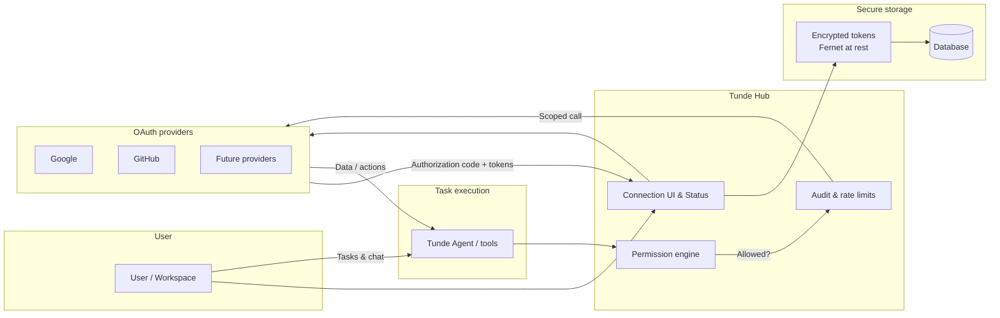
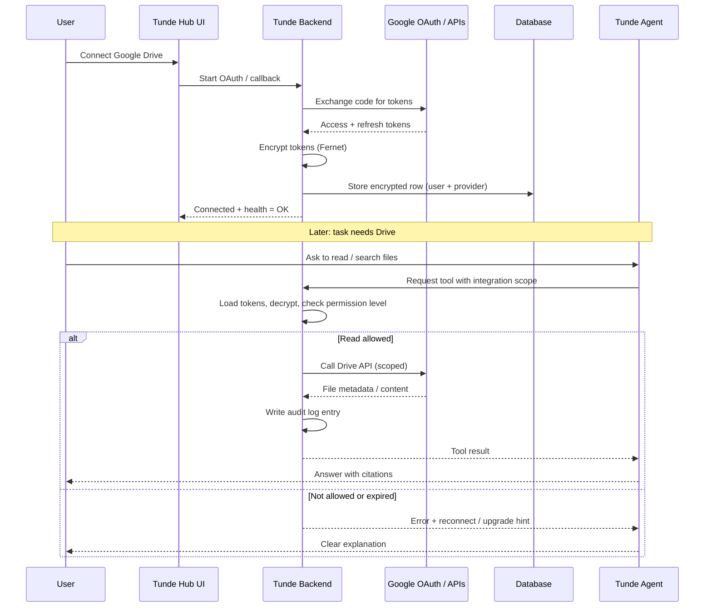

# Tunde Hub — Integration Ecosystem Overview

This document describes **Tunde Hub**: how Tunde Agent connects to the apps and services users already rely on, and how those connections stay safe, visible, and under user control.

---

## 1. Executive Summary

### What is Tunde Hub?

**Tunde Hub** is the integration layer for **Tunde Agent**. It is where users connect external accounts (for example Google Drive, Gmail, Calendar, or GitHub), manage permissions, and see whether each connection is healthy. From the product perspective, integrations appear as **memory and action sources**: the agent can read context from connected apps and, when allowed, take actions on the user’s behalf—always scoped by explicit consent and permission levels.

### Why it matters

| Audience | Benefit |
|----------|---------|
| **Individuals** | One place to link personal tools so Tunde remembers *your* files, mail, and schedule—not a generic chatbot with no context. |
| **Small businesses** | Shared workflows: drafts, documents, and handoffs stay tied to real systems the team already uses, with clear status on what is connected. |
| **Developers** | A path to **API-backed, extensible** connections and future marketplace-style integrations without rebuilding auth and storage for every provider. |

### Key differentiators vs Manus / Zapier

- **Agent-first, not automation-first:** Tunde Hub is built around **conversational task execution** and **memory** from connected sources, not only pre-defined “if this then that” chains (though automation can grow on top).
- **Connections as memory:** Integrations are framed as **what the agent is allowed to know and do**, with **read / write / auto** semantics users can understand—closer to a trusted assistant than a wiring diagram.
- **Health and transparency:** **Smart status** (last activity, new items) and **connection health** (connected, disconnected, token expired) keep users informed without digging into developer logs.
- **Zapier** excels at connecting thousands of apps with user-built Zaps; **Tunde Hub** focuses on **deep, consent-scoped** links for core productivity stacks and **agent-driven** use of those links. **Manus-style** drawers inspire the UX; Tunde Hub emphasizes **encryption, auditability, and tiered product packaging** aligned with Tunde Agent’s roadmap.

---

## 2. User Personas & Use Cases

### Individual — personal assistant, memory keeper

- Connects **Drive** (and optionally mail/calendar on higher tiers) so Tunde can summarize documents, find files, and recall “what we discussed” with real file references.
- Uses **Read Only** by default for sensitive sources; upgrades to **Read & Write** or **Auto** only when comfortable.
- Cares about **token expired** prompts and simple reconnect flows—not technical OAuth jargon.

### Small Business — team workflows

- Admins or owners map **which integrations** the workspace uses (e.g. shared drives, calendars, later: GitHub for engineering teams).
- Needs **visibility**: who connected what, last sync or activity indicators, and **audit-friendly** logs for integration actions.
- Benefits from **Business** tier breadth (more providers, future team policies) without each employee managing fragile API keys.

### Developer — custom integrations, API access

- Wants **documented flows**: OAuth, token lifecycle, permission checks before tool execution.
- Plans **future** custom connectors, webhooks, or marketplace entries; expects **rate limits** and clear extension points.
- **Enterprise** interest: dedicated SLAs, white-label Hub branding, and retention policies aligned with compliance.

---

## 3. Core Features

### Memory Connections

External apps are presented as **memory sources**: connecting an app extends what Tunde can retrieve and reason about. The UI groups integrations so users see **what feeds the agent’s context**, not a flat list of API names.

### Smart Status

For each connection, the product surfaces **signal without noise**:

- **Last activity** — when the integration was last used successfully in a task.
- **New items detected** — when applicable (e.g. new files or messages the agent can surface, subject to permissions).

This helps users trust that Hub is “alive” and decide when to reconnect or refresh access.

### Permission Levels

| Level | Meaning (user-facing) |
|-------|------------------------|
| **Read Only** | Tunde may fetch and summarize; no changes in the external system. |
| **Read & Write** | Tunde may create or update content when you ask (e.g. draft, upload), with confirmation where the product requires it. |
| **Auto** | Tunde may take allowed actions within policy as part of ongoing tasks (still bounded by provider scopes and product rules). |

Permission checks run **before** integration-backed tools run; denied actions fail clearly with an explanation, not silent no-ops.

### Connection Health

| State | Meaning |
|-------|---------|
| **Connected** | Tokens valid (or refreshable); integration available for eligible tasks. |
| **Disconnected** | User turned off the integration or revoked access; no calls until reconnected. |
| **Token Expired** | Refresh failed or session ended; user should reconnect or re-authorize. |

---

## 4. Subscription Tiers

| Tier | Integrations included | Notes |
|------|----------------------|--------|
| **Free** | **Google Drive** only | Entry point: files and folders as memory; encourages safe, read-focused workflows. |
| **Pro** | **Google Drive + Gmail + Calendar** | Full personal productivity loop: documents, email context, scheduling. |
| **Business** | **All Pro integrations + GitHub + future integrations** | Team-oriented and builder-oriented connectors; grows with the roadmap. |
| **Enterprise** | **Custom** | White-label Hub experience, negotiated **SLA**, custom retention and compliance packaging, optional dedicated support. |

*Tiers are product packaging; technical enforcement (feature flags, billing) is implemented in the application stack as the product matures.*

---

## 5. Architecture Diagram

High-level flow: identity and consent at the Hub, encrypted secrets at rest, permission gates on every execution path.

---

## 6. Data Flow Diagram

Example: user connects **Google Drive**—tokens are encrypted and stored; later the agent uses them only after permission checks.

---

## 7. Security & Compliance

### Token encryption (Fernet)

OAuth tokens are **encrypted at rest** (e.g. with **Fernet** symmetric encryption) before persistence. Raw secrets are not stored in plain text; decryption happens only in trusted backend paths that need to call provider APIs.

### Audit logs for integration actions

Every meaningful integration action (successful calls, denials, and notable failures) should be **attributable**: who, which connection, which permission level, and approximate outcome. This supports troubleshooting and organizational trust.

### GDPR / data retention

- **Data minimization:** Store only what is needed for tokens, identifiers, and operational logs.
- **Retention:** Define how long audit and telemetry are kept; **Enterprise** can negotiate stricter schedules.
- **User rights:** Disconnect flows and deletion policies should align with **erasure** requests for integration-linked data where applicable.

### Rate limiting per integration

Each provider connection is subject to **per-integration (and per-user) rate limits** to protect the platform, respect API quotas, and reduce abuse. Limits may vary by tier and provider.

---

## 8. Future Roadmap

| Initiative | Description |
|------------|-------------|
| **Custom integrations marketplace** | Third-party or partner connectors with review, discovery, and install flows inside Tunde Hub. |
| **Webhooks for real-time sync** | Push updates from external systems so Smart Status and memory stay fresh without constant polling. |
| **AI-powered automation suggestions** | Hub surfaces “you often do X with Drive + Calendar—want a saved workflow?” style hints, always opt-in. |

---

## Related documentation

- [Apps ecosystem design (Google & GitHub)](../04_integrations/apps_ecosystem_design.md) — OAuth flows, App Drawer, and `user_integrations` alignment.
- [Web backend security and compliance](../02_web_app_backend/security_and_legal_compliance.md) — broader product policies where applicable.
