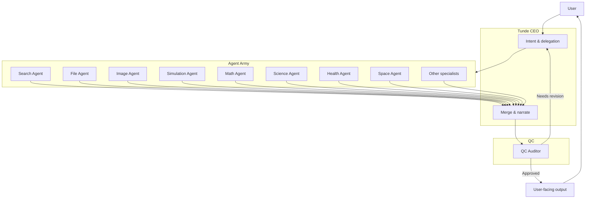
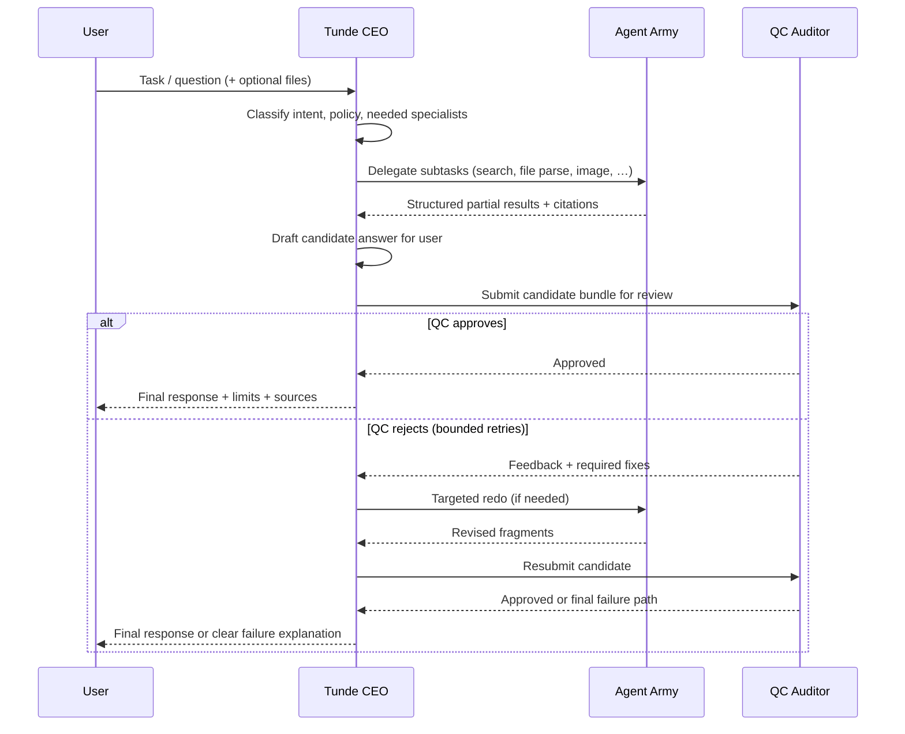

# Agent Army — Architecture Overview

This document explains **Tunde’s Agent Army**: how **Tunde CEO**, specialized **Army** members, and **QC (Quality Control)** work together to deliver accurate, traceable answers—without asking end users to manage a dozen separate bots.

For implementation detail and code maps, see [Multi-agent system (MAS)](../02_web_app_backend/multi_agent.md), [QC gateway](../02_web_app_backend/qc_gateway.md), and the [development roadmap](../05_project_roadmap/development_roadmap.md).

---

## Executive Summary

**Tunde CEO** is the single face of the product: it receives what the user says, decides what kind of work is needed, and speaks the final reply. Users should not have to pick “which model” or “which workflow” for every message—CEO handles that.

The **Agent Army** is a growing bench of **domain specialists** (search, files, images, math, science, and more). Each member has a **narrow charter** and a **limited toolbelt**. CEO delegates slices of work to them, then assembles a coherent result.

**QC** sits between raw specialist output and what the user sees. It audits candidate answers against policy and quality rules, can send work back for revision, and ensures the CEO does not “ship” unchecked material when enforcement is on.

In one line: **the user talks to one trusted executive; specialists do the homework; QC signs the release.**

---

## How it works

Step-by-step, a typical task flows like this:

1. **User → CEO** — The user sends a goal, question, or file. CEO interprets intent, risk, and which specialists might help.
2. **CEO → Army** — CEO delegates subtasks (for example: “find authoritative sources,” “parse this spreadsheet,” “draft a diagram description”). Each agent returns **scoped** results, not a full user-facing essay.
3. **Army → QC** — Specialist outputs and citations are packaged as a **candidate** response bundle for review.
4. **QC → CEO** — QC approves, rejects with feedback, or triggers a **bounded** revision loop. CEO incorporates feedback and may recall specific agents.
5. **CEO → User** — CEO delivers one clear answer: what was found, what was done, limits, and next steps—aligned with product tone and safety rules.

This loop is deliberately **visible** in the product (status steps, correlation IDs in logs) so teams can trust and debug the system.

---

## Agent Army members

| Agent name | Domain | Tools allowed (representative) | Status |
|------------|--------|--------------------------------|--------|
| **Tunde CEO** | Orchestration, intent, final voice | Delegation to Army; integration-backed tools per [Tunde Hub](../06_tunde_hub/overview.md); presentation layer | **Core — live** |
| **Search Agent** | Web research & discovery | Multilingual search, URL shortlist, page fetch, citation-grounded summaries | **Core — live** |
| **File Agent** | Documents & structured data | Uploads, parsing, tabular analysis, file context for reasoning | **Core — live** |
| **Image Agent** | Visual generation & analysis | Image tools where enabled; vision reads in research flows | **Core — live** (feature-flagged per environment) |
| **Simulation Agent** | Scenarios & “what-if” reasoning | Sandboxed replays, hypothetical stacks, stress-tests of plans (no silent production changes) | **Roadmap** |
| **Math Agent** | Quantitative rigor | Calculation, estimation checks, symbolic reasoning helpers | **Roadmap** |
| **Science Agent** | STEM synthesis | Source-led technical summaries, methods and limitations called out explicitly | **Roadmap** |
| **Health Agent** | Health & wellness information | Educational context only; **not** diagnostic or prescriptive medical advice | **Roadmap** (strict guardrails) |
| **Space Agent** | Astronomy & space missions | Research tools, mission/dataset-aware answers within scope | **Roadmap** |
| **QC Auditor** | Output governance & safety | Rule-based and (future) model-assisted audits; revision triggers; audit trail | **Core — live** (rules); **AI audit — roadmap** |

*Status reflects product direction; some specialists already overlap with shared research and analyst pipelines today—naming here is how we communicate the architecture to customers and partners.*

---

## Hierarchy: User to output

---

## One full task cycle (end-to-end)

---

## Why this architecture?

**Accuracy** — Specialists focus on what they are good at; CEO synthesizes. Narrow prompts and narrower tool lists reduce cross-domain mistakes.

**Specialization** — New domains (math, health, space, and others) join as **Army** members without rewriting the whole product. CEO’s contract stays stable for users.

**Hallucination resistance** — Search and file agents ground claims in **retrieved** material; QC adds a **second line of defense** before users see a polished answer. The roadmap moves QC from rule-based checks toward richer, auditable review—always with human oversight where the product requires it.

---

## Future agents roadmap — 25 domains planned

The long-term vision is **twenty-five domain lanes**—not twenty-five separate apps, but **twenty-five charters** the Army can draw on. Illustrative domains include:

- **Physical sciences:** Physics, Chemistry, Earth & geology, Climate & environment  
- **Life & mind:** Biology, Health & wellness (information-only), Psychology & behavior  
- **Math & computing:** Mathematics, Computer science & AI, Software & systems  
- **Built world:** Energy, Materials, Agriculture, Transportation, Manufacturing  
- **Society & markets:** Economics & finance, Business strategy, Legal & policy, Education  
- **Humanities & expression:** History, Language & linguistics, Arts & culture  
- **Frontier & security:** Space & astronomy, Cybersecurity & trust, Ethics & safety review  

Exact grouping will evolve with customer demand and safety review. CEO routing, Hub permissions, and QC gates scale together so each new domain **earns** its tools under governance.

---

## Related documentation

- [Multi-agent system (MAS)](../02_web_app_backend/multi_agent.md)  
- [QC gateway (backend enforcement)](../02_web_app_backend/qc_gateway.md)  
- [Task execution model](../02_web_app_backend/task_execution_model.md)  
- [Database schema overview (CEO / Army / QC)](../03_database_design/schema_overview.md)  
- [Development roadmap — Agent Army philosophy](../05_project_roadmap/development_roadmap.md)
