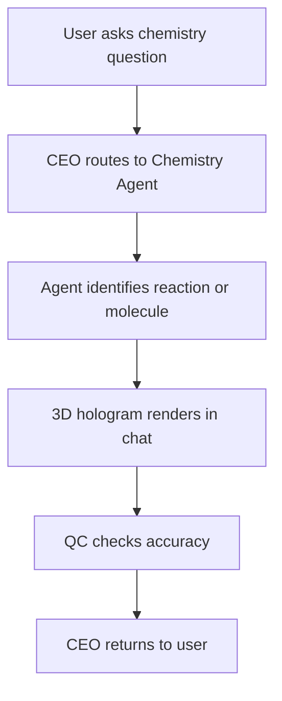

# Chemistry Agent

Detailed specification for the **Chemistry Agent** tool in Tunde Agent: purpose, capabilities (including **3D holographic molecular visualization**), I/O contract, orchestration through the Agent Army, safety rules, subscription gating, and phased delivery.

For how Chemistry Agent sits alongside other tools, see [Tools overview](./overview.md).

---

## 1. Overview

### What is Chemistry Agent?

**Chemistry Agent** is a planned Tunde specialist that routes chemistry questions to a dedicated **Chemistry Agent**. It delivers **explanations**, **balanced equations**, **stoichiometry-aware reasoning**, and—on supported tiers—**interactive 3D molecular “hologram” views** rendered in the chat canvas (implementation target: **Three.js**). It operates under **strict safety policy**: educational framing only, no dangerous synthesis instructions, no drug recipes, and prominent warnings for hazardous substances.

### Who is it for?

| Audience | Typical use |
|----------|-------------|
| **Students** | Reaction types, balancing practice, orbital/bonding intuition, periodic trends—with instructor-aligned academic integrity expectations. |
| **Chemists** | Quick stoichiometry checks, nomenclature refreshers, mechanism sketches at textbook level (not substitute for validated lab SOPs). |
| **Researchers** | Conceptual reminders and visualization of small molecules; cross-check claims against sources when Search is combined—never classified lab authorization. |

### How it fits into the Agent Army (CEO → Chemistry Agent → QC → CEO)

Chemistry Agent follows the standard **Agent Army** pattern:

1. **CEO (Tunde)** detects chemistry intent and passes a brief (equation text, molecule names, SMILES/InChI when available, tier flags for hologram).
2. **Chemistry Agent** produces structured narrative, balanced equations where applicable, and **render payloads** for 3D views when **Pro+** and QC allow.
3. **QC** enforces [§5](#5-safety-rules-important) (no dangerous instructions), factual tone, and tier gates (no hologram on Free when that rule is enforced).
4. **CEO** returns a single user-facing message with optional embedded 3D block in the chat stream.

This mirrors [Tools overview](./overview.md) (§4) and the [Agent Army overview](../07_agent_army/overview.md). It may be presented in product as a **specialist under Science** alongside the broader [Science Agent](./science_agent.md).

---

## 2. Capabilities

Capability areas below are the **product contract**; parsers, open chemistry databases, and Three.js integration are implementation details.

### Chemical reactions and stoichiometry

- Balanced equations, limiting reagent reasoning at education level, yield language with explicit assumptions (not industrial process guarantees).

### Molecular structure and bonding

- Lewis/VSEPR-style explanations, hybridization at intro/organic level, connectivity and basic stereochemistry concepts as text and (when enabled) structure→3D handoff.

### Periodic table information

- Trends (atomic radius, electronegativity, ionization) with caveats; no fabricated precise values—instrument-grade data deferred to cited sources when Search is used.

### Equation balancing

- Redox and ionic equations where rules are standard; ambiguous states (s, l, g, aq) clarified or questioned.

### Safety warnings for hazardous chemicals

- Explicit **hazard callouts** for toxic, corrosive, flammable, explosive, or heavily regulated substances; never present them as recipes to prepare in an uncontrolled setting (see [§5](#5-safety-rules-important)).

### 3D holographic molecular visualization

- **In-chat** rendering of molecules as an interactive **3D scene** (“hologram” UX): ball-and-stick or similar, element coloring, rotation—see [§6](#6-hologram-visualization).

---

## 3. Input & Output

### Input

| Mode | Description |
|------|-------------|
| **Chemical equation** | Text or LaTeX-friendly reaction line; optional conditions (heat, catalyst) as text. |
| **Molecule name** | Common or IUPAC-style names; disambiguation when synonyms collide. |
| **Reaction description** | Natural language (“what happens when…”) converted to structured reasoning by the agent. |

### Output

| Artifact | Description |
|----------|-------------|
| **Explanation** | Clear prose with steps and caveats aligned with safety rules. |
| **Balanced equation** | When applicable, normalized notation and states where known. |
| **3D hologram** | Embedded viewer block in chat (tier-gated): coordinates or structure reference → Three.js scene—see [§6](#6-hologram-visualization). |

---

## 4. Orchestration flow

Happy path including visualization and QC:

*QC may run **before** emitting the hologram block in strict modes, or review the full bundle (text + 3D metadata) depending on implementation. Bounded retries follow the same pattern as other specialists.*

---

## 5. Safety Rules (IMPORTANT)

These rules are **mandatory** for Chemistry Agent outputs and QC review:

1. **NEVER provide instructions for dangerous or explosive reactions** — including but not limited to energetic materials, improvised explosives, or amateur high-risk syntheses.
2. **NEVER provide drug synthesis methods** — including precursors lists, purification for human consumption, or evasion of controlled-substance law. Educational discussion of generic organic chemistry must not double as actionable illegal synthesis.
3. **ALWAYS flag hazardous chemicals** — corrosive, toxic, flammable, carcinogenic, or environmentally critical substances must be labeled with cautionary language appropriate to the context.
4. **Always recommend lab safety precautions** — PPE, ventilation, supervision, and compliance with local regulations when *any* lab-adjacent procedure is discussed at a high level; defer to institutional SOPs and qualified personnel for real experiments.

Cross-cutting platform safety also applies: [Tools overview](./overview.md) §7 and the Chemistry row in that document (no weaponizable or “how to harm” content).

---

## 6. Hologram Visualization

This section specifies the **intended** in-chat 3D experience for molecules (product + engineering target).

### In-chat behavior

- **3D molecules** appear as an embedded viewer **inside the conversation**; structures can **rotate slowly by default** (“floating hologram” feel) while remaining a standard web canvas, not a physical light-field display.

### Atom colors (CPK-style convention)

Typical assignments (configurable theme):

| Element | Color (convention) |
|---------|---------------------|
| **Carbon (C)** | Gray |
| **Hydrogen (H)** | White |
| **Oxygen (O)** | Red |
| **Nitrogen (N)** | Blue |
| … | Additional elements follow a consistent CPK-like palette in the stylesheet. |

Exact hex values live in frontend design tokens; accessibility (contrast) must be validated.

### Interactivity

- **User can rotate and zoom** the model (orbit controls) on supported clients; touch gestures on mobile where feasible.
- Optional: reset camera, toggle labels, simple measurement (bond length) in later phases.

### Technology

- **Three.js** is the reference stack for **3D rendering** in the web app (scene, lights, materials, controls). Geometry may be produced from **open cheminformatics** outputs (e.g., 3D coordinates from standard libraries or services) and passed to the client as **safe, validated numeric payloads**—never arbitrary executable code.

---

## 7. Subscription Tier

Gating aligns with [Tunde Hub](../06_tunde_hub/overview.md); enforcement via **feature flags** and billing.

| Tier | Chemistry Agent access |
|------|-------------------------|
| **Free** | **Basic reactions only** — explanations and balancing where enabled; **no hologram** visualization. |
| **Pro** | **Full chemistry** domain features plus **hologram visualizations** (subject to QC and safety filters). |
| **Business & Enterprise** | **All features** above plus **API access**, team quotas, audit-friendly logging, negotiated limits. |

Exact quotas are defined in operations configuration, not in this file.

---

## 8. Development Plan

Phased delivery. **Status** values are roadmap states.

| Phase | Focus | Tasks | Dependencies | Status |
|-------|--------|--------|--------------|--------|
| **Phase 1** | Core agent | Structured prompts, JSON/text contract, balancing & stoichiometry paths, CEO routing hooks, QC safety rules. | Agent Army; task lifecycle. | `not_started` |
| **Phase 2** | 3D hologram rendering | Three.js viewer component in chat; load molecular geometry from server-validated payload; default “gentle rotate” animation. | Phase 1; cheminformatics pipeline for 3D coords. | `not_started` |
| **Phase 3** | Interactive rotation / zoom | Orbit controls, mobile gestures, reset view, performance caps for large molecules. | Phase 2. | `not_started` |
| **Phase 4** | Reaction animation | Optional animated reaction steps (bond breaking/forming) for simple cases; heavy QC to avoid misleading “movie” for complex mechanisms. | Phases 1–3. | `not_started` |

---

## Related documentation

- [Tools overview](./overview.md) — full tool list, tiers, roadmap table.  
- [Science Agent](./science_agent.md) — broader STEM specialist.  
- [Agent Army overview](../07_agent_army/overview.md) — CEO / specialists / QC.  
- [Multi-agent system (MAS)](../02_web_app_backend/multi_agent.md) — implementation-oriented roles.  
- [Development roadmap](../05_project_roadmap/development_roadmap.md) — project-wide phases.
