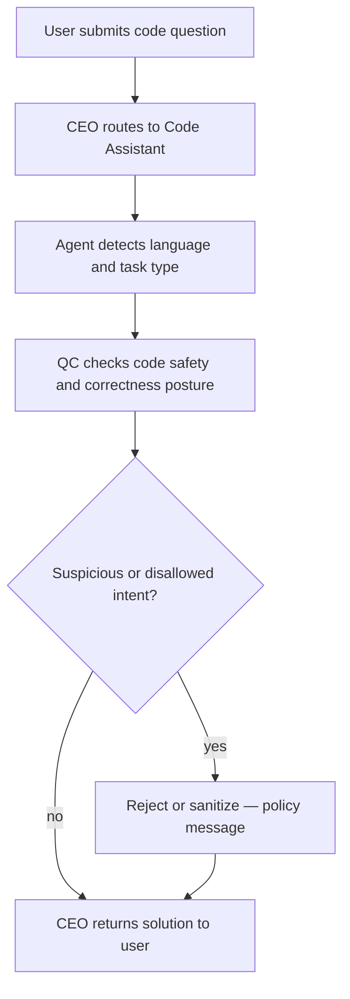

# Code Assistant

Detailed specification for the **Code Assistant** tool in Tunde Agent: purpose, capabilities, I/O contract, orchestration through the Agent Army, safety rules for trustworthy coding assistance, UI patterns (syntax highlighting, badges, copy actions), subscription gating, and phased delivery.

For how Code Assistant sits alongside other tools, see [Tools overview](./overview.md).

---

## 1. Overview

### What is Code Assistant?

**Code Assistant** is a planned Tunde specialist that routes **software development** tasks to a dedicated **Code Assistant** agent. It produces **readable code**, **explanations**, **reviews**, **debugging guidance**, and **tests**—always as **artifacts** (text / structured blocks) unless an explicitly **sandboxed** execution path exists ([§8](#8-development-plan)). It pairs with **repository or file context** when the Hub / integrations expose them, but remains **non-authoritative** for production merges until human review applies.

### Who is it for?

| Audience | Typical use |
|----------|-------------|
| **Beginner developers** | Step-by-step explanations, idioms, and comments-first answers that teach **why**, not only **what**. |
| **Students** | Homework-aligned help within academic integrity norms—concepts, pseudocode, and guided fixes rather than turnkey graded submissions unless product policy allows. |
| **Professionals** | Refactors, reviews, migration notes, test scaffolding, and complexity discussion—**not** a substitute for CI, security review, or team standards. |

### How it fits into the Agent Army (CEO → Code Assistant → QC → CEO)

Code Assistant follows the standard **Agent Army** pattern:

1. **CEO (Tunde)** detects coding intent (snippet, error log, “explain this,” refactor request) and passes a structured brief—language hint, task type, optional file/repo pointers, tier.
2. **Code Assistant** infers **language** and **task type** (write, explain, debug, review, translate, tests) and drafts outputs that respect [§5](#5-safety-rules-important).
3. **QC** validates **safety** (no malware, no exploit recipes), **policy** (secrets, harassment, stalkerware), and **basic sanity** for code-bearing responses; may request revision or block.
4. **CEO** returns a single coherent reply—optionally with syntax-highlighted blocks and metadata when the client supports them ([§6](#6-visual-design)).

This mirrors [Tools overview](./overview.md) (§4) and the [Agent Army overview](../07_agent_army/overview.md).

---

## 2. Capabilities

Capability areas below are the **product contract**; editors, sandboxes, and Git hosts are implementation details.

### Write code in any programming language

- Generate idiomatic-looking solutions when the model and policy support the language; **honest limits** when uncertain.

### Explain existing code line by line

- Structured walkthroughs: control flow, data structures, side effects, and assumptions.

### Debug and fix errors

- Interpret stack traces and compiler/linter messages; propose **minimal** fixes with rationale.

### Code review and best practices

- Style, readability, edge cases, naming, and testing gaps—framed as suggestions, not mandatory team law.

### Algorithm explanation with complexity analysis

- Big-O style discussion where appropriate; flag input assumptions ([§6](#6-visual-design) complexity badge when surfaced).

### Convert code between languages

- Faithful-ish translation with caveats about semantic differences (memory, concurrency, types).

### Generate unit tests

- Framework-aware test stubs or full tests when scope is clear; **no execution** claims without a verified runner ([§8](#8-development-plan)).

---

## 3. Input & Output

### Input

| Mode | Description |
|------|-------------|
| **Code snippets** | Pasted blocks, fenced code in chat, or excerpts from uploaded files when File Analyst / workspace allows. |
| **Error messages** | Logs, traces, CI output—structured or raw text. |
| **Programming questions** | “How do I…”, “why does this fail…”, “review this module…”. |

### Output

| Artifact | Description |
|----------|-------------|
| **Clean code** | Prefer small, focused blocks with **comments** explaining intent ([§5](#5-safety-rules-important)). |
| **Explanation** | Prose or bullets: behavior, tradeoffs, pitfalls. |
| **Complexity analysis** | Time/space notes when algorithms are discussed; optional **complexity badge** in UI ([§6](#6-visual-design)). |
| **Best-practices notes** | Security, testing, maintainability—without pretending to replace organization-specific standards. |

---

## 4. Orchestration flow

*QC may apply **bounded retry** to the specialist for fixes; correctness is **assistive**—users remain responsible for tests and deployment.*

---

## 5. Safety Rules (IMPORTANT)

These rules apply to Code Assistant outputs and QC review:

1. **Never write malicious code** — no malware, worms, ransomware, or destructive payloads framed as “help.”
2. **Never write code to hack or breach systems** — no unauthorized access, credential theft, or exploitation steps; defensive/educational framing only where policy allows.
3. **Never write code to harm privacy** — no stalkerware, spyware, or covert surveillance; no keyloggers except tightly scoped **explicitly authorized** accessibility contexts if product policy ever permits (default: refuse).
4. **Always add comments explaining what the code does** — especially for non-trivial logic; improves auditability and learner outcomes.
5. **Flag if a request seems suspicious** — escalate to refusal or sanitized educational response per platform rules.

Cross-cutting platform safety applies: [Tools overview](./overview.md) §7.

---

## 6. Visual Design

- **Syntax-highlighted code blocks** in the chat canvas (theme-aligned with Tunde dark UI).
- **Language badge** per block (e.g. Python, JavaScript, Rust)—detected or user-declared.
- **Copy button** on each primary code block for fast reuse.
- **Complexity badge** when algorithmic discussion is present (e.g. **O(n)**, **O(log n)**)—informational, not a formal proof.

---

## 7. Subscription Tier

Gating aligns with [Tunde Hub](../06_tunde_hub/overview.md); enforcement via **feature flags** and billing.

| Tier | Code Assistant access |
|------|------------------------|
| **Free** | **Basic code help**—answers scoped to roughly **up to ~50 lines** of generated/patched code per interaction as configured; shorter reviews. |
| **Pro** | **Full code assistance**—debugging depth, generated tests, richer explanations and refactors within fair-use limits. |
| **Business & Enterprise** | **All Pro-class features** plus **API access**, **private code review** workflows (team scope, audit logs), negotiated quotas. |

Exact numeric caps are defined in operations configuration, not in this file.

---

## 8. Development Plan

Phased delivery. **Status** values are roadmap states for each phase.

| Phase | Focus | Tasks | Dependencies | Status |
|-------|--------|--------|--------------|--------|
| **Phase 1** | Core code assistant | Specialist routing, prompts/schemas for write + explain, QC hooks for malware/exploit refusal. | Agent Army; task lifecycle. | `not_started` |
| **Phase 2** | Syntax highlighting in output | Render pipeline for fenced blocks, language detection, copy affordances ([§6](#6-visual-design)). | Phase 1; chat UI blocks. | `not_started` |
| **Phase 3** | Code execution *(sandboxed)* | Optional run/test in **isolated** runtime—no arbitrary unsandboxed execution of untrusted code. | Phase 1–2; infra sandbox. | `not_started` |
| **Phase 4** | GitHub integration | Review PRs / import context per OAuth and scopes; rate limits and audit. | Phase 1–3; Hub + OAuth. | `not_started` |

---

## Related documentation

- [Tools overview](./overview.md) — full tool list, tiers, and roadmap table.  
- [Agent Army overview](../07_agent_army/overview.md) — CEO / specialists / QC.  
- [Multi-agent system (MAS)](../02_web_app_backend/multi_agent.md) — implementation-oriented roles.  
- [Tunde Hub overview](../06_tunde_hub/overview.md) — integrations and tiers.  
- [Development roadmap](../05_project_roadmap/development_roadmap.md) — project-wide phases.
