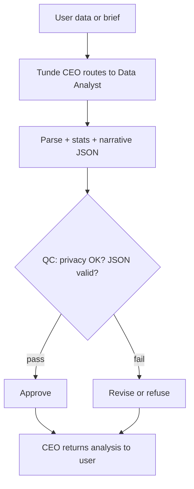

# Data Analyst

Detailed specification for the **Data Analyst** tool in Tunde Agent: **AI-powered data analysis** for individuals, businesses, and researchers—structured outputs (dataset profile, statistics, insights, narrative, alerts, quality score), orchestration through the Agent Army (CEO → Data Analyst → QC → CEO), privacy posture, UI patterns (badges, narrative callout, insight cards, alert boxes, stats table, Canvas export), subscription gating, and phased delivery.

For how Data Analyst sits alongside other tools, see [Tools overview](./overview.md).

---

## 1. Overview

### What is Data Analyst?

**Data Analyst** turns **tabular data** (pasted or uploaded as text) into a **structured analysis artifact**: **dataset name**, **row/column counts**, **column list**, **per-column summary statistics** (min, max, mean, median where applicable), **five key insights**, an **AI narrative** in plain English, **smart alerts** (outliers, skew, missingness, duplicates), a **data quality** score with notes, and a **confidence** level. Phase 1 focuses on **CSV/TSV/JSON text** in the API; the client may read small files and send their contents as text.

### Who is it for?

| Audience | Typical use |
|----------|-------------|
| **Individuals** | Quick exploration of personal spreadsheets, budgets, or hobby datasets. |
| **Businesses** | Sanity checks on exports, anomaly scanning, and narrative summaries for stakeholders. |
| **Researchers** | First-pass profiling of tabular results before deeper statistical workflows. |

### How it fits into the Agent Army (CEO → Data Analyst → QC → CEO)

1. **CEO (Tunde)** routes a data-analysis intent or user-enabled **Data Analyst** with optional dataset name.
2. **Data Analyst** parses the table, computes aggregates, and synthesizes a structured JSON artifact (insights, narrative, alerts, quality).
3. **QC** enforces **no leakage of raw sensitive values** in outward narratives where policy requires redaction; blocks disallowed content.
4. **CEO** returns the final reply; the web client renders **`data_solution`** blocks.

See [Agent Army overview](../07_agent_army/overview.md) and [Tools overview](./overview.md).

---

## 2. Capabilities

### Phase 1 (MVP — shipping target)

| Capability | Detail |
|-------------|--------|
| **File upload** | CSV, Excel (client-side read to text where applicable), JSON — surfaced as pasted/API `data` in Phase 1 HTTP contract. |
| **Paste data** | User pastes CSV/TSV or JSON array of objects directly in chat when **Data Analyst** is enabled. |
| **Summary statistics** | Per-column aggregates: min, max, mean, median for numeric-like columns; nulls and cardinality hints for text-like columns. |
| **Key insights** | Five high-signal, non-overlapping insights derived from the statistical profile. |
| **AI narrative** | One paragraph explaining what the data suggests overall. |
| **Smart alerts** | Outliers (e.g. IQR-based), missing data, duplicates, and pattern callouts. |
| **Export to Canvas** | Sends a text brief to **`POST /api/pages/generate`** to build a shareable HTML page (same stack as Research “Create”). |
| **Download** | Client download of the **source table** as a simple **CSV** file (Excel-friendly). |

### Phase 2 (in_progress)

| Capability | Detail |
|-------------|--------|
| **Interactive charts** | **Chart.js** in the chat **`data_solution`** block: **Bar**, **Line**, **Pie**, **Scatter** from structured **`chart_data`** (`suggested_chart`, `labels`, `datasets` with optional `color`). Type and color-theme controls in the UI. |
| **Post-analysis action buttons** | **Change Chart** (focus chart controls), **Deep Dive** (canned follow-up via LLM), **Show Trends** (expand trends/predictions), **Ask Follow-up** (free-form question), **Export to Canvas**, **Download** (CSV). |
| **Conversational follow-up** | **`POST /tools/data-follow-up`** accepts `question`, `original_data`, and `previous_analysis` (JSON snapshot); returns a focused **`answer`**. Results are appended on the **`data_solution`** block and persisted via **`saveToolResult`** (`data_analyst_follow_up`). |
| **Predictive trend analysis** | **`trends`**: list of detected trends with **`direction`** (`up` / `down` / `stable`) and short **`detail`**. **`predictions`**: simple extrapolations with explicit “if trend continues” guardrail language (heuristic + LLM merge). |

### Phase 3+ (roadmap)

| Capability | Detail |
|-------------|--------|
| **File picker UX** | Richer upload flows beyond paste + File Analyst. |
| **Excel-native export** | True `.xlsx` generation where product policy allows. |
| **Google Drive integration** | Pick sheets or files from Hub-backed storage (Business+). |

---

## 3. Input & Output

### Input (`POST /tools/data-analysis`)

| Field | Description |
|-------|-------------|
| **data** | Raw **CSV, TSV, or JSON** (array of objects or normalized table) — required. |
| **dataset_name** | Optional display name; defaults to a generic label if empty. |

### Output (`DataAnalysisResponse`)

| Field | Description |
|-------|-------------|
| **dataset_name** | Human-readable dataset label. |
| **row_count** | Number of rows parsed. |
| **column_count** | Number of columns. |
| **columns** | Ordered column names. |
| **summary_stats** | Map column → stats object (`dtype`, `null_count`, `min`, `max`, `mean`, `median`, etc., depending on type). |
| **key_insights** | Up to **five** ranked insights. |
| **ai_narrative** | Plain-English story of the dataset. |
| **smart_alerts** | Anomalies, outliers, or important patterns. |
| **data_quality** | `{ "score": "good" \| "fair" \| "poor", "notes": "..." }`. |
| **confidence** | `high` \| `medium` \| `low`. |
| **chart_data** | Chart.js-oriented payload: **`suggested_chart`** (`bar` \| `line` \| `pie` \| `scatter`), **`labels`**, **`datasets`** (`label`, `data`, optional **`color`**). Scatter uses **`data`** as `[{ "x", "y" }, ...]`. |
| **trends** | List of `{ "metric", "direction", "detail" }`. |
| **predictions** | List of `{ "text" }` — simple projections with disclaimers. |

### Follow-up (`POST /tools/data-follow-up`)

**Request JSON:**

| Field | Description |
|-------|-------------|
| **question** | User’s follow-up about the data (required). |
| **original_data** | Same raw table text as the original run (optional but recommended for precision). |
| **previous_analysis** | Snapshot of the prior **`DataAnalysisResponse`** / `data_solution` fields (insights, stats, chart summary, etc.). |

**Response JSON:**

| Field | Description |
|-------|-------------|
| **answer** | Focused plain-text (or light markdown) answer to the follow-up. |

---

## 4. Orchestration flow

---

## 5. Safety

1. **Never share user data** — treat uploads and pasted tables as **user confidential**; follow retention and logging policy.
2. **Always anonymize sensitive data** in outward-facing narratives — the model is fed **aggregate profiles**, not raw row dumps, in the Phase 1 pipeline.
3. **No exfiltration** — the tool must not encourage exporting secrets into public Canvas links without explicit user intent.
4. **Refuse harmful facilitation** — disallowed intents per platform policy (e.g. deanonymization attacks).
5. **Predictions are illustrative** — Phase 2 extrapolations are **not** forecasts for trading, medical, or legal decisions; copy and UI must keep that framing.

---

## 6. Visual design (chat)

- **Header row** — dataset title with **row** and **column** count badges.
- **Data quality badge** — **Good** = green, **Fair** = yellow, **Poor** = red.
- **AI narrative** — highlighted panel (teal/cyan accent).
- **Key insights** — numbered cards with icons.
- **Smart alerts** — orange warning-style callouts.
- **Summary stats** — compact table (column × metrics).
- **Chart** — below the stats table; type toggles and theme swatches.
- **Trends & predictions** — collapsible or action-revealed list with directional arrows.
- **Actions** — post-analysis buttons row; follow-up composer when **Ask Follow-up** is used.
- **Export to Canvas** / **Download** — unchanged from Phase 1 behavior.

---

## 7. Subscription tiers

| Tier | Data Analyst access |
|------|----------------------|
| **Free** | Pasted small/medium tables, bounded row counts, core narrative + stats. |
| **Pro** | Higher row limits, richer alerts, optional future charting. |
| **Business / Enterprise** | Hub-backed files, team audit (where enabled), API batch jobs on Enterprise. |

Exact limits are configured in operations, not in this file.

---

## 8. Development plan

| Phase | Focus | Tasks | Status |
|-------|--------|--------|--------|
| **Phase 1** | MVP | `POST /tools/data-analysis`, parse CSV/JSON, stats, LLM JSON, `data_solution` UI, Canvas generate hook, CSV download. | `done` |
| **Phase 2** | Charts + follow-up | `chart_data` / trends / predictions in API; Chart.js UI; action buttons; `POST /tools/data-follow-up`; `saveToolResult` for follow-ups. | `in_progress` |
| **Phase 3** | Conversational + predictive | Richer multi-turn, stronger forecasting guardrails, optional Excel export. | `not_started` |
| **Phase 4** | Hub + teams | Drive/warehouse connectors, audit, batch runs (Enterprise). | `not_started` |

---

## Related documentation

- [Tools overview](./overview.md) — roadmap and tiers.  
- [Agent Army overview](../07_agent_army/overview.md) — CEO / specialists / QC.  
- [Research Agent](./research_agent.md) — Canvas **generate** pattern reference.  
- [Development roadmap](../05_project_roadmap/development_roadmap.md) — project-wide phases.
