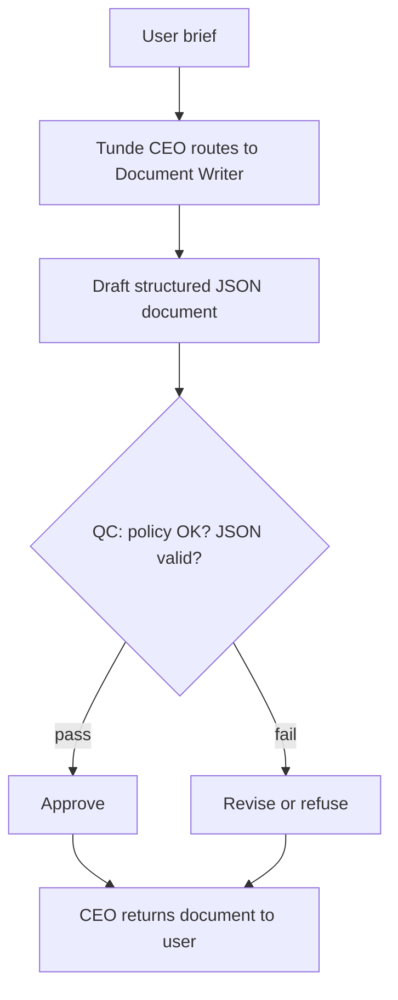

# Document Writer

Detailed specification for the **Document Writer** tool in Tunde Agent: **AI-powered professional document creation** for professionals, students, and businesses—structured outputs (`document_type`, title, body, tone, language, sections, confidence), orchestration through the Agent Army (CEO → Document Writer → QC → CEO), safety posture, UI patterns (`document_solution` blocks: badges, readable paper-style body, section pills, Canvas export), subscription gating, and phased delivery.

For how Document Writer sits alongside other tools, see [Tools overview](./overview.md).

---

## 1. Overview

### What is Document Writer?

**Document Writer** turns a **natural-language brief** into a **complete, professional document artifact**: detected **document type**, **title**, **full body text** (plain text or light markdown), **approximate word count**, **tone**, **language**, **section headings**, and a **confidence** score. Outputs are intended to be **near-ready** with minimal editing.

### Who is it for?

| Audience | Typical use |
|----------|-------------|
| **Professionals** | Reports, proposals, meeting notes, client emails, contracts (draft-level). |
| **Students** | Essays, structured assignments, study summaries formatted as formal documents. |
| **Businesses** | Consistent proposals, letters, internal memos, CV-style profiles. |

### How it fits into the Agent Army (CEO → Document Writer → QC → CEO)

1. **CEO (Tunde)** routes a writing intent or user-enabled **Document Writer** with the user’s brief.
2. **Document Writer** classifies the task and returns a structured JSON artifact (title, sections, body).
3. **QC** blocks fraudulent credentials, forged identities, disallowed legal instruments, or policy violations.
4. **CEO** returns the final reply; the web client renders **`document_solution`** blocks.

See [Agent Army overview](../07_agent_army/overview.md) and [Tools overview](./overview.md).

---

## 2. Capabilities

### Phase 1 (MVP — shipping target)

| Capability | Detail |
|------------|--------|
| **Brief → document** | User describes audience, purpose, length hints, and constraints; tool returns a full draft. |
| **Type detection** | `report`, `proposal`, `email`, `letter`, `cv`, `contract`, `meeting_notes`, `essay`, `other`. |
| **Tone control** | `formal`, `semi-formal`, `informal` surfaced as badges. |
| **Sections** | Named sections returned as a list and echoed in the UI as navigation pills. |
| **Export** | **Copy** full text, **Download .txt**, **Export to Canvas** (landing HTML generator from document context). |

### Phase 2 (roadmap)

| Capability | Detail |
|------------|--------|
| **Templates** | User-selectable corporate / academic templates; branded headers on Business+. |
| **Revision loop** | “Shorten”, “more formal”, “add risks section” without leaving chat. |
| **DOCX export** | Server-side `.docx` where product policy allows. |

---

## 3. Input & Output

### Input (`POST /tools/document`)

| Field | Description |
|-------|-------------|
| **request** | Natural-language **document brief** — purpose, audience, tone hints, length, must-include sections (required). |

### Output (`DocumentAnswerResponse`)

| Field | Description |
|-------|-------------|
| **document_type** | One of `report`, `proposal`, `email`, `letter`, `cv`, `contract`, `meeting_notes`, `essay`, `other`. |
| **title** | Document title. |
| **content** | Full document body (professional, well formatted as plain text or light markdown). |
| **word_count** | Approximate word count (validated/normalized server-side when needed). |
| **tone** | `formal` \| `semi-formal` \| `informal`. |
| **language** | Detected or stated primary language (e.g. `English`). |
| **sections** | List of main section names / headings. |
| **confidence** | `high` \| `medium` \| `low`. |

---

## 4. Orchestration flow

---

## 5. Safety

1. **No fraudulent documents** — no forged credentials, fake references, counterfeit letters, or instruments presented as officially issued.
2. **No fake identities** — do not invent notarization, seals, signatures, or government IDs.
3. **No illegal content** — refuse requests for materials that facilitate crime, impersonation, or harassment.
4. **Contracts and legal** — drafts are **informational**; users must engage qualified counsel for binding agreements.
5. **User responsibility** — the user is responsible for accuracy of facts they supply; the model must not invent specific people, companies, or authorities.

---

## 6. Visual design (chat)

- **Header** — 📝 Document Writer chip; optional confidence hint.
- **Badges** — document type, tone, word count.
- **Title** — prominent heading.
- **Body** — paper-style panel (light background, dark text) with readable typography.
- **Section pills** — horizontal chips for quick navigation within the draft.
- **Actions** — Copy Document, Export to Canvas, Download TXT.

---

## 7. Subscription tiers

| Tier | Document Writer access |
|------|-------------------------|
| **Free** | Short/medium drafts, core types, standard export. |
| **Pro** | Longer drafts, richer templates (when shipped), higher daily caps. |
| **Business / Enterprise** | Team-friendly limits, Hub-backed context (e.g. paste from Drive) on roadmap, audit on Enterprise. |

Exact limits are configured in operations, not in this file.

---

## 8. Development plan

| Phase | Focus | Tasks | Status |
|-------|--------|--------|--------|
| **Phase 1** | MVP | `POST /tools/document`, LLM JSON contract, `document_solution` UI, Copy / TXT / Canvas export, `saveToolResult` (`document_writer`). | `in_progress` |
| **Phase 2** | Templates + revise | Template picker, revision intents, optional DOCX. | `not_started` |
| **Phase 3** | Hub context | Pull approved snippets from connected Hub sources. | `not_started` |

---

## Related documentation

- [Tools overview](./overview.md) — roadmap and tiers.  
- [Agent Army overview](../07_agent_army/overview.md) — CEO / specialists / QC.  
- [Research Agent](./research_agent.md) — Canvas **generate** pattern reference.  
- [Development roadmap](../05_project_roadmap/development_roadmap.md) — project-wide phases.
