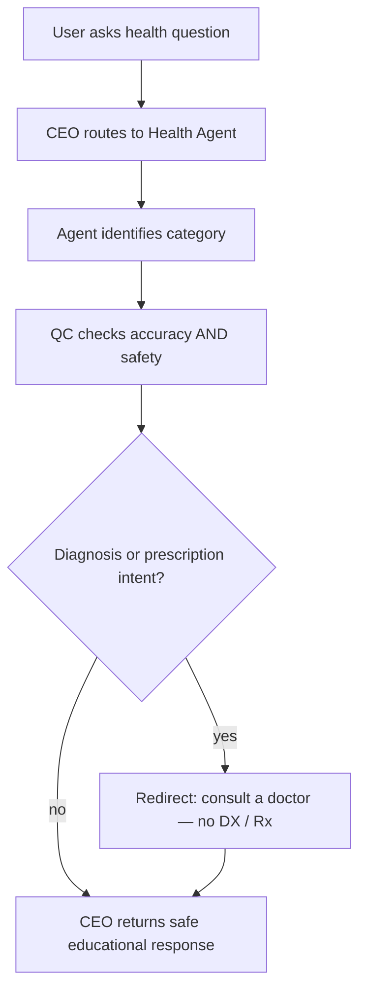

# Health Agent

Detailed specification for the **Health Agent** tool in Tunde Agent: purpose, capabilities, I/O contract, orchestration through the Agent Army, **critical** medical-safety rules, **SVG-based** visual design (no 3D hologram), subscription gating, and phased delivery.

For how Health Agent sits alongside other tools, see [Tools overview](./overview.md).

**Important:** Health Agent is **educational and informational only**. It is **not** a substitute for **professional medical advice**, diagnosis, or treatment. See [§5](#5-safety-rules-critical).

---

## 1. Overview

### What is Health Agent?

**Health Agent** is a planned Tunde specialist that routes **general health and wellness learning** questions to a dedicated **Health Agent**. It returns **structured, cautious explanations**: anatomy, how conditions are *described* in the literature, how classes of medications *work in principle*, nutrition and mental-health **awareness**—always with **clear limits** (no diagnosis, no prescriptions, no emergency triage). When the product supports it, answers may include **curated “reliable sources”** (e.g. public health pages) and **inline SVG diagrams** ( heart, lungs, brain, etc.)—**not** a Three.js hologram.

### Who is it for?

| Audience | Typical use |
|----------|-------------|
| **Patients / public** | Plain-language explanations of terms, anatomy, “what doctors might discuss”—with repeated encouragement to **see a clinician** for personal decisions. |
| **Students** | Biology-adjacent learning, terminology, systems overview—aligned with curricula as **study support**, not clinical training. |
| **Caregivers** | Context on conditions and caregiving themes; **never** individualized medical orders or substitutions for professional care. |
| **Health professionals** | Occasional **patient-education wording** drafts or analogy ideas—output remains **informational**, not authoritative for charting or prescribing. |

### How it fits into the Agent Army (CEO → Health Agent → QC → CEO)

Health Agent follows the standard **Agent Army** pattern:

1. **CEO (Tunde)** detects health-learning intent (and blocks or escalates **emergency** language per policy) and passes a structured brief—question, optional locale, tier, **never** implying a clinician relationship.
2. **Health Agent** classifies **category** (e.g. anatomy, disease literacy, nutrition, mental health awareness) and drafts an educational response following [§5](#5-safety-rules-critical).
3. **QC** applies **strict medical safety**: accuracy tone, **no diagnosis/prescription**, emergency redirects, self-harm policy, and tier scope (e.g. SVG on Pro+ when enforced).
4. **CEO** returns one coherent reply—optionally with SVG blocks and source links when orchestration enables them.

This mirrors [Tools overview](./overview.md) (§4) and the [Agent Army overview](../07_agent_army/overview.md). Personal symptom triage overlaps are explicitly **handed off** to “see a qualified professional” per [Tools overview](./overview.md) §7.

### Disclaimer (product-visible)

**Health Agent does not provide medical advice, diagnosis, or treatment.** Information is for **education only**. **Always consult a licensed healthcare professional** for symptoms, medications, or emergencies.

---

## 2. Capabilities

Capability areas below are the **product contract**; LLM routing, SVG asset library, and locale packs are implementation details.

### Human anatomy explanations

- Organ systems, structure–function at introductory level; aligned with **SVG diagrams** when available ([§6](#6-visual-design)).

### Disease and condition information

- **Educational** descriptions using established public-health framing—**not** individualized risk assessment or “you have X.”

### Symptoms overview (never diagnosis)

- **Patterns sometimes discussed** in education or triage literature—always with **“not a diagnosis”** language and **when to seek care** ([§5](#5-safety-rules-critical)).

### Medications and how they work (never prescriptions)

- **Drug classes**, mechanisms at high level, typical **roles in care** as described in consumer materials—**never** dose, brand switching, or “take this.”

### Nutrition and wellness guidance

- General dietary concepts, balanced eating patterns, hydration—**not** individualized meal plans that replace dietitian care where regulated.

### Mental health awareness

- Psychoeducation, stigma reduction, **how to find help**—with crisis-resource posture per platform policy; **no therapy-by-chat** claims.

### First aid information

- Widely taught **first-aid concepts** from reputable curricula; **always** emphasize **emergency services** for serious signs.

### Medical terminology explained simply

- Glossaries, pronunciation-friendly breakdowns, “what your doctor might mean”—still non-diagnostic.

---

## 3. Input & Output

### Input

| Mode | Description |
|------|-------------|
| **Health questions** | Natural language (“what does hypertension mean?”). |
| **Symptom descriptions** | User narratives—handled **only** as educational framing + **seek professional care**; no diagnostic closure. |
| **Medical terms** | Definitions and context; optional language/locale hints (roadmap: multilingual—see [§8](#8-development-plan)). |

### Output

| Artifact | Description |
|----------|-------------|
| **Structured explanation** | Sections or bullets with category tag, cautious language, and explicit limits. |
| **Key facts** | Short, memorable points—none framed as individualized medical fact about the user. |
| **When to see a doctor** | Prominent warning block for uncertainty, worsening symptoms, or anything resembling red flags. |
| **Reliable sources** | Links or pointers to **recognized** public-health / institutional pages when Search or curated lists are enabled—**never** fabricated URLs. |
| **SVG diagrams** *(tier / phase)* | Inline anatomical illustrations—see [§6](#6-visual-design); **no** Three.js hologram. |

---

## 4. Orchestration flow

*QC may reject or rewrite unsafe drafts; emergency phrases may short-circuit to crisis messaging per platform policy. Category labels may include anatomy / disease literacy / nutrition / mental health awareness.*

---

## 5. Safety Rules (CRITICAL)

These rules apply to Health Agent outputs and QC review:

1. **Never diagnose any condition** — no “you have,” no implied diagnosis from symptoms.
2. **Never recommend specific medications or dosages** — no drug names tied to “you should take,” no tapering, no substitutions for prescribed therapy.
3. **Never replace professional medical advice** — frame every medical-adjacent answer as **informational**; recommend **consulting a qualified clinician**.
4. **Always include “consult a doctor” (or equivalent)** where personal health decisions could arise—often in a dedicated callout.
5. **Flag emergency symptoms immediately** — chest pain, difficulty breathing, stroke signs, severe bleeding, loss of consciousness, suicidal intent: **seek emergency services / crisis lines** per locale; do not triage delays away.
6. **Never provide information that could enable self-harm** — crisis resources and policy blocks per platform rules.

Cross-cutting platform safety applies: [Tools overview](./overview.md) §7.

---

## 6. Visual Design

- **No 3D hologram** for Health Agent (contrast with [Chemistry Agent](./chemistry_agent.md) / [Space Agent](./space_agent.md)).
- **Anatomical diagrams** ship as **inline SVG** (heart, lungs, brain, digestive tract, etc.)—scalable, accessible, lightweight.
- **UI chrome:** **clean medical-style** presentation—**white / soft gray cards**, **green** accents for safety-positive actions (e.g. “consult a professional”), calm typography; consistent with dashboard canvas blocks when implemented.

---

## 7. Subscription Tier

Gating aligns with [Tunde Hub](../06_tunde_hub/overview.md); enforcement via **feature flags** and billing.

| Tier | Health Agent access |
|------|----------------------|
| **Free** | **Basic health information only**—shorter explanations; **no** full SVG packs or deepest structured sections as configured. |
| **Pro** | **Full anatomy explanations**, richer structure, **SVG anatomical diagrams** when implemented, expanded “when to see a doctor” tooling. |
| **Business & Enterprise** | **All features** above plus **API access**, team quotas, audit-friendly logging, negotiated limits. |

Exact quotas are defined in operations configuration, not in this file.

---

## 8. Development Plan

Phased delivery. **Status** values are roadmap states.

| Phase | Focus | Tasks | Dependencies | Status |
|-------|--------|--------|--------------|--------|
| **Phase 1** | Core health agent | Structured prompts, category tagging, JSON/text contract, CEO routing, QC safety rules ([§5](#5-safety-rules-critical)). | Agent Army; task lifecycle. | `not_started` |
| **Phase 2** | SVG anatomical diagrams | SVG library, chat block type, accessibility (alt text, contrast). | Phase 1; frontend canvas patterns. | `not_started` |
| **Phase 3** | Symptom checker *(educational only)* | Guided questionnaire UI—**education / “learn about possibilities”** only; **no** diagnostic output; heavy QC and legal review. | Phases 1–2; policy sign-off. | `not_started` |
| **Phase 4** | Multilingual health info | Arabic + English (minimum); locale-aware disclaimers and crisis strings. | Phases 1–3; i18n infrastructure. | `not_started` |

---

## Related documentation

- [Tools overview](./overview.md) — full tool list, tiers, and roadmap table.  
- [Science Agent](./science_agent.md) — adjacent STEM specialist; medical boundary routing.  
- [Agent Army overview](../07_agent_army/overview.md) — CEO / specialists / QC.  
- [Futuristic visuals — Year 2100](../09_design_philosophy/futuristic_visuals.md) — visual philosophy (Health uses SVG, not hologram).  
- [Development roadmap](../05_project_roadmap/development_roadmap.md) — project-wide phases.
