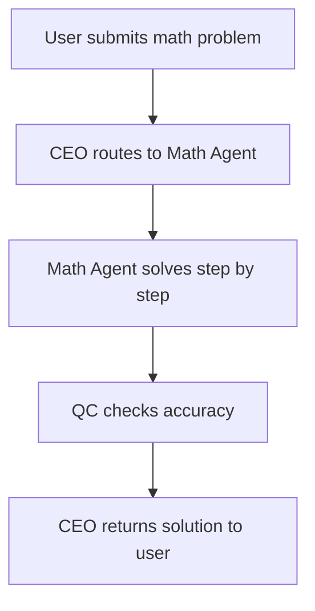

# Math Solver

Detailed specification for the **Math Solver** tool in Tunde Agent: purpose, capabilities, I/O contract, orchestration through the Agent Army, safety rules, subscription gating, and phased delivery.

For how Math Solver sits alongside other tools, see [Tools overview](./overview.md).

---

## 1. Overview

### What is Math Solver?

**Math Solver** is a planned Tunde tool that routes mathematical work to a dedicated **Math Agent**. It produces **step-by-step solutions**, **verified reasoning**, and—where appropriate—**graphs or charts** so users can follow the logic from problem statement to final answer. It is designed as a governed path in the same task lifecycle as other tools (CEO routes → specialist executes → QC reviews → CEO responds).

### Who is it for?

| Audience | Typical use |
|----------|-------------|
| **Students** | Homework support, exam prep, understanding derivations and standard procedures—without replacing instructor judgment where academic integrity policies apply. |
| **Researchers** | Quick symbolic manipulation, sanity checks on algebra, standard integrals or linear algebra routines—always with encouragement to verify in publication-critical contexts. |
| **Professionals** | Engineers, analysts, and technical staff checking calculations, translating word problems into equations, and generating illustrative plots for communication. |

### How it fits into the Agent Army (CEO → Math Agent → QC → CEO)

Math Solver is **not** a standalone calculator bolted onto chat. It follows the standard **Agent Army** pattern:

1. **CEO (Tunde)** interprets the user message, detects a math-solving intent, and hands a structured brief to the **Math Agent** (inputs, constraints, desired output format).
2. **Math Agent** performs the symbolic/numeric work, emits **full working steps** and candidate **graphs** when enabled.
3. **QC** reviews the candidate for policy, **obvious mathematical inconsistency**, and tier-appropriate scope (e.g., no calculus on Free tier when that rule is enforced).
4. **CEO** merges the approved result into a single user-facing reply, with consistent tone, citations to any external references if combined with Search, and disclaimers where needed.

This mirrors the pipeline described in [Tools overview](./overview.md) (§4) and the [Agent Army overview](../07_agent_army/overview.md).

---

## 2. Capabilities

The Math Agent is scoped to deliver the following **capability areas** (exact feature flags and symbolic engines are implementation details; this section is the product contract).

### Basic arithmetic and algebra

- Integers, rationals, reals; order of operations; fractions and percent applications.  
- Simplification, factoring, expanding, solving linear and quadratic equations, inequalities, and systems where standard methods apply.

### Calculus (derivatives, integrals)

- Differentiation rules, implicit differentiation, basic applications (e.g., extrema sketching in scope).  
- Integration techniques **as product and engine support allows** (substitution, parts, standard forms); definite and indefinite integrals with clearly stated assumptions.

### Statistics and probability

- Descriptive summaries, discrete/continuous distributions at an applied level, basic combinatorics, confidence-style language only when methodology is explicit and not presented as licensed professional advice.

### Geometry and trigonometry

- Triangles, circles, identities, polar/rectangular relationships, standard diagram-friendly problems expressed in text or from recognized image input (when image pipeline is live).

### Linear algebra (matrices, vectors)

- Operations, determinants, eigenproblems **where numerically/symbolically supported**; dimension and rank reasoning at appropriate educational depth.

### Step-by-step solution explanation

- Every user-visible solution path should include **explicit steps** aligned with [§5](#5-safety--accuracy-rules) (no undisclosed black-box jumps).

### Graph and chart generation for functions

- Plots of functions and simple relations (e.g., \(y = f(x)\)), with axis labels and domain awareness when specified; charts for data-driven requests when routed with analytics tools rather than miscategorized as pure math.

---

## 3. Input & Output

### Input

| Mode | Description |
|------|-------------|
| **Text** | Natural language word problems, LaTeX-friendly expressions, plain equations. |
| **Equations** | Inline or display math as supported by the client (e.g., pasted LaTeX, ASCII math). |
| **Images** | Photos or screenshots of problems; requires **vision + Math Agent** integration when available. Ambiguous handwriting may trigger clarification or uncertainty flags per [§5](#5-safety--accuracy-rules). |

### Output

| Artifact | Description |
|----------|-------------|
| **Step-by-step solution** | Ordered derivation or procedure, using established rules only; gaps must be disclosed, not invented. |
| **Final answer** | Clearly boxed or labeled final result (scalar, interval, simplified expression, etc.). |
| **Optional graph** | Function plot or diagram when tier and implementation allow; may be omitted if the problem does not admit a sensible plot or QC rejects low-confidence visuals. |

---

## 4. Orchestration flow

The following diagram shows the **happy path** for a math task through CEO, Math Agent, and QC.

*In production, QC may request a **bounded retry** or send **revision feedback** to the Math Agent before the CEO finalizes the reply—same pattern as other specialist tools.*

---

## 5. Safety & Accuracy Rules

These rules apply to Math Solver outputs and QC review:

1. **Always show full working steps (no black-box answers)**  
   Final numeric or symbolic answers must be reachable from stated premises via visible reasoning. If a shortcut is used, name the theorem or rule.

2. **Flag uncertainty when the problem is ambiguous**  
   Missing domain constraints, unstated units, illegible image regions, or multiple valid interpretations must be called out; prefer clarifying questions over guessing.

3. **Never fabricate formulas — use verified mathematical rules only**  
   Do not present made-up identities or citations. If a step cannot be justified, say so and stop or narrow the claim.

4. **Recommend human verification for critical calculations**  
   For safety-critical engineering, finance, medicine-adjacent dosing, legal evidence, or publishable results, explicitly recommend independent human review and suitable tools (e.g., CAS, peer review).

Cross-cutting platform safety (rate limits, logging, content policy) matches [Tools overview](./overview.md) §7.

---

## 6. Subscription Tier

Gating aligns with [Tunde Hub](../06_tunde_hub/overview.md) packaging; enforcement is via product **feature flags** and billing.

| Tier | Math Solver access |
|------|--------------------|
| **Free** | **Basic arithmetic and algebra only** (numerical and symbolic depth as configured; no calculus/statistics tier features). |
| **Pro** | **Full calculus and statistics** (within engine and policy limits), plus standard step-by-step output and graphs where available. |
| **Business & Enterprise** | **All features** described in this document, plus **API access** and team-oriented quotas, audit-friendly logging, and negotiated limits where applicable. |

Exact numeric quotas and per-request caps are defined in operations configuration, not in this file.

---

## 7. Development Plan

Phased delivery for Math Solver. **Status** values below are **roadmap** states for each phase.

| Phase | Tasks | Dependencies | Status |
|-------|--------|--------------|--------|
| **P1 — Contract & routing** | Product spec (this doc), CEO intent detection for “math solve,” payload schema (`math_problem`, `tier`, optional `image_ref`), queue integration. | Agent Army routing; existing task lifecycle; tier flags. | `not_started` |
| **P2 — Math Agent core** | Symbolic/numeric backend integration, LaTeX in/out, step formatter, error surfaces. | P1; backend environment and any CAS/API allowlist. | `not_started` |
| **P3 — QC & accuracy** | QC rules for math (consistency checks, ambiguity flags, tier enforcement), bounded retry to Math Agent. | P2; QC gateway patterns from live tools. | `not_started` |
| **P4 — Graphs** | Function plotting pipeline, export to message/canvas, axis/label sanity. | P2; image/chart infrastructure shared with Analyze or Image paths as chosen. | `not_started` |
| **P5 — Image input** | Upload/vision path for problem images, OCR + Math Agent handoff, low-confidence UX. | P2; File Analyst or dedicated vision pipeline; privacy review. | `not_started` |
| **P6 — API & Enterprise** | Business/Enterprise API surface, rate limits, audit fields, SSO/tenant scoping as per Hub. | P1–P4; billing and Hub integration. | `not_started` |

---

## Related documentation

- [Tools overview](./overview.md) — full tool list, tiers, and roadmap table.  
- [Agent Army overview](../07_agent_army/overview.md) — CEO / specialists / QC.  
- [Multi-agent system (MAS)](../02_web_app_backend/multi_agent.md) — implementation-oriented roles.  
- [Development roadmap](../05_project_roadmap/development_roadmap.md) — project-wide phases.
