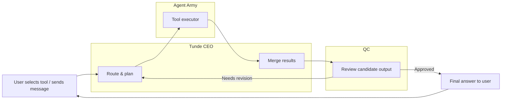
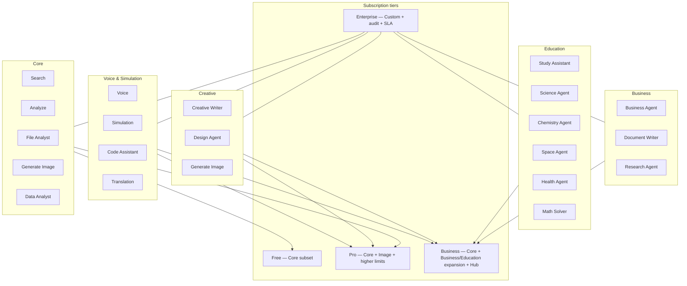

# Tunde Agent — Tools Overview

This document is the **single reference** for Tunde **tools**: what exists today, what is planned, how tools map to the **Agent Army** (CEO → specialists → QC), and how **subscription tiers** gate availability.

---

## 1. Executive Summary

### What are Tunde Tools?

**Tunde Tools** are the **capabilities** users turn on or invoke so Tunde can act beyond plain chat: live search, structured data work, file understanding, image generation, and (on the roadmap) domain specialists such as math, science, and code assistance.

Each tool has a **contract**: allowed inputs, expected outputs, safety boundaries, and which **Army member** executes the work. The **CEO (Tunde)** decides when to call tools; **QC** can block or force revision before the user sees a final answer.

### How tools connect to the Agent Army (CEO → Agent → QC)

| Stage | Role |
|-------|------|
| **CEO (Tunde)** | Interprets the user, selects tools, merges specialist results into one coherent response. |
| **Agent (Army)** | Runs the tool: search, analysis, file parsing, image generation, etc. |
| **QC** | Reviews candidate outputs against policy; approves, rejects with feedback, or triggers a bounded retry loop. |

Tools are not “side apps”—they are **governed execution paths** inside the same task lifecycle users already see in the dashboard (queued → running → QC → complete).

### Tool availability per subscription tier

*Tiers align with [Tunde Hub](../06_tunde_hub/overview.md) packaging; enforcement is product/feature-flag driven as billing matures.*

| Tier | Typical tool access |
|------|---------------------|
| **Free** | **Search** (bounded quotas), **File Analyst** (basic uploads), core chat. **Analyze** for small pasted tables where enabled. **Data Analyst** for bounded pasted CSV/JSON profiles where enabled. |
| **Pro** | Free tools + **Generate Image** (fair-use limits), richer **Analyze**, expanded **Search** quotas, optional memory-backed context. |
| **Business** | Pro + team-oriented limits, **Hub** integrations (e.g. Drive, Gmail, Calendar, GitHub) feeding tools, priority queues for heavy jobs. |
| **Enterprise** | Custom tool mix, private models or endpoints, audit exports, negotiated SLAs, optional **white-label** surfaces. |

Exact limits and flags are configured in product operations—not hard-coded in this document.

---

## 2. Current tools (already built)

Internal names in parentheses reflect backend identifiers where useful (`web_research`, `data_analysis`, `data_analyst`, `file_analyst`, `image_generation`).

### Search — Live web search

| Field | Detail |
|-------|--------|
| **Purpose** | Find **current**, source-grounded information on the public web; support comparisons and fact-seeking requests. |
| **Input** | User message (and planner-derived `search_query`); optional locale/research settings from product config. |
| **Output** | Retrieved excerpts, URLs, and synthesized text used by the CEO in the final reply (with citations as the product requires). |
| **Agent** | **Search Agent** (research stack: discovery, fetch, grounding). |
| **Status** | **Live** |

### Analyze — CSV/TSV data analysis

| Field | Detail |
|-------|--------|
| **Purpose** | Summarize and explore **tabular** data pasted in chat (CSV/TSV-style). |
| **Input** | Pasted table text or structured `data_text` from the planner; user instructions. |
| **Output** | Metrics, summaries, tables, or charts surfaced in the assistant message / blocks. |
| **Agent** | **Analyst / data path** (structured analysis; CEO presents results). |
| **Status** | **Live** |

### File Analyst — Upload and analyze files

| Field | Detail |
|-------|--------|
| **Purpose** | Ingest **uploaded files**, extract structure, and answer questions about them (including optional Data Wizard actions). |
| **Input** | File upload via API; `file_context` / `file_analyst_action` in task payload; user message. |
| **Output** | Parsed summary, previews, and analysis text; may chain with other tools when enabled. |
| **Agent** | **File Agent** (upload pipeline + analyst augmentation). |
| **Status** | **Live** |

### Generate Image — AI image generation

| Field | Detail |
|-------|--------|
| **Purpose** | Create **images** from user prompts with configurable style and aspect ratio (wizard in UI). |
| **Input** | User prompt + `image_generation` metadata (style, aspect ratio); may use prior tool output as context when orchestration allows. |
| **Output** | Image artifact(s) attached to the message / canvas flow. |
| **Agent** | **Image Agent** (generation tool path). |
| **Status** | **Live** (environment and API keys permitting) |

---

## 3. Planned tools (next phases)

Each entry follows the same pattern. **Status** here means **roadmap** unless otherwise noted.

### Math Solver

| Field | Detail |
|-------|--------|
| **Purpose** | Step-aware math: arithmetic, algebra, calculus support with explicit reasoning checks. |
| **Input** | Equations, word problems, LaTeX-friendly text, and (roadmap) uploaded images of problems. |
| **Output** | Derivation steps, final answer, sanity checks, optional graphs. |
| **Agent** | **Math Agent** |
| **Status** | **In progress** — see [Math Solver](./math_solver.md) |

### Science Agent

| Field | Detail |
|-------|--------|
| **Purpose** | Cross-disciplinary STEM explanations with domain awareness, structured output, and honest uncertainty. |
| **Input** | Text questions, topic requests, and (roadmap) uploaded documents or excerpts. |
| **Output** | Structured explanation, key concepts, real-world examples, further reading suggestions; Search-backed links when orchestration enables Search. |
| **Agent** | **Science Agent** |
| **Status** | **In progress** — see [Science Agent](./science_agent.md) |

### Chemistry Agent

| Field | Detail |
|-------|--------|
| **Purpose** | Stoichiometry, bonding, periodic context, balancing—**education** only; optional **Three.js** in-chat **3D molecular hologram** on Pro+. Never unsafe lab instructions. |
| **Input** | Chemical equations, molecule names, reaction descriptions. |
| **Output** | Explanations, balanced equations, hazard callouts; **3D hologram** (tier-gated). |
| **Agent** | **Chemistry Agent** (specialist under Science) |
| **Status** | **In progress** — see [Chemistry Agent](./chemistry_agent.md) |

### Space Agent

| Field | Detail |
|-------|--------|
| **Purpose** | Astronomy, missions, cosmology—**evidence-first** answers; optional **Three.js** in-chat **3D solar system / cosmic hologram** on Pro+. |
| **Input** | Space questions, planet/object names, astronomical events (dates where relevant). |
| **Output** | Structured explanations + optional **interactive 3D hologram** (tier-gated); outdated data flagged. |
| **Agent** | **Space Agent** |
| **Status** | **In progress** — see [Space Agent](./space_agent.md) |

### Health Agent

| Field | Detail |
|-------|--------|
| **Purpose** | **Education only**—anatomy, condition literacy, nutrition awareness, mental-health awareness; **SVG diagrams** (no 3D hologram); **never** diagnosis, prescriptions, or emergency triage. |
| **Input** | Health questions, symptom narratives (handled cautiously), medical terms; locale *(roadmap: multilingual)*. |
| **Output** | Structured explanations, key facts, **when to see a doctor**, reliable sources when enabled; QC blocks DX/Rx intent (see [Health Agent](./health_agent.md)). |
| **Agent** | **Health Agent** |
| **Status** | **In progress** — see [Health Agent](./health_agent.md) |

### Simulation

| Field | Detail |
|-------|--------|
| **Purpose** | Sandbox “what-if” scenarios, stress-tests of plans, hypothetical rollouts **without** changing real systems. |
| **Input** | Scenario description, constraints, optional numeric parameters. |
| **Output** | Scenario comparison, risks, and assumptions—clearly labeled as simulation. |
| **Agent** | **Simulation Agent** |
| **Status** | **Planned** |

### Voice

| Field | Detail |
|-------|--------|
| **Purpose** | Spoken input/output: STT → CEO pipeline → TTS, with privacy controls (local-first where promised). |
| **Input** | Audio stream or recorded utterance. |
| **Output** | Transcript + spoken reply. |
| **Agent** | **CEO + infrastructure** (voice adapter); specialists unchanged. |
| **Status** | **Planned** (see [development roadmap](../05_project_roadmap/development_roadmap.md)) |

### Code Assistant

| Field | Detail |
|-------|--------|
| **Purpose** | Write, explain, debug, review, translate, and generate tests **as text**; syntax-highlighted blocks, language/complexity badges, copy actions ([Code Assistant](./code_assistant.md)). |
| **Input** | Code snippets, error logs, programming questions; repo/file context when Hub/Git is connected. |
| **Output** | Commented code, explanations, complexity notes, best-practices—**no unsandboxed execution** of untrusted code until sandboxed runner ships. |
| **Agent** | **Code Assistant** (software specialist) |
| **Status** | **In progress** — see [Code Assistant](./code_assistant.md) |

### Translation

| Field | Detail |
|-------|--------|
| **Purpose** | Instant translation across **50+ languages** — detection, tone (`formal` / `informal` / `neutral`), transliteration, alternatives, structured chat blocks ([Translation Agent](./translation_agent.md)). |
| **Input** | Source **text**; optional **target language** hint; tier affects language breadth. |
| **Output** | Translated text, transliteration when applicable, tone/confidence, 2–3 alternatives when relevant. |
| **Agent** | **Translation Agent** (language specialist) |
| **Status** | **In progress** — see [Translation Agent](./translation_agent.md) |

### Research Agent

| Field | Detail |
|-------|--------|
| **Purpose** | Deep **academic- and web-style** synthesis: multi-source summaries, citations, credibility typing, conflicting views ([Research Agent](./research_agent.md)). |
| **Input** | Research **question** or brief (scope, comparison, angle). |
| **Output** | Topic, summary, key findings, **typed sources** with credibility, citations, debates, confidence, disclaimer. |
| **Agent** | **Research Agent** (structured specialist; Search / Hub retrieval when integrated). |
| **Status** | **In progress** — see [Research Agent](./research_agent.md) |

### Study Assistant

| Field | Detail |
|-------|--------|
| **Purpose** | Help learners **understand and memorize** any topic: summaries, study plans, key concepts, memory techniques, practice questions, and (roadmap) mind maps ([Study Assistant](./study_assistant.md)). |
| **Input** | Study **topic** or goal (notes / PDFs on roadmap). |
| **Output** | Topic, summary, concepts, plan, memory tips, practice + hints, difficulty, time estimate, confidence. |
| **Agent** | **Study Assistant** (education specialist) |
| **Status** | **In progress** — see [Study Assistant](./study_assistant.md) |

### Data Analyst

| Field | Detail |
|-------|--------|
| **Purpose** | **AI-powered data analysis** for individuals, businesses, and researchers: paste or upload-as-text **CSV/Excel/JSON**, summary statistics, five insights, narrative, smart alerts (outliers), quality score, **Chart.js** charts, trends/predictions, **follow-up Q&A** (`POST /tools/data-follow-up`), **Export to Canvas**, CSV download ([Data Analyst](./data_analyst.md)). |
| **Input** | Pasted or API-supplied **tabular text** (`data`); optional **dataset_name**; follow-up: `question` + `previous_analysis` JSON; Phase 3+ Hub files. |
| **Output** | Structured `DataAnalysisResponse` / chat **`data_solution`** blocks (narrative, insights, alerts, stats table, `chart_data`, `trends`, `predictions`, `follow_up_history`). |
| **Agent** | **Data Analyst** (Analyst path under CEO + QC). |
| **Status** | **In progress** — see [Data Analyst](./data_analyst.md) |

### Document Writer

| Field | Detail |
|-------|--------|
| **Purpose** | **AI-powered professional document creation** — reports, proposals, emails, letters, CVs, contracts, meeting notes, essays; structured chat **`document_solution`** blocks; **`POST /tools/document`**; Copy, TXT download, Canvas export ([Document Writer](./document_writer.md)). |
| **Input** | Natural-language **document brief** (`request`); tone and length hints in text. |
| **Output** | `DocumentAnswerResponse`: `document_type`, `title`, `content`, `word_count`, `tone`, `language`, `sections`, `confidence`. |
| **Agent** | **Document Writer** (CEO + writer specialist + QC). |
| **Status** | **In progress** — see [Document Writer](./document_writer.md) |

### Business Agent

| Field | Detail |
|-------|--------|
| **Purpose** | Strategy framing, market sizing language, competitive scans **with** sourcing discipline. |
| **Input** | Business question, constraints, geography. |
| **Output** | Structured business narrative; explicit uncertainty. |
| **Agent** | **Business specialist** |
| **Status** | **Planned** |

### Design Agent

| Field | Detail |
|-------|--------|
| **Name** | Design Agent |
| **Status** | ⏳ **In Development** |
| **Description** | AI-powered brand identity — colors, typography, logo & guidelines |
| **Tier** | **Business / Enterprise** |
| **Purpose** | Full brand identity package: palette, typography, SVG logo concepts, and brand guidelines in a dedicated Design Canvas—not a replacement for professional design sign-off on every launch. |
| **Input** | Wizard: business info, audience & tone, color mood & logo style; confirm & generate (see [Design Agent](./design_agent.md)). |
| **Output** | Structured brand identity + canvas review + exports (PNG, SVG, CSS variables, PDF per roadmap). |
| **Agent** | **Design Agent** (brand / visual specialist path under CEO + QC) |
| **Docs** | [Design Agent](./design_agent.md), [architecture & spec](./design_agent_spec.md) |

### Creative Writer

| Field | Detail |
|-------|--------|
| **Purpose** | Stories, scripts, marketing drafts with tone control and safety filters. |
| **Input** | Genre, characters, length, audience. |
| **Output** | Creative prose; age- and policy-appropriate. |
| **Agent** | **Creative writer specialist** |
| **Status** | **Planned** |

---

## 4. Tool flow (CEO, Agent, QC)

---

## 5. Tools by category and tier

*Diagram is illustrative: exact bundling is finalized in pricing and feature-flag tables.*

---

## 6. Tool development roadmap

| Tool name | Category | Priority | Phase | Status |
|-----------|----------|----------|-------|--------|
| Search | Core | P0 | Shipping | **done** |
| Analyze | Core | P0 | Shipping | **done** |
| File Analyst | Core | P0 | Shipping | **done** |
| Generate Image | Creative / Core | P0 | Shipping | **done** |
| QC gateway (all tools) | Core | P0 | Shipping | **done** (rules; AI audit roadmap) |
| Research Agent | Core / Business | P1 | Orchestration + Army | **in_progress** |
| Math Solver | Education | P1 | Army expansion | **in_progress** |
| Study Assistant | Education | P2 | Army expansion | **in_progress** |
| Science Agent | Education | P1 | Army expansion | **in_progress** |
| Chemistry Agent | Education | P2 | Army expansion | **in_progress** |
| Space Agent | Education | P2 | Army expansion | **in_progress** |
| Health Agent | Education | P1 | Army + policy | **in_progress** |
| Simulation | Core / Infra | P2 | Sandboxed runtime | **not_started** |
| Voice | Infra | P2 | Client + backend | **not_started** |
| Code Assistant | Business / Dev | P1 | Army + sandbox | **in_progress** |
| Translation | Core | P2 | Army | **in_progress** |
| Data Analyst | Core | P1 | Phase 2: charts + follow-up API + UI | **in_progress** |
| Document Writer | Business | P2 | MVP: HTTP + UI + persistence | **in_progress** |
| Business Agent | Business | P2 | Army | **not_started** |
| Design Agent | Creative | P3 | Army — Brand Identity Phase 1 | **in_development** |
| Creative Writer | Creative | P3 | Army + safety | **not_started** |

---

## 7. Security and safety per tool

Cross-cutting rules apply to **every** tool: no bypass of [human approval](../01_telegram_bot/human_approval_gate.md) where configured, logging with **correlation IDs**, rate limits, and content policies.

| Tool / area | Safety rule |
|-------------|-------------|
| **Health Agent** | **Always** recommend **professional medical consultation** for symptoms, diagnosis, treatment, or medications. Informational-only; no emergency triage. |
| **Chemistry Agent** | **Never** provide instructions for **dangerous, illegal, or weaponizable** syntheses; no “how to harm” content. Educational framing only. |
| **Code Assistant** | **Never** execute **malicious** or user-supplied code outside a **sandbox**; no exfiltration helpers; secrets must not be solicited. |
| **Search / Research** | Respect robots, provider ToS, and citation honesty—no fabricated sources. |
| **Study Assistant** | **No academic misconduct** encouragement; honest **confidence**; cite **types** of sources learners should use—no fabricated bibliographic detail. |
| **File Analyst** | Treat uploads as **user-sensitive**; retention and deletion per policy and tier. |
| **Data Analyst** | **Never** leak raw sensitive rows into public artifacts; prefer **aggregate** profiles for model input; user-controlled Canvas publish. |
| **Document Writer** | **No** forged credentials, counterfeit letters, fake identities, or fraudulent legal instruments; drafts are **non-binding** until reviewed by humans and counsel. |
| **Generate Image** | Block disallowed content classes; watermark or label when product requires. |

---

## Related documentation

- [Math Solver](./math_solver.md) — detailed Math Solver specification.  
- [Science Agent](./science_agent.md) — detailed Science Agent specification.  
- [Chemistry Agent](./chemistry_agent.md) — detailed Chemistry Agent specification (including 3D hologram).  
- [Space Agent](./space_agent.md) — detailed Space Agent specification (including 3D solar system hologram).  
- [Health Agent](./health_agent.md) — detailed Health Agent specification (medical safety, SVG visuals).  
- [Code Assistant](./code_assistant.md) — detailed Code Assistant specification (dev safety, UI patterns).  
- [Translation Agent](./translation_agent.md) — translation specification (safety, tiers, UI blocks).  
- [Research Agent](./research_agent.md) — research specification (citations integrity, UI blocks).  
- [Study Assistant](./study_assistant.md) — study plans, practice, integrity, UI blocks.  
- [Data Analyst](./data_analyst.md) — tabular analysis, privacy, Canvas export, phased roadmap.  
- [Document Writer](./document_writer.md) — professional documents, safety, Canvas export.  
- [Design Agent](./design_agent.md) — brand identity wizard, canvas, exports, tiers.  
- [Agent Army overview](../07_agent_army/overview.md) — CEO / Army / QC narrative.  
- [Multi-agent system (MAS)](../02_web_app_backend/multi_agent.md) — code-level roles and routing.  
- [Tunde Hub overview](../06_tunde_hub/overview.md) — integrations and tiers.  
- [Workspace tools (frontend)](../03_web_app_frontend/workspace_tools_and_landing.md) — UI behaviors for file, image, canvas.  
- [Development roadmap](../05_project_roadmap/development_roadmap.md) — phased delivery.
