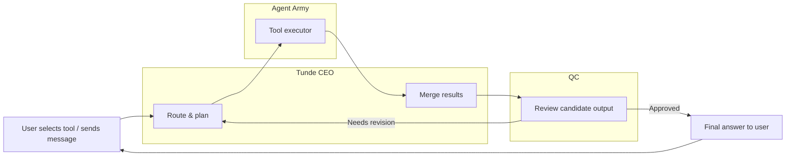
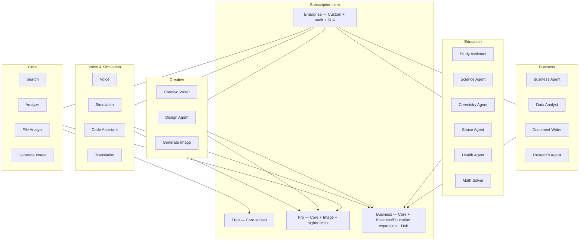

# Tunde Agent — Tools Overview

This document is the **single reference** for Tunde **tools**: what exists today, what is planned, how tools map to the **Agent Army** (CEO → specialists → QC), and how **subscription tiers** gate availability.

---

## 1. Executive Summary

### What are Tunde Tools?

**Tunde Tools** are the **capabilities** users turn on or invoke so Tunde can act beyond plain chat: live search, structured data work, file understanding, image generation, and (on the roadmap) domain specialists such as math, science, and code assistance.

Each tool has a **contract**: allowed inputs, expected outputs, safety boundaries, and which **Army member** executes the work. The **CEO (Tunde)** decides when to call tools; **QC** can block or force revision before the user sees a final answer.

### How tools connect to the Agent Army (CEO → Agent → QC)

| Stage | Role |
|-------|------|
| **CEO (Tunde)** | Interprets the user, selects tools, merges specialist results into one coherent response. |
| **Agent (Army)** | Runs the tool: search, analysis, file parsing, image generation, etc. |
| **QC** | Reviews candidate outputs against policy; approves, rejects with feedback, or triggers a bounded retry loop. |

Tools are not “side apps”—they are **governed execution paths** inside the same task lifecycle users already see in the dashboard (queued → running → QC → complete).

### Tool availability per subscription tier

*Tiers align with [Tunde Hub](../06_tunde_hub/overview.md) packaging; enforcement is product/feature-flag driven as billing matures.*

| Tier | Typical tool access |
|------|---------------------|
| **Free** | **Search** (bounded quotas), **File Analyst** (basic uploads), core chat. **Analyze** for small pasted tables where enabled. |
| **Pro** | Free tools + **Generate Image** (fair-use limits), richer **Analyze**, expanded **Search** quotas, optional memory-backed context. |
| **Business** | Pro + team-oriented limits, **Hub** integrations (e.g. Drive, Gmail, Calendar, GitHub) feeding tools, priority queues for heavy jobs. |
| **Enterprise** | Custom tool mix, private models or endpoints, audit exports, negotiated SLAs, optional **white-label** surfaces. |

Exact limits and flags are configured in product operations—not hard-coded in this document.

---

## 2. Current tools (already built)

Internal names in parentheses reflect backend identifiers where useful (`web_research`, `data_analysis`, `file_analyst`, `image_generation`).

### Search — Live web search

| Field | Detail |
|-------|--------|
| **Purpose** | Find **current**, source-grounded information on the public web; support comparisons and fact-seeking requests. |
| **Input** | User message (and planner-derived `search_query`); optional locale/research settings from product config. |
| **Output** | Retrieved excerpts, URLs, and synthesized text used by the CEO in the final reply (with citations as the product requires). |
| **Agent** | **Search Agent** (research stack: discovery, fetch, grounding). |
| **Status** | **Live** |

### Analyze — CSV/TSV data analysis

| Field | Detail |
|-------|--------|
| **Purpose** | Summarize and explore **tabular** data pasted in chat (CSV/TSV-style). |
| **Input** | Pasted table text or structured `data_text` from the planner; user instructions. |
| **Output** | Metrics, summaries, tables, or charts surfaced in the assistant message / blocks. |
| **Agent** | **Analyst / data path** (structured analysis; CEO presents results). |
| **Status** | **Live** |

### File Analyst — Upload and analyze files

| Field | Detail |
|-------|--------|
| **Purpose** | Ingest **uploaded files**, extract structure, and answer questions about them (including optional Data Wizard actions). |
| **Input** | File upload via API; `file_context` / `file_analyst_action` in task payload; user message. |
| **Output** | Parsed summary, previews, and analysis text; may chain with other tools when enabled. |
| **Agent** | **File Agent** (upload pipeline + analyst augmentation). |
| **Status** | **Live** |

### Generate Image — AI image generation

| Field | Detail |
|-------|--------|
| **Purpose** | Create **images** from user prompts with configurable style and aspect ratio (wizard in UI). |
| **Input** | User prompt + `image_generation` metadata (style, aspect ratio); may use prior tool output as context when orchestration allows. |
| **Output** | Image artifact(s) attached to the message / canvas flow. |
| **Agent** | **Image Agent** (generation tool path). |
| **Status** | **Live** (environment and API keys permitting) |

---

## 3. Planned tools (next phases)

Each entry follows the same pattern. **Status** here means **roadmap** unless otherwise noted.

### Math Solver

| Field | Detail |
|-------|--------|
| **Purpose** | Step-aware math: arithmetic, algebra, calculus support with explicit reasoning checks. |
| **Input** | Equations, word problems, or LaTeX-friendly text. |
| **Output** | Derivation steps, final answer, sanity checks. |
| **Agent** | **Math Agent** |
| **Status** | **Planned** |

### Science Agent

| Field | Detail |
|-------|--------|
| **Purpose** | Cross-disciplinary STEM explanations with source discipline and limitations. |
| **Input** | Questions, figures (future), or pasted excerpts. |
| **Output** | Structured scientific narrative; citations when search is combined. |
| **Agent** | **Science Agent** |
| **Status** | **Planned** |

### Chemistry Agent

| Field | Detail |
|-------|--------|
| **Purpose** | Stoichiometry, properties, lab **education**-level concepts—never unsafe lab instructions. |
| **Input** | Chemistry questions, formulas, context. |
| **Output** | Explanations, balanced equations (where appropriate), safety-forward disclaimers. |
| **Agent** | **Chemistry Agent** (specialist under Science) |
| **Status** | **Planned** |

### Space Agent

| Field | Detail |
|-------|--------|
| **Purpose** | Astronomy, missions, orbital concepts, public dataset-aware answers. |
| **Input** | Questions, optional dates or mission names. |
| **Output** | Accurate, dated context where relevant; limits clearly stated. |
| **Agent** | **Space Agent** |
| **Status** | **Planned** |

### Health Agent

| Field | Detail |
|-------|--------|
| **Purpose** | **General wellness and education only**—not diagnosis or treatment planning. |
| **Input** | User questions; locale and language. |
| **Output** | Informational summaries; always steer to professionals for medical decisions (see §7). |
| **Agent** | **Health Agent** |
| **Status** | **Planned** |

### Simulation

| Field | Detail |
|-------|--------|
| **Purpose** | Sandbox “what-if” scenarios, stress-tests of plans, hypothetical rollouts **without** changing real systems. |
| **Input** | Scenario description, constraints, optional numeric parameters. |
| **Output** | Scenario comparison, risks, and assumptions—clearly labeled as simulation. |
| **Agent** | **Simulation Agent** |
| **Status** | **Planned** |

### Voice

| Field | Detail |
|-------|--------|
| **Purpose** | Spoken input/output: STT → CEO pipeline → TTS, with privacy controls (local-first where promised). |
| **Input** | Audio stream or recorded utterance. |
| **Output** | Transcript + spoken reply. |
| **Agent** | **CEO + infrastructure** (voice adapter); specialists unchanged. |
| **Status** | **Planned** (see [development roadmap](../05_project_roadmap/development_roadmap.md)) |

### Code Assistant

| Field | Detail |
|-------|--------|
| **Purpose** | Read, explain, refactor, and generate code **as text**; pair with repo context when Hub/Git is connected. |
| **Input** | Snippets, file paths, natural-language specs. |
| **Output** | Patches, explanations, tests suggestions—**no unsandboxed execution** of untrusted code. |
| **Agent** | **Code / Software specialist** (charter TBD) |
| **Status** | **Planned** |

### Translation

| Field | Detail |
|-------|--------|
| **Purpose** | High-quality translation and localization notes between languages. |
| **Input** | Source text, target locale, tone hints. |
| **Output** | Translated text, glossary notes where useful. |
| **Agent** | **Language specialist** |
| **Status** | **Planned** |

### Research Agent

| Field | Detail |
|-------|--------|
| **Purpose** | Deep, multi-step research missions (beyond a single search call): plans, synthesis, verification loops. |
| **Input** | Research brief, scope, output format. |
| **Output** | Long-form report artifacts, briefs, or structured JSON for downstream UI. |
| **Agent** | **Research / Analyst stack** (extends today’s search + analyst paths) |
| **Status** | **Partially live** (Telegram/research orchestration); **full product parity planned** |

### Study Assistant

| Field | Detail |
|-------|--------|
| **Purpose** | Flashcards, quizzes, spaced-repetition-friendly summaries from user material. |
| **Input** | Notes, PDFs (future), or topic requests. |
| **Output** | Study plans, Q&A, weak-area highlights. |
| **Agent** | **Education specialist** |
| **Status** | **Planned** |

### Data Analyst

| Field | Detail |
|-------|--------|
| **Purpose** | Advanced analytics: joins, forecasts, dashboards—beyond paste-only CSV. |
| **Input** | Connected spreadsheets, exports, or warehouse snapshots (Enterprise-oriented). |
| **Output** | Narrative + charts + metric definitions. |
| **Agent** | **Analyst Agent** (extended) |
| **Status** | **Planned** |

### Document Writer

| Field | Detail |
|-------|--------|
| **Purpose** | Long-form documents: memos, specs, proposals with outline → draft → revision. |
| **Input** | Brief, tone, template hints. |
| **Output** | Structured Markdown/DOCX-ready content. |
| **Agent** | **CEO + writer specialist** |
| **Status** | **Planned** |

### Business Agent

| Field | Detail |
|-------|--------|
| **Purpose** | Strategy framing, market sizing language, competitive scans **with** sourcing discipline. |
| **Input** | Business question, constraints, geography. |
| **Output** | Structured business narrative; explicit uncertainty. |
| **Agent** | **Business specialist** |
| **Status** | **Planned** |

### Design Agent

| Field | Detail |
|-------|--------|
| **Purpose** | UX copy, design briefs, component descriptions—not a replacement for professional design sign-off. |
| **Input** | Product context, audience, constraints. |
| **Output** | Briefs, wireframe language, accessibility reminders. |
| **Agent** | **Design / UI specialist** |
| **Status** | **Planned** |

### Creative Writer

| Field | Detail |
|-------|--------|
| **Purpose** | Stories, scripts, marketing drafts with tone control and safety filters. |
| **Input** | Genre, characters, length, audience. |
| **Output** | Creative prose; age- and policy-appropriate. |
| **Agent** | **Creative writer specialist** |
| **Status** | **Planned** |

---

## 4. Tool flow (CEO, Agent, QC)

---

## 5. Tools by category and tier

*Diagram is illustrative: exact bundling is finalized in pricing and feature-flag tables.*

---

## 6. Tool development roadmap

| Tool name | Category | Priority | Phase | Status |
|-----------|----------|----------|-------|--------|
| Search | Core | P0 | Shipping | **done** |
| Analyze | Core | P0 | Shipping | **done** |
| File Analyst | Core | P0 | Shipping | **done** |
| Generate Image | Creative / Core | P0 | Shipping | **done** |
| QC gateway (all tools) | Core | P0 | Shipping | **done** (rules; AI audit roadmap) |
| Research Agent | Business | P1 | Orchestration | **in_progress** (parity across surfaces) |
| Math Solver | Education | P1 | Army expansion | **not_started** |
| Study Assistant | Education | P2 | Army expansion | **not_started** |
| Science Agent | Education | P1 | Army expansion | **not_started** |
| Chemistry Agent | Education | P2 | Army expansion | **not_started** |
| Space Agent | Education | P2 | Army expansion | **not_started** |
| Health Agent | Education | P1 | Army + policy | **not_started** |
| Simulation | Core / Infra | P2 | Sandboxed runtime | **not_started** |
| Voice | Infra | P2 | Client + backend | **not_started** |
| Code Assistant | Business / Dev | P1 | Army + sandbox | **not_started** |
| Translation | Core | P2 | Army | **not_started** |
| Data Analyst | Business | P2 | Hub + models | **not_started** |
| Document Writer | Business | P2 | Army | **not_started** |
| Business Agent | Business | P2 | Army | **not_started** |
| Design Agent | Creative | P3 | Army | **not_started** |
| Creative Writer | Creative | P3 | Army + safety | **not_started** |

---

## 7. Security and safety per tool

Cross-cutting rules apply to **every** tool: no bypass of [human approval](../01_telegram_bot/human_approval_gate.md) where configured, logging with **correlation IDs**, rate limits, and content policies.

| Tool / area | Safety rule |
|-------------|-------------|
| **Health Agent** | **Always** recommend **professional medical consultation** for symptoms, diagnosis, treatment, or medications. Informational-only; no emergency triage. |
| **Chemistry Agent** | **Never** provide instructions for **dangerous, illegal, or weaponizable** syntheses; no “how to harm” content. Educational framing only. |
| **Code Assistant** | **Never** execute **malicious** or user-supplied code outside a **sandbox**; no exfiltration helpers; secrets must not be solicited. |
| **Search / Research** | Respect robots, provider ToS, and citation honesty—no fabricated sources. |
| **File Analyst** | Treat uploads as **user-sensitive**; retention and deletion per policy and tier. |
| **Generate Image** | Block disallowed content classes; watermark or label when product requires. |

---

## Related documentation

- [Agent Army overview](../07_agent_army/overview.md) — CEO / Army / QC narrative.  
- [Multi-agent system (MAS)](../02_web_app_backend/multi_agent.md) — code-level roles and routing.  
- [Tunde Hub overview](../06_tunde_hub/overview.md) — integrations and tiers.  
- [Workspace tools (frontend)](../03_web_app_frontend/workspace_tools_and_landing.md) — UI behaviors for file, image, canvas.  
- [Development roadmap](../05_project_roadmap/development_roadmap.md) — phased delivery.
