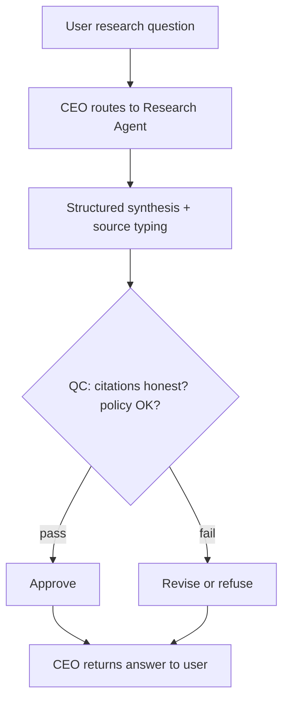

# Research Agent

Detailed specification for the **Research Agent** tool in Tunde Agent: **deep academic-style and web-grounded synthesis**, structured outputs (topic, findings, sources, citations, debates), orchestration through the Agent Army (CEO → Research Agent → QC → CEO), citation integrity rules, UI patterns (citation cards, credibility badges), subscription gating, and phased delivery.

For how Research Agent sits alongside other tools, see [Tools overview](./overview.md).

---

## 1. Overview

### What is Research Agent?

**Research Agent** produces **structured research answers** from a user topic or brief: a **detected topic label**, **comprehensive summary**, **key findings**, **typed sources** with **credibility** tiers, **formatted citations**, **conflicting viewpoints**, **confidence**, and a fixed **disclaimer** reminding users that outputs are AI-assisted and must be verified against primary sources ([§5](#5-safety-rules)). When live **Search** or library integrations are wired, retrieval augments synthesis; until then, responses must **never fabricate** bibliographic detail ([§5](#5-safety-rules)).

### Who is it for?

| Audience | Typical use |
|----------|-------------|
| **Students** | Literature-style summaries, comparison of positions, citation lists to chase in the library or database. |
| **Researchers & analysts** | Quick landscape views, hypothesis framing, **explicit uncertainty** and debate mapping—not a substitute for reading originals. |
| **Professionals** | Briefings with source typing (official, news, academic) and credibility cues for internal triage before publication or decisions. |

### How it fits into the Agent Army (CEO → Research Agent → QC → CEO)

1. **CEO (Tunde)** routes a research-intent message or user-enabled **Research Agent** with optional scope and tier context.
2. **Research Agent** synthesizes a structured JSON artifact: summary, findings, sources, citations, conflicts, confidence.
3. **QC** enforces **no fabricated citations**, blocks harmful research requests, and surfaces uncertainty.
4. **CEO** returns the final reply; the web client may render **[§6](#6-visual-design)** blocks.

See [Agent Army overview](../07_agent_army/overview.md) and [Tools overview](./overview.md).

---

## 2. Capabilities

### Multi-source research

Blends perspectives from **academic**, **official**, **reputable news**, and general **web**-style sources—labeled by **type** and **credibility**, not as proof of live retrieval unless the stack confirms it.

### Academic papers (conceptual)

Frames questions in ways that map to **journal-style** and **preprint** discourse; **future** phases attach real DOI/PDF pipelines when integrations exist ([§8](#8-development-plan)).

### Fact checking & verification posture

Surfaces **what is contested**, **confidence** level, and **conflicting views** rather than false certainty.

### Citations & summarization

**Formatted citation strings** for bibliography follow-up; **summary** and **key findings** for fast reading.

### Comparative analysis

**Conflicting views** captures opposing schools or interpretations when the topic warrants it.

---

## 3. Input & Output

### Input

| Field | Description |
|-------|-------------|
| **question** | Research topic or brief (required)—may include scope, date range, or “compare A vs B.” |

### Output

| Field | Description |
|-------|-------------|
| **topic** | Short label for the research theme. |
| **summary** | Comprehensive narrative summary. |
| **key_findings** | Ordered list of main findings. |
| **sources** | Items with **title**, **type** (`academic` \| `news` \| `official` \| `web`), **credibility** (`high` \| `medium` \| `low`). |
| **citations** | Strings in a consistent academic-friendly format. |
| **conflicting_views** | Opposing or debated positions, if any. |
| **confidence** | `high` \| `medium` \| `low`. |
| **disclaimer** | e.g. *Research is based on AI knowledge. Always verify with primary sources.* |

---

## 4. Orchestration flow

---

## 5. Safety Rules

1. **Never fabricate citations** — no invented DOIs, URLs, titles, authors, or journal names.
2. **Verify sources when live tools exist** — when Search or library APIs are enabled, anchors should be **grounded**; otherwise clearly **flag** unverified claims and keep confidence honest.
3. **Flag uncertainty** — disputed areas go to **conflicting_views**; **confidence** reflects epistemic state.
4. **Refuse harmful research facilitation** — weapons, illicit activity, harassment, or other disallowed intents per platform policy.

---

## 6. Visual Design

- **Citation / source cards** — one card per source with **title**, **type** badge, **credibility** badge (**High** = green, **Medium** = yellow, **Low** = red).
- **Research summary layout** — large **topic** heading, **summary** body, numbered **key findings**.
- **Citations** — dedicated list in **academic-style** formatted strings (monospace-friendly).
- **Conflicting views** — **orange** callout when non-empty.
- **Disclaimer** — muted footer strip.

---

## 7. Subscription tiers

| Tier | Research Agent access |
|------|------------------------|
| **Free** | Basic topic summaries and limited source cards; tighter length quotas. |
| **Pro** | Fuller structured outputs, richer **comparative** sections, higher fair-use limits. |
| **Business / Enterprise** | **API access**, team audit (where enabled), Hub-backed retrieval when integrated. |

Exact limits are configured in operations, not in this file.

---

## 8. Development plan

| Phase | Focus | Tasks | Status |
|-------|--------|--------|--------|
| **Phase 1** | Structured LLM JSON + API | `POST /tools/research`, schema, QC-friendly prompt, disclaimer. | `in_progress` |
| **Phase 2** | Chat UI | `research_solution` blocks, cards, credibility colors, conflicting-views box. | `in_progress` |
| **Phase 3** | Live grounding | Wire **Search** + optional academic index; real URL/DOI validation. | `not_started` |
| **Phase 4** | Teams & API | Rate limits, audit exports, batch research jobs (Enterprise path). | `not_started` |

---

## Related documentation

- [Tools overview](./overview.md) — roadmap and tiers.  
- [Agent Army overview](../07_agent_army/overview.md) — CEO / specialists / QC.  
- [Development roadmap](../05_project_roadmap/development_roadmap.md) — project-wide phases.
