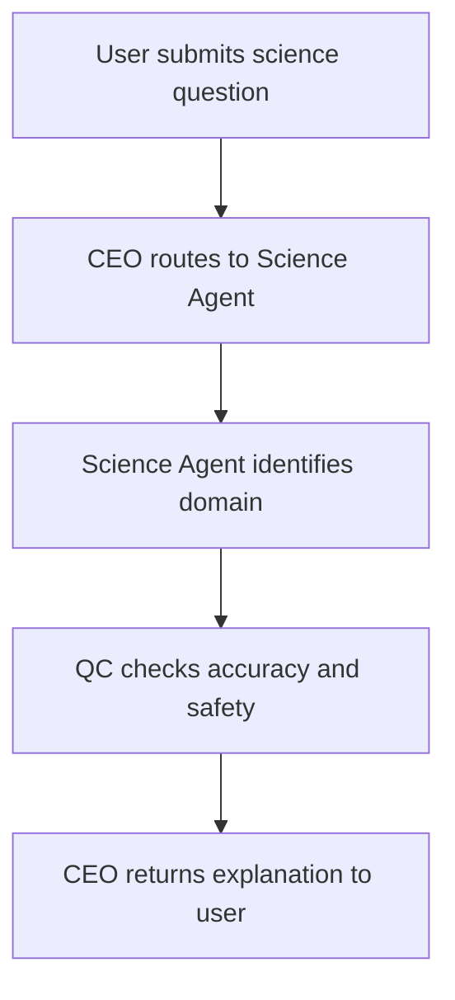

# Science Agent

Detailed specification for the **Science Agent** tool in Tunde Agent: purpose, capabilities, I/O contract, orchestration through the Agent Army, safety rules, subscription gating, and phased delivery.

For how Science Agent sits alongside other tools, see [Tools overview](./overview.md).

---

## 1. Overview

### What is Science Agent?

**Science Agent** is a planned Tunde tool that routes cross-disciplinary science questions to a dedicated **Science Agent**. It produces **structured explanations**, **domain-aware framing** (physics, biology, earth science, and related fields), and **honest uncertainty** when evidence is incomplete or contested. It may combine with **Search** or document context when the product enables retrieval, but core answers must rest on **well-established principles**—never invented facts.

### Who is it for?

| Audience | Typical use |
|----------|-------------|
| **Students** | Clear explanations of concepts, exam-oriented summaries, and intuition-building analogies—supplementing, not replacing, curricula and instructor guidance. |
| **Teachers** | Draft explanations, analogy ideas, and discussion prompts with explicit limits and optional alignment notes (local standards remain the user’s responsibility). |
| **Researchers** | High-level refresher language, cross-domain pointers, and caveats for areas outside the user’s specialty—**not** a substitute for primary literature review. |
| **Curious minds** | Accessible narratives, real-world hooks, and pointers to learn more without overselling certainty. |

### How it fits into the Agent Army (CEO → Science Agent → QC → CEO)

Science Agent follows the standard **Agent Army** pattern:

1. **CEO (Tunde)** interprets the user message, detects science-learning intent, and passes a structured brief to the **Science Agent** (question, optional attachments, tier, desired depth).
2. **Science Agent** drafts an explanation with identified **domain**, **key concepts**, and **examples**, respecting [§5](#5-safety--accuracy-rules).
3. **QC** reviews for factual tone (no fabrication), safety (no harmful instructions), medical boundaries, and tier scope.
4. **CEO** delivers a single coherent reply—optionally merging Search snippets or file summaries when orchestration enables them—with consistent disclaimers where needed.

This mirrors the pipeline described in [Tools overview](./overview.md) (§4) and the [Agent Army overview](../07_agent_army/overview.md).

---

## 2. Capabilities

The Science Agent is scoped to deliver the following **capability areas** (exact retrieval stack and models are implementation details; this section is the product contract).

### Physics: mechanics, thermodynamics, electromagnetism, quantum

- Classical mechanics, energy, waves, and circuits at undergraduate intro level unless the user requests depth and tier allows.  
- Thermodynamics and EM concepts with explicit assumptions and units.  
- Quantum ideas at conceptual level with clear **“introductory / not a substitute for formal QM”** boundaries when appropriate.

### Biology: cells, genetics, evolution, human body

- Cell biology, genetics, evolution, and organismal topics framed for education.  
- Human-related content stays **informational**; see [§5](#5-safety--accuracy-rules) for medical boundaries and cross-link to **Health Agent** when the product routes personal health queries.

### Earth Science: geology, weather, climate

- Geologic processes, weather vs climate literacy, and well-established climate science communication—without political advocacy; distinguish **models vs observations** where relevant.

### Scientific method explanation

- Hypotheses, experiments, controls, reproducibility, and how evidence accumulates—suited for classroom-style clarity.

### Experiment design guidance

- **Educational** suggestions only: variables, controls, measurement ideas, and safety-conscious framing—**no** procedures that could enable harm, illegal activity, or unsupervised dangerous lab work.

### Real-world examples and analogies

- Everyday analogies and illustrations, clearly labeled as intuition helpers, not rigorous proofs.

### Citation of scientific principles (no fabrication)

- References to named laws, standard models, or textbook frameworks when appropriate.  
- **No** fake studies, fake authors, or invented numerical claims; when combined with Search, citations must trace to real sources per product rules.

---

## 3. Input & Output

### Input

| Mode | Description |
|------|-------------|
| **Text** | Natural-language questions, topic prompts, level hints (e.g., “high school”). |
| **Topic requests** | “Explain X in the context of Y,” compare concepts, or request structured study notes. |
| **Uploaded documents** | PDFs or notes via **File Analyst** or future direct handoff; extractions must be attributed to user-provided material, not presumed external papers. |

### Output

| Artifact | Description |
|----------|-------------|
| **Structured explanation** | Sections or bullets aligned to product schema (intro → concepts → implications), with **domain** identified up front when useful. |
| **Key concepts** | Definitions and relationships the learner should remember; jargon briefly glossed. |
| **Real-world examples** | Short, concrete instances or analogies; uncertainty flagged where analogies break down. |
| **Further reading suggestions** | Textbook-style pointers, public-course themes, or **Search-backed** links when the orchestration stack provides verified URLs—never invented references. |

---

## 4. Orchestration flow

The following diagram shows the **happy path** for a science task through CEO, Science Agent, and QC.

*Domain identification may emit explicit labels (e.g., physics / biology / earth) for QC and UI badges when the product surfaces them. QC may request a **bounded retry** or revision feedback before the CEO finalizes—same pattern as other specialist tools.*

---

## 5. Safety & Accuracy Rules

These rules apply to Science Agent outputs and QC review:

1. **Never fabricate scientific facts**  
   Do not invent paper titles, data, or institutional claims. If unsure, say so and narrow the answer.

2. **Always distinguish theory vs proven fact**  
   Label hypotheses, models, and contested areas clearly; avoid presenting speculation as established consensus.

3. **Flag controversial or debated topics**  
   Summarize mainstream scientific views and note active debate where applicable; avoid partisan framing.

4. **Recommend professional consultation for medical questions**  
   Personal symptoms, diagnosis, treatment, or medication decisions belong with licensed professionals; steer to **Health Agent** policy and [Tools overview](./overview.md) §7 as implemented.

5. **Never provide instructions that could cause harm**  
   No dangerous chemistry, biology, or physics demonstrations; no weaponization; no evasion of safety law. Educational experiment ideas must be benign or explicitly defer to supervised lab settings.

Cross-cutting platform safety (rate limits, logging, content policy) matches [Tools overview](./overview.md) §7.

---

## 6. Subscription Tier

Gating aligns with [Tunde Hub](../06_tunde_hub/overview.md) packaging; enforcement is via product **feature flags** and billing.

| Tier | Science Agent access |
|------|----------------------|
| **Free** | **Basic science explanations only**—single-domain, shorter depth, limited experiment-design assistance as configured. |
| **Pro** | **Full multi-domain science** plus **experiment design** guidance (still safety-bounded), richer structure, and optional Search pairing where enabled. |
| **Business & Enterprise** | **All features** described in this document, plus **API access**, team-oriented quotas, audit-friendly logging, and negotiated limits where applicable. |

Exact numeric quotas and per-request caps are defined in operations configuration, not in this file.

---

## 7. Development Plan

Phased delivery for Science Agent. **Status** values below are **roadmap** states for each phase.

| Phase | Tasks | Dependencies | Status |
|-------|--------|--------------|--------|
| **P1 — Contract & routing** | Product spec (this doc), CEO intent detection for science Q&A, payload schema (`science_query`, `domain_hint`, `tier`, optional `file_ref`), queue integration. | Agent Army routing; task lifecycle; tier flags. | `not_started` |
| **P2 — Science Agent core** | Specialist prompt/schema, structured output format (explanation, concepts, examples, reading), domain classifier. | P1; LLM routing policy. | `not_started` |
| **P3 — QC & safety** | QC rules for fabrication checks, medical handoff, experiment safety, bounded retry to Science Agent. | P2; QC gateway patterns. | `not_started` |
| **P4 — Documents** | File Analyst / upload handoff for long excerpts, citation-to-user-material only until Search hooks are verified. | P2; File pipeline. | `not_started` |
| **P5 — Search pairing** | Optional grounded “further reading” via **Search** with real URLs; hallucination-resistant merge in CEO. | P2–P3; Search tool. | `not_started` |
| **P6 — API & Enterprise** | Business/Enterprise HTTP surface, rate limits, audit fields, tenant scoping per Hub. | P1–P5; billing and Hub integration. | `not_started` |

---

## Related documentation

- [Tools overview](./overview.md) — full tool list, tiers, and roadmap table.  
- [Agent Army overview](../07_agent_army/overview.md) — CEO / specialists / QC.  
- [Multi-agent system (MAS)](../02_web_app_backend/multi_agent.md) — implementation-oriented roles.  
- [Development roadmap](../05_project_roadmap/development_roadmap.md) — project-wide phases.
