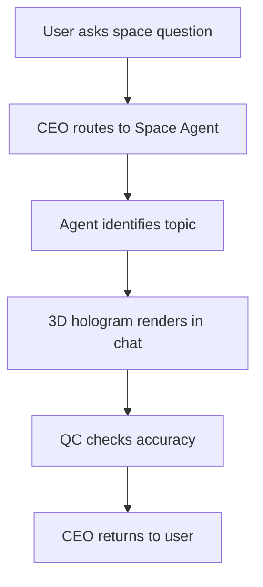

# Space Agent

Detailed specification for the **Space Agent** tool in Tunde Agent: purpose, capabilities (including **3D holographic solar system and cosmic visualization**), I/O contract, orchestration through the Agent Army, safety/accuracy rules, subscription gating, and phased delivery.

For how Space Agent sits alongside other tools, see [Tools overview](./overview.md).

---

## 1. Overview

### What is Space Agent?

**Space Agent** is a planned Tunde specialist that routes astronomy and space-science questions to a dedicated **Space Agent**. It produces **structured explanations** about the solar system, stars, galaxies, missions, and cosmology— and, on supported tiers, **interactive 3D “hologram” views** in the chat canvas (implementation target: **Three.js**, aligned with the [Chemistry Agent](./chemistry_agent.md) rendering stack). It is **evidence-first**: no invented ephemeris, no fake mission results, and clear labels when data are uncertain or time-sensitive.

### Who is it for?

| Audience | Typical use |
|----------|-------------|
| **Students** | Orbits, scale, and mission context for coursework—supplementing textbooks and instructor guidance, not replacing formal curricula. |
| **Astronomy enthusiasts** | Deeper but accessible narrative, event context (eclipses, launches), and “where to look” education without unsourced precision claims. |
| **Researchers** | High-level pointers, standard vocabulary, and honest limits; **not** a replacement for professional ephemeris software, data archives, or peer-reviewed sources. |

### How it fits into the Agent Army (CEO → Space Agent → QC → CEO)

Space Agent follows the standard **Agent Army** pattern:

1. **CEO (Tunde)** detects space/astronomy intent and passes a brief (topic, object names, date range, optional “show 3D” flag, subscription tier).
2. **Space Agent** classifies the domain (e.g., solar system, stars, galaxies, cosmology), produces narrative and—when enabled—**render metadata** for the 3D block.
3. **QC** enforces [§5](#5-safety--accuracy-rules) (no fabricated numbers, theory vs observation clearly separated) and tier gates (no hologram on Free when enforced).
4. **CEO** returns one coherent reply with optional embedded viewer, optionally merging **Search**-grounded citations when orchestration enables them.

This mirrors [Tools overview](./overview.md) (§4) and the [Agent Army overview](../07_agent_army/overview.md). Space Agent complements the broader [Science Agent](./science_agent.md) with **domain-specific astronomy depth** and visualization.

---

## 2. Capabilities

Capability areas below are the **product contract**; ephemeris APIs, NASA/ESA archives, and Three.js scenes are implementation details.

### Solar system exploration (planets, moons, orbits)

- Conceptual and comparative descriptions of planets and major moons; orbital mechanics at educational depth with explicit simplifications.

### Stars and stellar evolution

- Life-cycle narratives (MS, giants, remnants) with **model vs observation** cues where stellar physics is uncertain for a given object.

### Galaxies and cosmic structures

- Scaling, morphology classes, and distance ladder concepts—without pretending single-chat precision for Hubble constants or disputed values without dates and sources.

### Black holes and neutron stars

- Conceptual and observational signatures (accretion, jets, GW context) framed educationally; **no sensationalism** presented as certainty.

### Space missions and discoveries

- Mission roles, timelines, and discovery claims **only** when traceable to public agencies (NASA, ESA, JAXA, etc.) or peer-reviewed literature when Search/document tools are attached.

### Cosmology (Big Bang, dark matter, dark energy)

- Standard-model storytelling with explicit **open questions** and debate flags where cosmology remains active.

### 3D holographic solar system visualization

- **In-chat** Three.js scene: approximate relative scales, orbiting bodies, labeled worlds—see [§6](#6-hologram-visualization).

---

## 3. Input & Output

### Input

| Mode | Description |
|------|-------------|
| **Questions about space** | Natural language (“why is Mars red?”, “how far is Jupiter?”) with optional level (“ELI5”, “undergrad”). |
| **Planet / object names** | Sun, planets, dwarf planets, notable moons, missions, or catalog designations when disambiguated. |
| **Astronomical events** | Eclipses, conjunctions, launch windows—**dates and locations** should be verified via Search or official data when user needs operational planning. |

### Output

| Artifact | Description |
|----------|-------------|
| **Structured explanation** | Sections or bullets with topic tag, caveats, and “last verified” language when tied to rapidly changing datasets. |
| **3D hologram** (tier-gated) | Embedded viewer: solar system or stylized cosmic object—**approximate** geometry/scale for pedagogy, not navigation-grade—see [§6](#6-hologram-visualization). |

---

## 4. Orchestration flow

*Topic identification may map to buckets such as **solar system**, **stars**, **galaxies**, **cosmology**. The 3D block may be omitted on Free tier or when QC rejects low-confidence visuals. Bounded retries match other specialists.*

---

## 5. Safety & Accuracy Rules

These rules apply to Space Agent outputs and QC review:

1. **Never fabricate astronomical data** — no invented magnitudes, distances, masses, or mission outcomes. If precise numbers are required and not in context, say so or ground them via Search/attached sources.
2. **Distinguish confirmed facts from theories** — label models, simulations, and active debates (e.g., certain early-universe scenarios) appropriately.
3. **Cite missions and discoveries accurately (NASA, ESA, etc.)** — use official mission names, instrument context, and **no** misattributed “firsts” or dates. When combined with Search, citations must point to **real** pages.
4. **Flag if data may be outdated** — ephemerides, instrument calibrations, and “latest” measurements change; include time context or recommend checking an authoritative catalog.

Cross-cutting platform safety applies: [Tools overview](./overview.md) §7.

---

## 6. Hologram Visualization

Engineering targets for in-chat **Three.js** experiences (same technical baseline as [Chemistry Agent](./chemistry_agent.md) viewers).

### Solar system mode

- **Interactive 3D solar system** with **orbiting planets** (simplified Kepler-style or keyed animation for pedagogy, not real-time JPL ephemeris unless explicitly integrated later).
- **Planet sizes** approximately proportional within a legible scale band (linear scale cannot fit Sun–Neptune and remain readable—use **multi-scale** or **split views** when needed and label as illustrative).

### Interaction

- **Clicking a planet** opens or highlights an **info panel** (name, type, key facts from the agent’s structured payload)—no hidden fabrication; text must match [§5](#5-safety--accuracy-rules).

### Stars and compact objects

- **Stars** as **glowing spheres** (emissive materials) with size tied to narrative “class” rather than fake astrometry.
- **Black holes** stylized with **accretion disk** shader or geometry—clearly labeled **illustrative**, not scientific imaging unless sourced.

### Galaxies & cosmology (later phases)

- Simplified meshes or billboards for **galaxy modes**; cosmology visuals avoid misleading “precision” distance ladders in a single snapshot.

### Technology

- **Three.js** for scene graph, lighting, controls (orbit/pan where appropriate), and animation loops. Payloads from the backend must be **validated numeric JSON**—never executable code.

---

## 7. Subscription Tier

Gating aligns with [Tunde Hub](../06_tunde_hub/overview.md); enforcement via **feature flags** and billing.

| Tier | Space Agent access |
|------|----------------------|
| **Free** | **Basic space facts only** — short explanations; **no** 3D solar system hologram. |
| **Pro** | **Full explanations** plus **3D solar system hologram** and richer structured output (subject to QC). |
| **Business & Enterprise** | **All features** above plus **API access**, team quotas, audit-friendly logging, negotiated limits. |

Exact quotas are defined in operations configuration, not in this file.

---

## 8. Development Plan

Phased delivery. **Status** values are roadmap states.

| Phase | Focus | Tasks | Dependencies | Status |
|-------|--------|--------|--------------|--------|
| **Phase 1** | Core space agent | Structured prompts, topic classifier (solar system / stars / galaxies / cosmology), JSON/text contract, CEO routing, QC accuracy rules. | Agent Army; task lifecycle. | `not_started` |
| **Phase 2** | 3D solar system hologram | Three.js scene in chat; Sun + planets + simplified orbits; scale/labelling strategy; performance budgets. | Phase 1; shared Three.js patterns from Chemistry Agent. | `not_started` |
| **Phase 3** | Interactive planet info | Raycasting / picking; panel UI bound to validated fact payloads from agent. | Phase 2. | `not_started` |
| **Phase 4** | Star & galaxy visualizations | Emissive stars, basic galaxy modes; guardrails against false precision. | Phases 1–3. | `not_started` |
| **Phase 5** | Black hole accretion disk animation | Stylized disk shader/geometry; mandatory “illustration” labelling; QC review for sensationalism. | Phases 1–4. | `not_started` |

---

## Related documentation

- [Tools overview](./overview.md) — full tool list, tiers, and roadmap table.  
- [Science Agent](./science_agent.md) — broader STEM specialist.  
- [Chemistry Agent](./chemistry_agent.md) — Three.js hologram reference patterns.  
- [Agent Army overview](../07_agent_army/overview.md) — CEO / specialists / QC.  
- [Multi-agent system (MAS)](../02_web_app_backend/multi_agent.md) — implementation-oriented roles.  
- [Development roadmap](../05_project_roadmap/development_roadmap.md) — project-wide phases.
