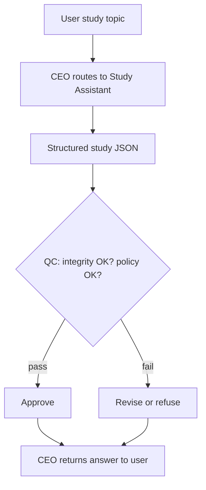

# Study Assistant

Detailed specification for the **Study Assistant** tool in Tunde Agent: **learning, memorization, and conceptual mastery** for any topic, structured outputs (topic, summary, concepts, plan, memory aids, practice), orchestration through the Agent Army (CEO → Study Assistant → QC → CEO), academic-integrity rules, UI patterns (difficulty badges, checkable plan steps, expandable practice hints), subscription gating, and phased delivery.

For how Study Assistant sits alongside other tools, see [Tools overview](./overview.md).

---

## 1. Overview

### What is Study Assistant?

**Study Assistant** helps **students** (and lifelong learners) **learn, memorize, and understand** a topic they name or describe. It returns a **detected topic label**, a **concise summary**, **key concepts**, a **step-by-step study plan**, **memory techniques**, **practice questions** with **non-spoiler hints**, **difficulty level**, **estimated study time**, and an honest **confidence** score. Outputs are **educational** and **integrity-preserving**: the tool does not encourage cheating on graded work ([§5](#5-safety-rules)).

### Who is it for?

| Audience | Typical use |
|----------|-------------|
| **Students** | Exam prep framing, spaced-friendly plans, self-check questions—not doing assignments for them. |
| **Professionals** | Onboarding study for new domains, vocabulary, and structured refreshers. |
| **Educators** | Draft study scaffolds to adapt for classes (human review always assumed). |

### How it fits into the Agent Army (CEO → Study Assistant → QC → CEO)

1. **CEO (Tunde)** routes a study-intent message or user-enabled **Study Assistant** with optional tier context.
2. **Study Assistant** produces a structured JSON artifact: summary, concepts, plan, memory tips, practice, difficulty, time estimate, confidence.
3. **QC** enforces **no academic-misconduct encouragement**, policy alignment, and reasonable uncertainty.
4. **CEO** returns the final reply; the web client renders **[§6](#6-visual-design)** blocks.

See [Agent Army overview](../07_agent_army/overview.md) and [Tools overview](./overview.md).

---

## 2. Capabilities

### Topic summaries

Clear, engaging **summaries** scoped to the learner’s stated topic.

### Study plans

Ordered **steps to master** the material, suitable for calendars and checklists.

### Concept explanations

**Key concepts** surfaced as the highest-signal ideas to understand first.

### Memory techniques

**Mnemonics**, chunking, and retention tips aligned to the topic.

### Practice questions

A small set of **self-test questions** with **hints** (not full solutions) to support honest practice.

### Mind maps (roadmap)

**Future** phases may emit graph/mind-map structures for canvas rendering ([§8](#8-development-plan)).

---

## 3. Input & Output

### Input

| Field | Description |
|-------|-------------|
| **question** | Study topic or learning goal (required)—may include level, deadline, or sub-focus. |

### Output

| Field | Description |
|-------|-------------|
| **topic** | Short label for the study theme. |
| **summary** | Clear, concise overview of the topic. |
| **key_concepts** | Up to **5** critical concepts to understand. |
| **study_plan** | Ordered steps to master the topic. |
| **memory_tips** | Memory techniques and mnemonics. |
| **practice_questions** | **3** questions to test understanding. |
| **practice_hints** | **3** short hints aligned 1:1 with questions (guidance without full answers). |
| **difficulty_level** | `beginner` \| `intermediate` \| `advanced`. |
| **estimated_time** | Human-readable study window (e.g. `"2–3 hours"`). |
| **confidence** | `high` \| `medium` \| `low`. |

---

## 4. Orchestration flow

---

## 5. Safety Rules

1. **No academic cheating** — do not complete graded exams, quizzes, or take-home assessments for the user; steer toward understanding and self-generated work.
2. **Always cite sources (honestly)** — point learners to **types** of reputable materials (textbooks, official documentation, course notes); **never fabricate** URLs, DOIs, or citations.
3. **Flag uncertainty** — keep **confidence** and wording aligned with what can be responsibly taught from general knowledge.
4. **Refuse harmful facilitation** — same baseline policy stack as other tools (weapons, harassment, etc.).

---

## 6. Visual Design

- **Header** — topic title, **difficulty** badge (**Beginner** = green, **Intermediate** = yellow, **Advanced** = red), **estimated time** pill.
- **Summary** — readable paragraph block.
- **Key concepts** — **numbered cards** (1–5).
- **Study plan** — **numbered checklist** with checkable steps (local UI state).
- **Memory tips** — list with **💡** icon treatment.
- **Practice** — **expandable cards**; click to reveal **hint** only (not a full worked answer).
- **Composer** — **blue / indigo** accent when Study Assistant is active; header chip **📚 Study Assistant**.

---

## 7. Subscription tiers

| Tier | Study Assistant access |
|------|-------------------------|
| **Free** | **Basic summaries** and shorter plans; tighter fair-use limits. |
| **Pro** | **Full study plans**, memory tips, and **practice** packs; higher limits. |
| **Business** | **API access** (`POST /tools/study`), team-oriented quotas where enabled. |

Exact limits are configured in operations, not in this file.

---

## 8. Development plan

| Phase | Focus | Tasks | Status |
|-------|--------|--------|--------|
| **Phase 1** | Structured LLM JSON + API | `POST /tools/study`, schema, integrity-aware prompt, parsing + fallbacks. | `in_progress` |
| **Phase 2** | Chat UI | `study_solution` blocks, difficulty colors, checkable plan, expandable practice. | `in_progress` |
| **Phase 3** | Personalization | Optional user level, prior messages, weak-area tagging; spaced-repetition export. | `not_started` |
| **Phase 4** | Teams & mind maps | API rate tiers, batch study jobs, optional mind-map / graph canvas. | `not_started` |

---

## Related documentation

- [Tools overview](./overview.md) — roadmap and tiers.  
- [Agent Army overview](../07_agent_army/overview.md) — CEO / specialists / QC.  
- [Research Agent](./research_agent.md) — complementary deep synthesis with citations.  
- [Development roadmap](../05_project_roadmap/development_roadmap.md) — project-wide phases.
