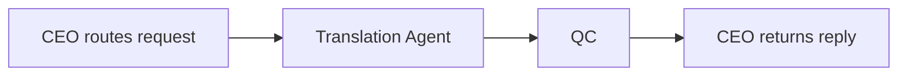

# Translation Agent

Detailed specification for the **Translation Agent** tool in Tunde Agent: instant translation across **50+ languages**, structured I/O (detection, tone, transliteration, alternatives), orchestration through the Agent Army (CEO → Translation Agent → QC → CEO), safety boundaries, UI patterns (language badges, side-by-side text), subscription gating, and phased delivery.

For how Translation sits alongside other tools, see [Tools overview](./overview.md).

---

## 1. Overview

### What is Translation Agent?

**Translation Agent** routes **natural-language translation** tasks to a dedicated specialist. It returns **detected source language**, **requested target language**, **accurate translations** preserving intent and tone, optional **romanization/transliteration** when scripts differ, **formal/informal/neutral** tone tags, **confidence**, and **2–3 alternative renderings** when helpful. Output is **structured** so the chat UI can render badges, columns, and copy actions ([§6](#6-visual-design)).

### Who is it for?

| Audience | Typical use |
|----------|-------------|
| **Travelers & multilingual chat** | Quick phrases, menus, signage, conversational replies. |
| **Students & researchers** | Homework-aligned phrasing within academic norms; glossary-style alternatives—not completed graded work substitution unless policy allows. |
| **Teams & content producers** | Draft localization, tone control (formal/informal), parallel options for headlines or CTAs—**human review** remains required for publishing. |

### How it fits into the Agent Army (CEO → Translation Agent → QC → CEO)

Translation follows the standard **Agent Army** pattern:

1. **CEO (Tunde)** detects translation intent or user-enables the tool and passes source text plus optional target language and tier context.
2. **Translation Agent** detects **source language**, produces **primary translation**, **transliteration** when scripts differ, **tone** classification, **alternatives**, and **confidence**.
3. **QC** validates **policy** (no facilitation of harm, harassment, fraud, or illegal acts via translation path); may refuse, redact, or escalate.
4. **CEO** delivers a coherent reply—when the client supports blocks, surfacing **[§6](#6-visual-design)** layouts.

See [Tools overview](./overview.md) §4 and [Agent Army overview](../07_agent_army/overview.md).

---

## 2. Capabilities

### Text translation

High-quality neural translation across **50+ languages** when the specialist model and policy permit; **honest uncertainty** surfaced via confidence.

### Automatic language detection

**Source language** inferred from input; users may still hint or constrain via composer text (e.g., “Translate to Japanese: …”).

### Formal / informal tone

Output includes **tone** (`formal`, `informal`, or `neutral`) for UI badges and downstream formatting—**assistive**, not guaranteed register-perfect in every dialect.

### Transliteration

**Romanization or pronunciation-oriented transliteration** when the **target** uses a different script or when product policy requests dual-script display.

---

## 3. Input & Output

### Input

| Field | Description |
|-------|-------------|
| **text** | Source material to translate (required). |
| **target_language** | Optional explicit target (name or locale hint); empty means **infer best target** from user wording or workspace defaults. |

### Output

| Field | Description |
|-------|-------------|
| **source_language** | Detected human-readable language label (e.g., “English”). |
| **target_language** | Resolved target label (e.g., “Arabic”). |
| **original_text** | Echo of canonical input snippet for audit/UI alignment. |
| **translated_text** | Primary translation. |
| **transliteration** | Pronunciation guide string when applicable; empty when not relevant. |
| **tone** | `formal` \| `informal` \| `neutral`. |
| **confidence** | `high` \| `medium` \| `low` for QA surfacing. |
| **alternative_translations** | **2–3** stylistic alternatives when helpful; may be shorter when constrained. |

---

## 4. Orchestration flow

**QC** may reject dangerous requests outright or replace output with a **policy message** rather than translating harmful content ([§5](#5-safety-rules)).

---

## 5. Safety Rules

1. **Do not translate harmful content** — violent instruction, exploitation, harassment, malware distribution, fraud, self-harm encouragement, or other disallowed classes per platform policy.
2. **Flag dangerous intent** — requests that signal harm, unlawful activity, or coercion are **blocked or redirected** with a refusal; optional internal signal for moderation when product telemetry allows.
3. **No substitution for legal/certified translation** — outputs are **assistive**; sworn or regulatory translation requires human-certified workflows.
4. Cross-cutting policies apply as in [Tools overview](./overview.md) §7.

---

## 6. Visual Design

- **Language badges / flags** — compact pills for **source → target** with directional emphasis (arrow); optional locale flags where product assets exist.
- **Side-by-side layout** — **original** (left) and **translated** (right) for scanability on wide viewports; stacked on narrow screens.
- **Transliteration** — italic secondary line under the translated column when present.
- **Tone badge** — Formal / Informal / Neutral for quick scanning.
- **Alternative translations** — expandable list (details/summary) so the primary surface stays clean.
- **Copy** — one-click copy for **translated text**.

---

## 7. Subscription tiers

| Tier | Translation access |
|------|---------------------|
| **Free** | **Core subset — ~5 languages** (locale bundle TBD via feature flags). |
| **Pro** | **50+ languages**, transliteration, alternatives, tone badges within fair-use limits. |
| **Business** | **API access**, higher quotas, team governance hooks (audit where enabled). |

Exact caps live in operations configuration.

---

## 8. Development plan

| Phase | Focus | Tasks | Status |
|-------|--------|--------|--------|
| **Phase 1** | Backend contract | `POST /tools/translation`, JSON schema, refusal behavior in prompt + QC hooks. | `in_progress` |
| **Phase 2** | Chat UI | `translation_solution` blocks, badges, side-by-side, copy, expandable alternatives. | `in_progress` |
| **Phase 3** | Tier enforcement | Free vs Pro language matrix, rate limits, Hub billing alignment. | `not_started` |
| **Phase 4** | API & integrations | Business API keys, batch/segment translation hooks, audit exports (Enterprise path). | `not_started` |

---

## Related documentation

- [Tools overview](./overview.md) — roadmap and tier context.  
- [Agent Army overview](../07_agent_army/overview.md) — CEO / specialists / QC.  
- [Development roadmap](../05_project_roadmap/development_roadmap.md) — cross-project phases.
