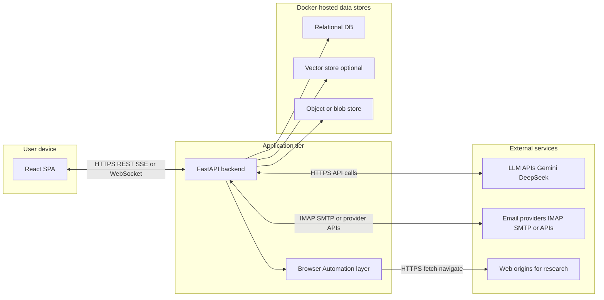
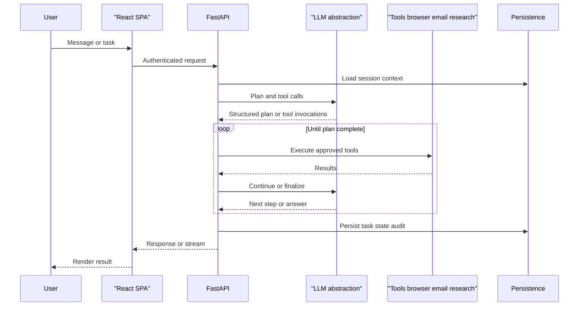

# Architecture

Technical blueprint for Tunde Agent: components, boundaries, data flow, and persistence. For capability detail see [features.md](./features.md). For how environments are run and deployed, see [infrastructure.md](./infrastructure.md). Phasing and risks sit in [roadmap.md](./roadmap.md). Long-term safety for adaptive behavior is in [self_improvement_rules.md](./self_improvement_rules.md).

---

## 1. Goals and non-goals

**Goals**

- A **personal agent** accessible through a web application: the user converses, delegates tasks, and receives structured results (email assistance, research artifacts, bounded browser work).
- Clear **separation of concerns**: presentation, orchestration, tool execution, and durable state behind small, replaceable adapters.
- **Pluggable language models** behind one conceptual **LLM abstraction** so backends such as **Gemini** and **DeepSeek** can be swapped or combined without rewriting the whole stack.
- **Browser automation** as a first-class capability, with **Playwright** as the primary mechanism; **browser-use** (or similar) may sit on top of or beside Playwright as an orchestration pattern—the architecture does not mandate a single library API.

**Non-goals (MVP)**

- Multi-tenant SaaS, billing, or public self-signup.
- Unbounded autonomous operation without human oversight for high-risk actions.
- Desktop or OS-level control (that is a later phase; see [roadmap.md](./roadmap.md)).

---

## 2. High-level system diagram

The following diagram shows major components and trust-relevant boundaries. The browser SPA talks only to the API; the API talks to LLM providers, the **Browser Automation layer**, and data services typically hosted in Docker.

**Stack boundaries (summary)**

| Boundary | What crosses it | Notes |
| -------- | ----------------- | ----- |
| User device ↔ API | Session-bearing HTTP; optional streaming channel | Auth surface at the browser (cookies or bearer tokens, JWT or opaque server session—design choice). |
| API ↔ LLM providers | Prompts, tool schemas, completions | Secrets for provider keys stay server-side; no keys in the SPA. |
| API ↔ Browser Automation layer | Structured commands and results | Isolation per user or session; see [Browser automation layer](#5-browser-automation-layer). |
| API ↔ Email providers | Read, send, metadata | Credentials scoped and stored with least privilege. |
| API ↔ Data tier | Queries, transactions, blob I/O | Persistence adapters keep domain logic independent of vendor SQL or vector APIs. |

---

## 3. Frontend (React, pure JS/CSS)

The **single-page application** owns chat and task UI, lightweight client state (current thread, pending approvals), and transport to the backend. Implementation may use **REST with polling**, **Server-Sent Events**, or **WebSockets** for partial updates; the architecture treats that as an implementation choice, not a fixed contract here.

The frontend does **not** hold provider API keys for Gemini or DeepSeek. It may hold a user session indicator (cookie or token) and must follow same-origin or explicit CORS rules defined at deploy time (see [infrastructure.md](./infrastructure.md) for environment layout).

---

## 4. Backend (FastAPI)

The **FastAPI** service is the hub for:

1. **Orchestration** — Turn user input into plans, model calls, and ordered tool use; enforce policy gates (human approval where required).
2. **Tool execution** — Browser tasks, email operations, research fetches; each tool is a bounded capability with explicit inputs and outputs.
3. **Persistence adapters** — Map domain concepts (sessions, tasks, preferences, rules) to the relational database and optional vector or blob stores.

Work is **async-friendly**: long-running tool steps and I/O should not block the event loop unnecessarily. For heavier or queued work, a **background job** or **worker** process is a natural scale-out hook (aligned with Phase 3 in [roadmap.md](./roadmap.md)); the MVP may inline some of that work in the API process while keeping interfaces compatible with a later queue.

---

## 5. Browser automation layer

The **Browser Automation layer** (Playwright primary) executes navigation, extraction, and scripted flows on behalf of the backend. Design choices include:

- **Isolation** — A **dedicated browser context** (or equivalent) per user or session reduces cross-session leakage of cookies, storage, and identity.
- **Invocation** — Playwright may run **in-process** with API workers, in a **sidecar** service, or on dedicated hosts under the same trust domain; the boundary that matters is: only the backend (or its worker) issues commands, not the end-user browser tab running the React app.
- **Security** — The model must not trigger **arbitrary code execution** in the operator’s environment. High-risk actions (credential entry on unknown sites, payments, mass actions) require **human-in-the-loop** confirmation or policy blocks. **Domain allowlists** and step limits reduce abuse surface.

Optional **browser-use**-style orchestration (LLM-chosen steps with guardrails) composes with the same layer; the abstraction is “automation runtime + policy,” not a specific Python package name frozen in stone.

---

## 6. Email automation

Logical modules:

- **Read path** — IMAP or provider APIs for listing, searching, and threading; cache or store minimal metadata in the relational DB for fast UI and audit.
- **Send path** — SMTP or provider send APIs; **drafting** may be automated while **sending** remains behind an explicit approval step in MVP.
- **Organization** — Labels, folders, or rules persisted in the DB where the product model requires it; respect provider-specific limits and quotas.

All of this ties to **Docker-hosted** or equivalent database storage for sessions, preferences, and rule definitions (see [Docker and data persistence](#8-docker-and-data-persistence)).

---

## 7. Web research and analysis

Pipeline conceptually:

1. **Fetch** — HTTP retrieval respecting **rate limits**, **robots.txt**, and site **terms of use** (operational constraints, not optional niceties).
2. **Extract** — Structured or semi-structured content (tables, specs, prices) normalized for downstream use.
3. **LLM synthesis** — Comparison narratives, competitor matrices, sentiment summaries—with explicit **limitations** (stale data, paywalled content, model hallucination) surfaced in product copy or metadata where appropriate.

Outputs include **comparison tables** and scored sentiment as **artifact types** stored or exported per [features.md](./features.md).

---

## 8. Docker and data persistence

State intended for containers or managed equivalents:

- **Relational database** — Sessions, tasks, user preferences, email rule metadata, audit pointers.
- **Vector store** (optional) — Embeddings for retrieval-augmented generation or long-document recall.
- **Object or blob store** — Attachments, large exports, cached fetch payloads where inline DB storage is inappropriate.

**Volumes** — Development may use **bind mounts** for fast iteration; production favors **named volumes** or provider-managed disks for portability and backup hooks. **Backup and restore** are procedural: scheduled volume snapshots or logical dumps, periodic **restore drills** to verify recoverability—without embedding compose or script content in this document.

Networking and ports between the API, SPA dev server, and databases are described in [infrastructure.md](./infrastructure.md).

---

## 9. Security and trust boundaries

- **Secrets** — API keys for Gemini, DeepSeek, email, and automation infrastructure live **outside** images (environment, secret manager, or host files with strict permissions)—never committed to the repository.
- **Least privilege** — Email and browser credentials scoped to required folders or sites; automation accounts separated from personal admin accounts where feasible.
- **Trust zones** — The public internet, the reverse proxy, the API, the automation runtime, and data stores form nested zones; each hop should assume the outer zone is hostile.

Self-improvement and immutable security-sensitive components are constrained in [self_improvement_rules.md](./self_improvement_rules.md).

---

## 10. Observability

Design placeholders (no vendor lock-in prescribed):

- **Logging** — Structured logs correlating request ID, user or session ID, and tool run ID.
- **Metrics** — Latency, error rates, queue depth if workers exist, LLM token or cost estimates.
- **Tracing** — Optional distributed traces across API → tools → external calls for debugging slow paths.

---

## 11. End-to-end request flow

Typical path: **user asks → model plans → tools run → response** (with approvals where policy requires).

This flow is the architectural backbone; feature-level acceptance detail remains in [features.md](./features.md).
