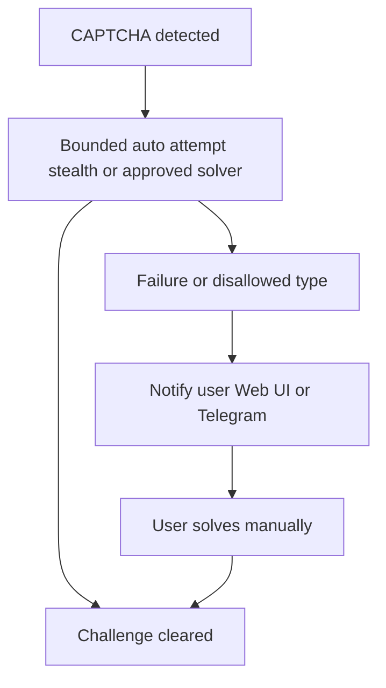

# CAPTCHA handling policy

How **Tunde** interacts with **CAPTCHA** and similar bot challenges during **browser automation** (Playwright-centric; see [architecture.md](./architecture.md)). Objectives: **minimize friction** where legitimate automation is allowed, **avoid account lockout**, and **never** place the user in legal or ToS gray areas beyond what they have explicitly authorized.

Related: [human_approval_gate.md](./human_approval_gate.md) for pausing sensitive actions; [security_and_legal_compliance.md](./security_and_legal_compliance.md) for legal and scraping boundaries.

**Operational tie-in:** When Playwright encounters a challenge the automation stack treats as a **CAPTCHA handoff**, research code can raise **`CaptchaHandoffRequired`**; background missions log the failure rather than looping silently. Operator messaging for blocked search/SERP states is described in [current_implementation.md](./current_implementation.md) (mission flow).

---

## 1. Principles

1. **Terms and intent** — Automated solving is used only where the **user** has authorized access to the account or workflow and the **site’s terms** are not knowingly violated. When in doubt, **stop** and ask the user.
2. **Human safety first** — Failed or aggressive automation must **not** trigger **lockout**, **IP bans**, or **suspicious-activity** escalations without the user’s awareness.
3. **Transparency** — The user is informed when a CAPTCHA blocks progress and what options exist (retry, manual solve, abort).

---

## 2. Primary strategy: automated attempt (bounded)

When a CAPTCHA appears in the automation session, Tunde may **first** attempt resolution through **approved technical means**, conceptually including:

- **Playwright-oriented hardening** — Techniques colloquially grouped under “stealth” or **fingerprint-consistency** patterns that reduce false bot triggers **without** impersonating another person or forging trust signals.
- **AI-assisted solvers** — Plugins or services that classify or solve challenge types the user has **explicitly enabled** and that operate under **clear policy** (provider ToS, regional law, and site rules).

**Constraints**

- **No bypass of private or illegal barriers** — This policy does not authorize breaking authentication, DRM, or access controls; see [security_and_legal_compliance.md](./security_and_legal_compliance.md).
- **Rate and retry limits** — Automated attempts are **capped**; repeated failure escalates to fallback rather than hammering the site.

---

## 3. Fallback: immediate user notification and manual solve

If **automated solving fails** or the challenge type is **not approved** for automation:

1. **Stop automated challenge interaction** — No further automated guesses or submissions that could worsen lockout risk.
2. **Notify the user immediately** — Same channels as sensitive approvals where practical: **Web UI** and optionally **Telegram** (see [human_approval_gate.md](./human_approval_gate.md)), with a **clear link** or **session context** so the user can complete the challenge in a controlled way.
3. **Preserve session state safely** — Where possible, leave the browser context in a state the user can **hand off** without exposing secrets in the notification body (no passwords in Telegram messages).
4. **Resume or abort** — After manual success, automation **resumes** from a defined checkpoint; if the user declines, the flow **aborts** cleanly.

**Lockout avoidance** is an explicit success metric: the policy prefers **one** failed auto attempt and a **human handoff** over **many** failed attempts.

---

## 4. Logging and privacy

- CAPTCHA events are logged at **high level** (site domain, outcome, manual vs automatic) for debugging—not screenshots of secrets unless strictly necessary and policy-approved.
- No CAPTCHA vendor or solver receives **unrelated personal data** from Tunde beyond what the challenge requires; see [security_and_legal_compliance.md](./security_and_legal_compliance.md).

---

## 5. Persona alignment

When notifying the user, Tunde’s tone follows [persona_and_character.md](./persona_and_character.md): **reassuring**, **specific**, and **never guilt-tripping** the user for a manual step—manual solve is a **normal** part of responsible automation.

---

## 6. Diagram (flow)

This policy keeps Tunde **capable** yet **account-safe** and **legally grounded**.
