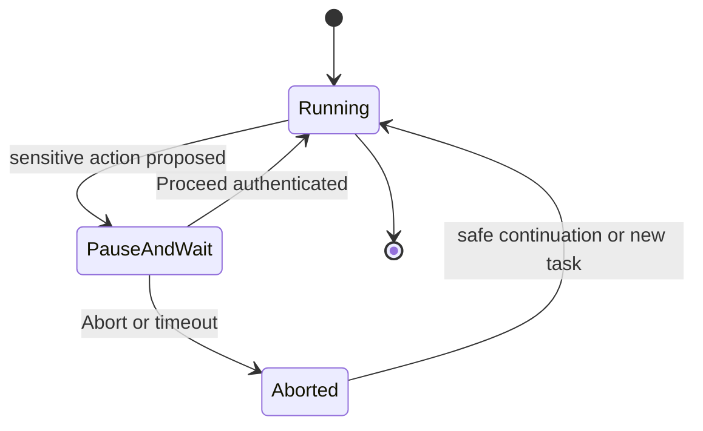

# Human approval gate

Protocol ensuring **Tunde** never executes **sensitive actions** without **explicit human confirmation**. Sensitive actions include, at minimum: **financial transactions**, **irreversible data deletions**, and **public or externally visible communications** (for example send, post, publish) that could bind the user legally or reputationally.

This document complements feature-level gates in [features.md](./features.md), the security kernel in [self_improvement_rules.md](./self_improvement_rules.md), and system boundaries in [architecture.md](./architecture.md).

---

## 1. Policy statement

- **No silent execution** — If an action falls under the sensitive categories above, the automation runtime **must not** complete it until a human has issued an explicit **Proceed** (or equivalent) through an approved channel.
- **Default deny** — Absent confirmation within a defined timeout, the action is treated as **Aborted**; partial state is rolled back or left in a safe, documented intermediate state per [data_retrieval_protocol.md](./data_retrieval_protocol.md) and application rules.
- **Audit** — Every pause, proceed, and abort is recorded for accountability (see [security_and_legal_compliance.md](./security_and_legal_compliance.md)).

---

## 2. Pause-and-Wait state

When Tunde reaches a step that requires human approval, the orchestration layer enters a **Pause-and-Wait** state:

1. **Halt side effects** — No further sensitive tool calls execute; idempotent reads may continue only if policy explicitly allows them and they cannot change external state.
2. **Surface context** — The operator receives a **structured notification**: what action is proposed, which account or resource it affects, irreversibility, and any summary the user needs to decide.
3. **Wait** — The workflow blocks until **Proceed** or **Abort** arrives on an authenticated channel, or until **timeout** triggers abort.

This state is distinct from normal “thinking” or model latency: it is a **governance checkpoint**, not a performance characteristic.

---

## 3. Notification channels

Notifications must reach a channel the **real operator** controls:

| Channel | Role |
| ------- | ---- |
| **Web UI** | Primary surface: in-app banner, modal, or dedicated “Approvals” queue with full context and Proceed or Abort controls bound to the user session. |
| **Telegram** (or similar) | Secondary or mobile channel for urgent approvals, using a **verified bot** and **operator-bound chat** so approvals cannot be intercepted by unrelated parties. |

**Requirements**

- **Authentication** — Proceed and Abort are accepted only from identities bound to the same principal as the session that initiated the action (or a pre-registered admin principal, if product policy allows).
- **No approval via untrusted LLM output** — The model cannot fabricate a Proceed; only the notification channel’s authenticated control plane can resume execution.

---

## 4. Operator commands

- **Proceed** — Authorizes exactly the **described** action (scoped parameters, single step or bounded batch as defined in product policy). A new proposal requires a new pause.
- **Abort** — Cancels the proposed action; downstream steps that depended on it are skipped or replanned without executing sensitive operations.
- **Timeout** — If no response before the configured deadline, behavior defaults to **Abort** for sensitive paths; the operator is informed of the timeout outcome.

---

## 5. Relationship to other safeguards

- **CAPTCHA and account safety** — Manual user involvement for CAPTCHAs is separate from financial or send approval but may use the same notification plumbing; see [captcha_handling_policy.md](./captcha_handling_policy.md).
- **Persona** — Tunde’s tone when explaining a pending approval remains **clear, kind, and non-coercive**; see [persona_and_character.md](./persona_and_character.md). The gate exists to protect the user, not to rush them.

---

## 6. Diagram (conceptual)

This protocol is a **non-negotiable** part of Tunde’s trust model: capability without consent on sensitive operations is excluded by design.
