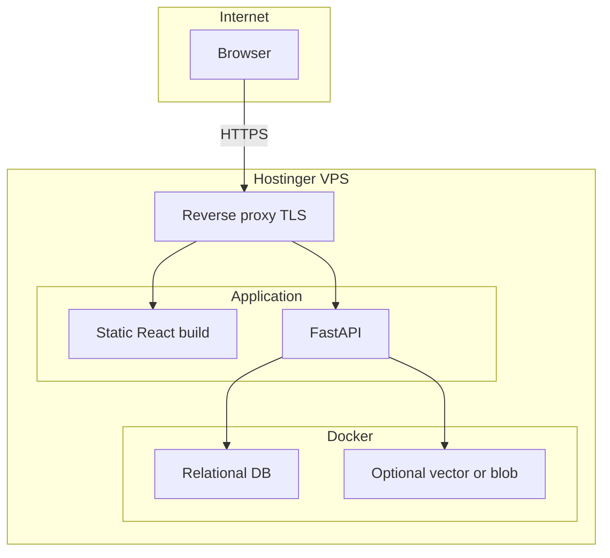

# Infrastructure

How Tunde Agent runs in **development (localhost)** and how it transitions to **production on a Hostinger VPS**, without prescribing executable configuration in this document. Architecture and components appear in [architecture.md](./architecture.md). Product capabilities are in [features.md](./features.md). Phasing and risks are in [roadmap.md](./roadmap.md). Safety and change governance overlap with [self_improvement_rules.md](./self_improvement_rules.md).

---

## 1. Environments

| Environment | Intent | Hosting |
| ----------- | ------ | ------- |
| **Development** | Fast iteration, local debugging, optional hot reload for the SPA | Operator workstation (localhost) |
| **Production** | Durable service for a single operator or small trusted group | **Hostinger VPS** (single node to start) |

**Configuration principles (twelve-factor style)**

- **Environment variables** and host-managed secrets carry configuration; nothing that authenticates to providers or databases belongs in the repository or in container images as baked-in secrets.
- **Parity of behavior** where it matters: the same logical services (API, data stores, automation boundaries) exist in both environments; only scale, TLS termination, and network exposure differ.

---

## 2. Local development (localhost)

### 2.1 Logical process layout

- **Frontend** — A development server for the React SPA serves static assets and supports client-side routing during development; it proxies or points API calls to the local backend origin.
- **Backend** — The FastAPI process handles orchestration, tool execution, and persistence calls.
- **Browser Automation layer** — Playwright (or equivalent runtime) runs with dependencies installed on the workstation; browser binaries may be managed by the automation stack. The SPA in the user’s Chrome or Edge is **not** the automation browser unless explicitly designed for debugging-only flows.
- **Docker** — Used **primarily for databases** (and optional supporting services such as object or vector stores), so schema and data survive API restarts without re-provisioning the whole machine.

### 2.2 Networking (conceptual)

Traffic flows on **loopback**: the browser hits the SPA dev port; the SPA calls the API on its port; the API reaches **localhost-exposed database ports** from Docker publish mappings. No TLS is strictly required locally; production terminates TLS at the edge (see below).

**Typical port pattern (illustrative, not prescriptive)**

| Listener | Role |
| -------- | ---- |
| SPA dev | User-facing UI during development |
| API | REST and optional streaming endpoints |
| DB | Relational engine published on localhost |

Exact numbers are chosen per operator preference and documented outside this file in environment-specific notes if needed.

### 2.3 Data during development

- **Bind mounts** may attach container data directories to the workstation filesystem for easy reset and inspection.
- **Backups** are optional locally but recommended before schema experiments that could destroy test data.

---

## 3. Production on Hostinger VPS

### 3.1 Edge and reverse proxy

- A **reverse proxy** (for example **Caddy** or **Nginx**) sits on the public edge: it terminates **TLS**, enforces **HTTP to HTTPS** redirects, and forwards to the API and static frontend assets according to path and host rules.
- **Single-node** deployment initially: API process, static SPA build, and Docker-managed databases on one VPS. Future **split** (separate DB host or worker host) is an evolution path described in [roadmap.md](./roadmap.md), not a day-one requirement.

### 3.2 Application layout behind the proxy

- The **built** SPA (static files) may be served by the proxy directly or by a minimal static file tier; the **API** listens on an internal loopback or private interface port exposed only to the proxy.
- **Docker** continues to host **relational** (and optional **vector** or **blob**) persistence with **named volumes** or provider-equivalent durable storage for portability and backup hooks.

### 3.3 Firewall and SSH hardening (checklist, prose)

- Allow **inbound 443** (and **80** only for ACME or redirect); **deny** direct exposure of database ports to the internet.
- **SSH**: key-based auth, disable password login, non-default port optional, fail2ban or equivalent rate limiting where available.
- **Automatic security updates** and reboot windows planned to avoid surprise downtime during active automation.

---

## 4. Deployment topology

This diagram omits the **Browser Automation layer** runtime placement (same host vs. sidecar); that choice remains an operational detail aligned with [architecture.md](./architecture.md).

---

## 5. Transition strategy: localhost to VPS

1. **Build parity** — Produce production-style artifacts locally (minified SPA, API run mode without dev reload) and verify against a **staging-like** Docker DB snapshot when possible.
2. **Secrets** — Move provider keys and database credentials into the VPS secret mechanism (env files with strict permissions, or host panel secrets); rotate any keys that ever lived on a shared machine.
3. **Data migration** — Logical dump or volume snapshot from development **only** if that data is intended for production; otherwise start clean and reconnect mail and research accounts through the app.
4. **DNS and TLS** — Point the hostname at the VPS; let the reverse proxy obtain and renew certificates.
5. **Smoke validation** — Authenticated login, one email read path, one research task, one bounded browser task—each verified under TLS and real provider connectivity.
6. **Rollback mindset** — Keep previous working image or release directory until the new stack is validated; database migrations follow a **backup-first** rule (see below).

---

## 6. Data and backups

- **Volume backup** on the VPS: scheduled snapshots or logical dumps of the relational database to off-site storage (object storage, another region, or operator-controlled backup account).
- **Restore testing** on a cadence (for example quarterly): prove a backup can become a running instance without discovering corruption during an emergency.
- **Retention** — Define how long research exports and audit logs remain online versus archived; align with personal privacy preferences and disk cost.

---

## 7. CI and CD (conceptual)

Without embedding pipeline definitions here, a reasonable lifecycle is:

1. **Build** — Install dependencies, run tests, build the SPA, assemble the API artifact or container image.
2. **Test** — Unit and integration tests; optional smoke against disposable DB containers.
3. **Deploy** — SSH or pull-based update on the VPS, migrate database schema if applicable, restart processes under a process manager, reload reverse proxy if needed.

Promotion from **branch to production** should remain a **conscious operator action** until Phase 3 controls in [roadmap.md](./roadmap.md) demand stricter gates.

---

## 8. Cost and capacity

- **VPS sizing** — Reserve headroom for **browser automation** memory usage (separate contexts per session consume RAM); undersizing manifests as OOM kills and flaky automation.
- **API cost levers** — **Gemini** and **DeepSeek** usage scales with token volume and tool-loop depth; caching summaries, tightening prompts, and batching research reduce spend.
- **Email and web quotas** — Provider IMAP limits and site rate limits affect perceived performance; the product should degrade gracefully under throttling.

---

## 9. Related documents

- [architecture.md](./architecture.md) — Trust boundaries and Browser Automation isolation.
- [features.md](./features.md) — What must work in each environment.
- [roadmap.md](./roadmap.md) — When multi-node or stronger isolation may appear.
