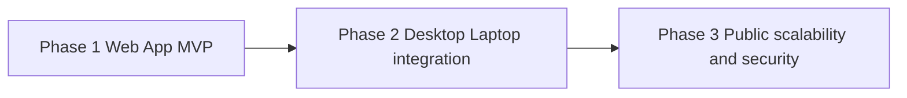

# Roadmap

Phased delivery for Tunde Agent from a **personal web MVP** toward **desktop integration** and eventually **public scalability and hardening**. Architecture is in [architecture.md](./architecture.md); features in [features.md](./features.md); runbooks and hosting in [infrastructure.md](./infrastructure.md); safety and change limits in [self_improvement_rules.md](./self_improvement_rules.md).

---

## Phase overview

Each phase **builds on** the previous one; skipping Phase 2 is possible for a purely hosted product, but local integration is part of the long-term vision described here.

---

## Phase table

| Phase | Focus | Outcomes (milestones) | Dependencies |
| ----- | ----- | --------------------- | ------------ |
| **Phase 1 — Web App MVP (current)** | Core web app, FastAPI backend, basic agent loop, Playwright for bounded tasks, first vertical slices for email and research | Deliverables aligned with MVP scope in [features.md](./features.md): chat or task UI, authenticated API, Browser Automation layer with policy gates, email read or draft flows with send approval, research artifacts with attribution | Stable component boundaries in [architecture.md](./architecture.md); localhost and VPS paths in [infrastructure.md](./infrastructure.md) |
| **Phase 2 — Desktop and laptop integration** | OS-level or local companion capabilities, secure bridge between web agent and the user’s machine | Approved local helper or automation channel; stricter **local auth** and pairing; clear trust model for what the remote API may request from the device | Phase 1 stable; operator trust in [self_improvement_rules.md](./self_improvement_rules.md) enforcement |
| **Phase 3 — Public scalability and security** | Multi-user isolation, rate limits, audit and compliance-oriented controls, scale-out options | **Tenant** or account isolation, abuse prevention, centralized observability, optional **multi-VPS** or **orchestrated** deployment—described as options, not a single mandated stack | Lessons from Phases 1–2; formal governance for prompts, tools, and infrastructure changes |

---

## Phase 1 detail (Web App MVP)

- **Web application** — SPA plus API as the sole product surface; no requirement for public registration.
- **Agent loop** — Plan, tool calls, synthesis, with human gates where [features.md](./features.md) requires them.
- **Browser Automation layer** — Playwright-backed, session-scoped contexts; domain allowlists and confirmation for sensitive steps.
- **Stubs versus slices** — Early milestones may stub some integrations, but **one end-to-end slice** (for example research or email) should be production-credible before declaring Phase 1 complete.

---

## Phase 2 detail (Desktop and laptop integration)

- **Purpose** — Extend delegation to files, local apps, or OS workflows the browser cannot safely reach.
- **Security** — Local channel uses **pairing**, **scoped permissions**, and **user-visible prompts** for high-risk actions; aligns with the immutable kernel concepts in [self_improvement_rules.md](./self_improvement_rules.md).
- **Architecture impact** — Introduces a new trust boundary (local agent ↔ cloud API); [architecture.md](./architecture.md) will need a companion diagram when implementation begins.

---

## Phase 3 detail (Public scalability)

- **Isolation** — Strong separation between users’ data, credentials, and automation contexts.
- **Scale** — Horizontal API replicas, queued jobs, or split database and automation workers as load demands.
- **Compliance posture** — Retention policies, export and deletion workflows, and audit depth appropriate to a multi-user offering—exact targets are product decisions outside this roadmap’s detail.

---

## Risk register

| Risk | Description | Mitigation direction |
| ---- | ----------- | -------------------- |
| **Browser abuse** | Automation used to scrape, spam, or interact with sites against policy or law | Allowlists, rate limits, logging, operator-visible session records; legal and ToS education in product copy |
| **Credential leakage** | Email or site passwords exposed via logs, screenshots, or overly broad tool outputs | Secret hygiene per [infrastructure.md](./infrastructure.md); redaction in logs; least-privilege app passwords |
| **Model-driven unsafe actions** | Hallucination or overconfidence leads to wrong send, wrong click, or wrong “facts” in research | Human approval gates, tool argument validation, evidence citations for research, kill switch and policy versioning per [self_improvement_rules.md](./self_improvement_rules.md) |
| **Supply chain and dependencies** | Compromised package or image undermines the stack | Pinning, integrity checks, minimal images, separate prod deploy approvals (Phase 3) |
| **Single-node fragility** (early production) | VPS outage loses all services | Backups, monitoring, documented restore; later HA options in Phase 3 |

---

## Alignment with safety rules

Phase 1 adopts the **security kernel** mindset at a minimal level (no self-modifying auth). Phase 2 adds **local trust**. Phase 3 demands **formal controls** and stricter change classes—see [self_improvement_rules.md](./self_improvement_rules.md).
