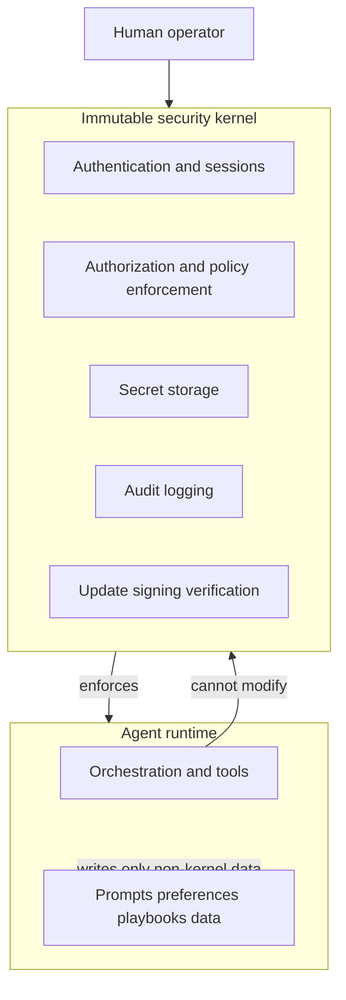

# Self-improvement rules

Safety and ethics framework for long-term **adaptive** behavior: the agent may refine prompts, policies, and workflows in controlled ways, but **must not** subvert core security, authentication, or audit guarantees. Architecture context appears in [architecture.md](./architecture.md). Product capabilities and human gates are in [features.md](./features.md). Operational secrecy and deployment are in [infrastructure.md](./infrastructure.md). Phasing and risk themes appear in [roadmap.md](./roadmap.md).

---

## 1. Definitions

**Self-improvement (allowed)**

- Improving **task success** within boundaries: prompt templates, tool-selection heuristics, summarization style, research checklists, and user-visible **playbooks** stored as data.
- Learning from **explicit user feedback** (thumbs, corrections, approved edits) encoded as **versioned policy or preference records** in application storage—not as opaque executable blobs from the model.

**Self-improvement (forbidden without out-of-band human process)**

- Changing **authentication or authorization** logic, **cryptographic** primitives, **secret storage**, **audit pipeline**, or **policy enforcement** code or configuration that the agent can otherwise influence.
- Circumventing **human approval gates** defined for MVP features in [features.md](./features.md).
- Altering **immutable security kernel** components (next section) except through a **separate admin workflow** that does not run inside the agent’s normal tool loop.

---

## 2. Immutable security kernel (conceptual)

The **security kernel** is a logical set of components that establish **who the user is**, **what the agent may do**, and **what happened**. The agent **may not** modify these components autonomously. Updates require **human intent** verified through an **out-of-band channel** (for example a second device, admin console with re-authentication, or signed release artifact from the operator).

**Kernel elements (illustrative)**

| Element | Role | Why immutable to the agent |
| ------- | ---- | -------------------------- |
| **Authentication and session binding** | Proves user identity to the API | Self-alteration would enable impersonation |
| **Authorization and policy enforcement** | Decides allowed tools, domains, spend caps | Bypass would undo all other safeguards |
| **Secret storage and retrieval** | API keys, mail credentials, TLS material | Exfiltration or substitution is catastrophic |
| **Audit logging** | Durable record of sensitive actions | Tampering destroys accountability |
| **Update signing and verification** | Trust in new binaries or configs | Unsigned or model-authored “updates” are unsafe |

The kernel may be **implemented** as libraries, services, and configuration inside the FastAPI stack described in [architecture.md](./architecture.md); immutability is a **governance property**, not a specific file layout.

---

## 3. Change classes and approval tiers

| Tier | Examples | Approval |
| ---- | -------- | -------- |
| **D** — Data and prompts | User preferences, draft templates, research notes | User or operator explicit save; versioned |
| **C** — Tool definitions | New tool schemas, parameter bounds, allowlists | Operator review; tests for safety properties |
| **B** — Dependencies | Package upgrades, base image updates | Change window; vulnerability scan; rollback plan |
| **A** — Infrastructure and kernel | Auth module, proxy rules, secret backend | Out-of-band human; second channel; signed artifacts |

Higher tiers **subsume** lower-risk discipline: a Tier A change never ships on model initiative.

---

## 4. Human oversight

Full automation is **prohibited** without additional safeguards for:

- **Financial transactions** (payments, transfers, checkout).
- **Mass or bulk email** (marketing bursts, wide CC lists).
- **Destructive file or account operations** (irreversible deletion, privilege escalation).

These align with the MVP gates in [features.md](./features.md) and the risk register in [roadmap.md](./roadmap.md).

---

## 5. Ethical use

- **Terms of service** — Respect site and provider rules; automation is not a license to bypass paywalls, CAPTCHAs intended for humans, or access controls.
- **Privacy** — Minimize retention of personal third-party data in research caches; honor export and deletion expectations as the product matures.
- **Proportionality** — Tool use should match the user’s stated goal; no gratuitous scraping or credential expansion.

---

## 6. Monitoring, drift, and rollback

- **Drift detection** — Monitor for sudden changes in tool-call rates, new domains, or policy violations; correlate with model version and prompt hash.
- **Kill switch** — Operator ability to **disable** automation categories (browser, send, research) independently without redeploying the entire product where possible.
- **Versioned policies** — Prompt packs and allowlists carry **version identifiers**; rollback means reactivating a known-good version, not asking the model to “remember” the old behavior.

---

## 7. Alignment with the roadmap

- **Phase 1** — Kernel is small but real: secrets outside the repo per [infrastructure.md](./infrastructure.md); no agent-authored auth changes.
- **Phase 2** — Local integration adds a **local trust boundary**; kernel rules extend to pairing and device-scoped permissions.
- **Phase 3** — Multi-user operation requires **stronger** Tier A governance, centralized audit, and possibly regulated workflows—still subject to the same immutability principle.

---

## 8. Summary

Tunde Agent may **improve how it helps** within data and policy layers the operator controls. It may **not** redefine **who is trusted** or **what is allowed** at the security kernel without **human, out-of-band, intentional** change. This preserves operator agency and systemic safety as capability grows.
